<div align="center">

# UWB-RTLS

### On-device indoor positioning for autonomous mobile robots

[](#hardware-and-software)
[](#system-overview)
[](docs/firmware/architecture.md)
[](docs/firmware/positioning_algorithms.md)
[](docs/software/rtls_studio_and_tools.md)

**[Results](#experimental-validation) · [System](#system-overview) · [Features](#core-capabilities) · [Quick start](#quick-start) · [Documentation](#documentation)**

</div>

UWB-RTLS is an end-to-end real-time location system developed for indoor mobile robots. Fixed UWB Anchors measure their distance to a mobile Tag using DS-TWR. The Tag validates the ranges, selects a reliable Anchor subset, fuses UWB with IMU data, and calculates its pose directly on an STM32F411. RTLS Studio provides wireless configuration, live diagnostics, visualization, and experiment logging.

<table>
  <tr>
    <th align="center">Best evaluated MAE</th>
    <th align="center">Best evaluated RMSE</th>
    <th align="center">Positioning</th>
    <th align="center">Validation</th>
  </tr>
  <tr>
    <td align="center"><strong>8.5 cm</strong></td>
    <td align="center"><strong>10.9 cm</strong></td>
    <td align="center"><strong>On the Tag</strong></td>
    <td align="center"><strong>2 real environments</strong></td>
  </tr>
</table>

## System Overview

Fixed Anchors provide UWB references around the operating area. The mobile Tag performs ranging and position estimation, sends pose data directly to the vehicle controller, and exposes configuration and telemetry through the BLE gateway.

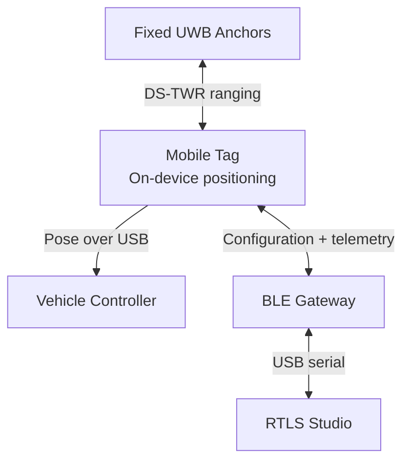

Positioning remains operational without the desktop application: RTLS Studio is a configuration and observability tool, not the positioning engine.

## System in Practice

The experimental platform uses the developed Anchor/Tag hardware and a 1:10-scale vehicle. The photographs below show the actual Chapter 5 test-yard deployment.

<p align="center">
  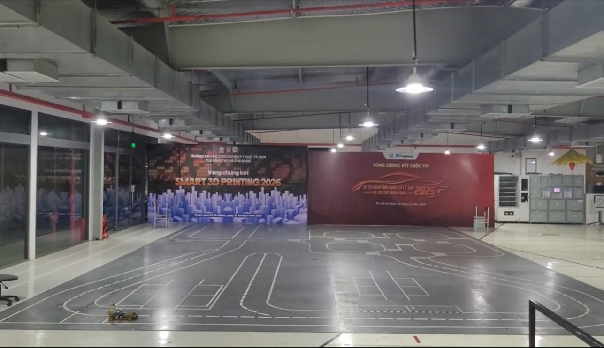<br>
  <sub>Full four-Anchor test-yard deployment</sub>
</p>

<table>
  <tr>
    <td width="50%" align="center">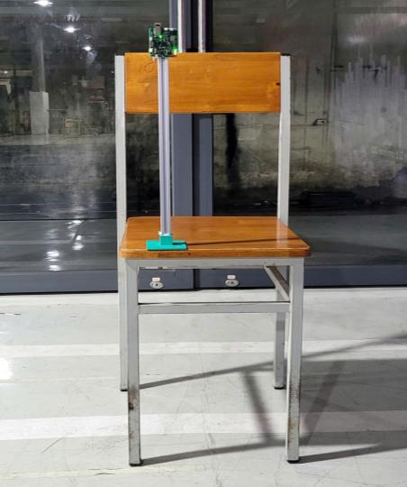<br><sub>Anchor installed at the surveyed height</sub></td>
    <td width="50%" align="center">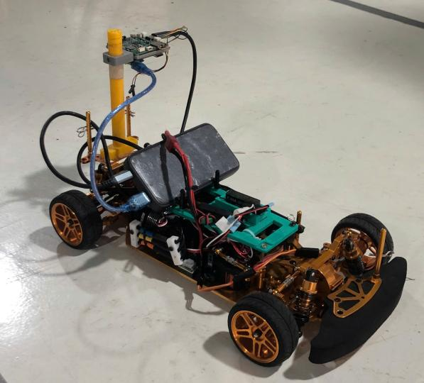<br><sub>1:10-scale vehicle carrying the Tag</sub></td>
  </tr>
</table>

RTLS Studio provides the host-side view of the deployed system for device configuration, diagnostics, and experiment recording.

<p align="center">
  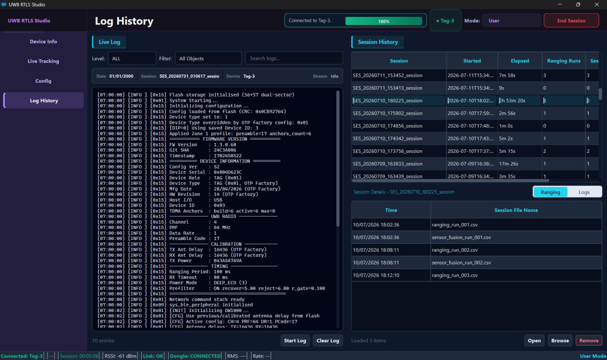<br>
  <sub>Connected-device diagnostics, live logs, and recorded ranging sessions</sub>
</p>

## Experimental Validation

Two dynamic cases were evaluated: a large, mostly line-of-sight test yard and a furnished classroom with stronger multipath and partial obstruction. Direct trilateration and UKF outputs were recorded simultaneously so both estimators saw the same motion and UWB measurements.

### Evaluation protocol

| Item | Method |
|---|---|
| Reference path | Manually surveyed control points connected by interpolation |
| Point error | Euclidean distance from each estimate to the nearest point on the reference path |
| Active interval | Samples before departure and after the vehicle stopped were excluded |
| Repetition | Three runs for each trajectory or Anchor configuration |
| Reported metrics | MAE, RMSE, 95th-percentile error, and maximum error |

### Case 1 — Test yard, four Anchors

The first case used a **9.76 m × 11.64 m** indoor test yard with mostly clear line of sight. Four Anchors surrounded the working area at **0.895 m**, while the Tag was mounted at **0.350 m**. The vehicle followed two surveyed trajectories, each repeated three times.

<table>
  <tr>
    <td width="50%" align="center">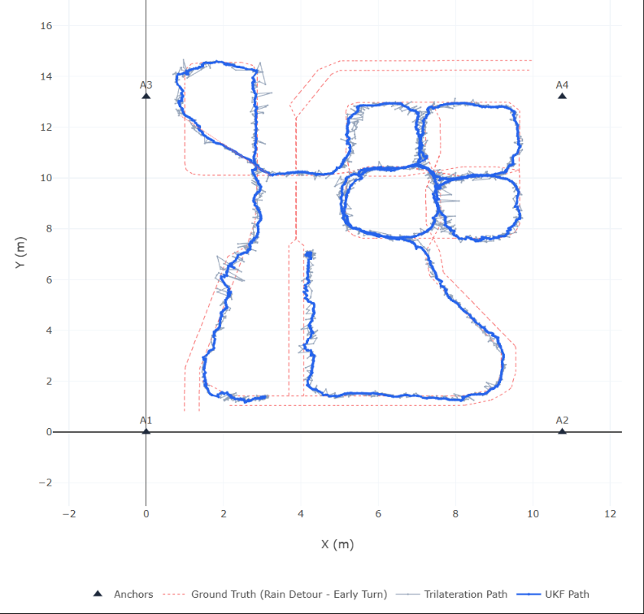</td>
    <td width="50%" align="center">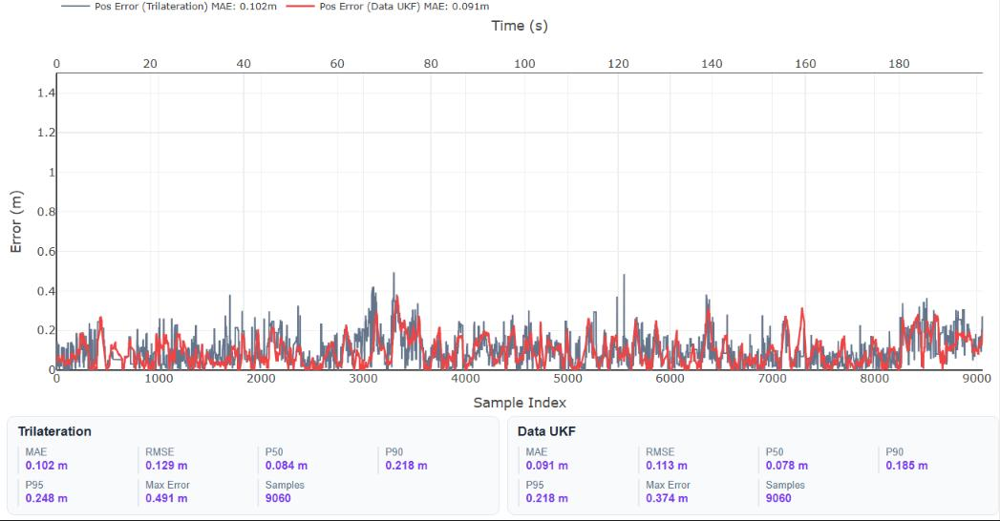</td>
  </tr>
  <tr>
    <td align="center"><sub>Reference path, direct trilateration, and UKF trajectory</sub></td>
    <td align="center"><sub>Position error from the same representative run</sub></td>
  </tr>
</table>

| Estimator | MAE (m) | RMSE (m) | P95 (m) | Max (m) |
|---|---:|---:|---:|---:|
| Direct trilateration | 0.102 ± 0.006 | 0.134 ± 0.010 | 0.268 ± 0.024 | 0.782 ± 0.281 |
| **UKF** | **0.091 ± 0.005** | **0.117 ± 0.005** | **0.236 ± 0.014** | **0.456 ± 0.063** |

Across the test-yard runs, the UKF reduced average MAE by **10.9%**, RMSE by **12.8%**, and maximum error from **0.782 m to 0.456 m**.

### Case 2 — Classroom, four and six Anchors

The second case used an **8.3 m × 8.7 m** classroom containing desks, people, and reflective surfaces. Anchors were installed at **2.495 m** and the Tag at **0.585 m**. Both four- and six-Anchor layouts were tested to measure the value of additional spatial redundancy.

<table>
  <tr>
    <td width="50%" align="center">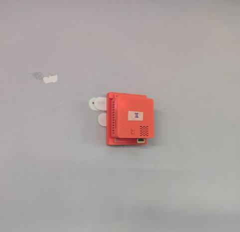</td>
    <td width="50%" align="center">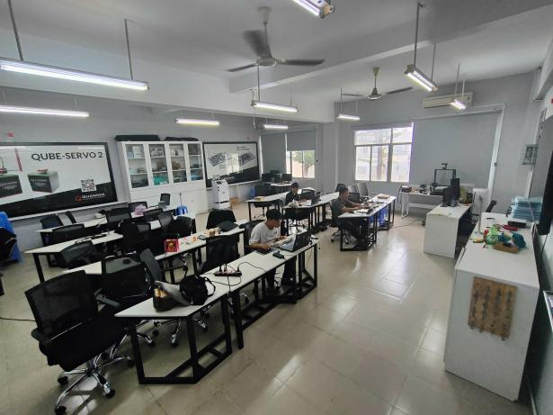</td>
  </tr>
  <tr>
    <td align="center"><sub>Wall-mounted Anchor</sub></td>
    <td align="center"><sub>Classroom deployment with furniture and occupants</sub></td>
  </tr>
</table>

<table>
  <tr>
    <td width="50%" align="center">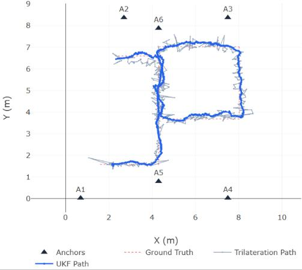</td>
    <td width="50%" align="center">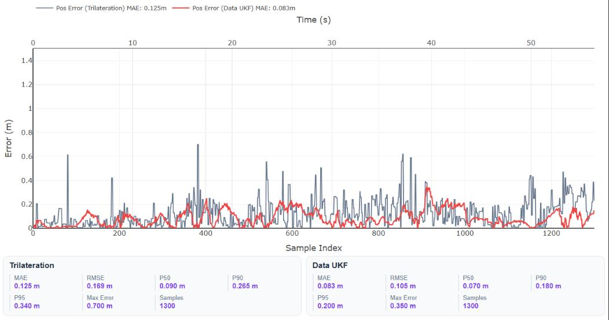</td>
  </tr>
  <tr>
    <td align="center"><sub>Six-Anchor reference, trilateration, and UKF trajectories</sub></td>
    <td align="center"><sub>Position error from the same representative run</sub></td>
  </tr>
</table>

| Layout | Estimator | MAE (m) | RMSE (m) | P95 (m) | Max (m) |
|---|---|---:|---:|---:|---:|
| 4 Anchors | Direct trilateration | 0.173 ± 0.027 | 0.230 ± 0.037 | 0.457 ± 0.084 | 1.099 ± 0.131 |
| 4 Anchors | **UKF** | **0.139 ± 0.036** | **0.185 ± 0.043** | **0.393 ± 0.085** | **0.583 ± 0.064** |
| 6 Anchors | Direct trilateration | 0.123 ± 0.006 | 0.177 ± 0.007 | 0.340 ± 0.035 | 1.150 ± 0.562 |
| 6 Anchors | **UKF** | **0.085 ± 0.013** | **0.109 ± 0.015** | **0.215 ± 0.035** | **0.340 ± 0.026** |

The six-Anchor UKF configuration produced the strongest overall result: **8.5 cm MAE**, **10.9 cm RMSE**, **21.5 cm P95**, and **34.0 cm maximum error**. The result demonstrates the benefit of additional valid ranging links in a difficult indoor environment.

> **Measurement scope:** the reference trajectory was reconstructed from manually measured control points, not an independent motion-capture system. The results therefore quantify tracking performance under the documented procedure rather than metrology-grade absolute accuracy.

## Core Capabilities

| Area | Implemented capability | Purpose |
|---|---|---|
| Ranging | Asymmetric DS-TWR with TDMA scheduling | Measures multiple Tag-to-Anchor ranges without clock synchronization |
| Measurement validation | Spatial innovation prefilter | Rejects inconsistent range combinations before estimation |
| Anchor selection | Robust precision and WGDOP ranking | Chooses a geometrically useful three-Anchor measurement set |
| Sensor fusion | 8-state UWB/IMU UKF | Estimates planar position, velocity, yaw, and IMU biases |
| Embedded runtime | FreeRTOS task-based firmware | Separates ranging, fusion, communication, storage, and supervision |
| Hardware flexibility | Unified Tag/Anchor STM32 firmware | Selects the device role and Anchor identity without maintaining separate applications |
| Configuration | Persistent profiles with CRC-protected storage | Keeps deployment parameters across resets |
| Communication | Shared Protobuf messages with COBS-framed transport | Maintains one contract across STM32, BLE, and Python |
| Desktop tooling | RTLS Studio and firmware programmer | Supports commissioning, live diagnostics, logs, and updates |

## Hardware and Software

| Layer | Main technology | Responsibility |
|---|---|---|
| Tag and Anchor MCU | STM32F411CEU6, Cortex-M4F | Real-time protocol, positioning, sensor fusion, and interfaces |
| UWB radio | Decawave/Qorvo DW1000 module | Precision packet timestamping for DS-TWR |
| Motion sensor | 6-DOF SPI IMU | Acceleration and yaw-rate input to the UKF |
| BLE nodes | Nordic nRF52 | Wireless configuration and telemetry |
| USB gateway | Nordic nRF52840 dongle | BLE central and USB bridge |
| Embedded OS | FreeRTOS | Deterministic task and queue organization |
| Desktop | Python 3.10+ and PyQt6 | RTLS Studio, programming, and analysis tools |

### Verified Development Environment

| Tool | Verified version |
|---|---|
| STM32CubeIDE | 1.19.0; project supports the 1.10+ workflow |
| Arm GNU Toolchain | 10.3.1 and 13.3.Rel1 |
| GNU Make | 4.4.1 |
| Nordic nRF5 SDK | 17.1.0 |
| Python | 3.10+; 3.12 verified |

## Quick Start

The commands below build the repository and launch RTLS Studio. Device flashing, antenna-delay calibration, Anchor surveying, and commissioning are covered in the [Getting Started Guide](docs/getting_started.md) and [Deployment Guide](docs/deployment.md).

### 1. Clone and generate the shared protocol

```powershell
git clone --recursive https://github.com/phuongmt08/uwb-rtls.git
cd uwb-rtls
make -C protocol
```

### 2. Build the STM32 firmware

Install STM32CubeIDE or an Arm GNU toolchain, then point `GCC_PATH` to its compiler `bin` directory.

```powershell
$env:GCC_PATH = "C:\path\to\arm-none-eabi\bin"
make -C firmware/uwb -j8
```

The build produces ELF, HEX, and BIN files under `firmware/uwb/build`.

### 3. Build the BLE firmware when required

The gateway and BLE bridge targets use Nordic nRF5 SDK 17.1.0.

```powershell
$env:SDK_ROOT = "C:\nRF5_SDK_17.1.0_ddde5a0"
make -C firmware/ble_firmware/central/armgcc
make -C firmware/ble_firmware/peripheral/armgcc
```

### 4. Launch RTLS Studio

```powershell
cd software
python -m venv .venv
.\.venv\Scripts\Activate.ps1
pip install -r requirements.txt
python uwb_rtls_studio/main.py
```

### 5. Commission a deployment

1. Install at least four Anchors around the operating area and assign unique IDs.
2. Survey their coordinates and create the deployment profile in RTLS Studio.
3. Mount the Tag on the vehicle and enter the Tag height.
4. Connect the BLE gateway, select the Tag, and push the configuration.
5. Start ranging and confirm that at least three valid Anchor links are available.
6. Monitor the embedded pose or record a session for offline evaluation.

## Repository Structure

```text
uwb-rtls/
├── firmware/     STM32 application, BLE firmware, and bootloader
├── software/     RTLS Studio, programmer, and analysis tools
├── protocol/     Protobuf contracts and generated bindings
├── hardware/     Schematics, PCB sources, and calibration data
└── docs/         Setup, deployment, architecture, algorithms, and thesis
```

## Documentation

| Start here | Scope |
|---|---|
| **[Getting Started](docs/getting_started.md)** | Toolchains, builds, flashing, and first connection |
| **[Deployment and Commissioning](docs/deployment.md)** | Physical layout, Anchor survey, calibration, and validation |
| **[Firmware Architecture](docs/firmware/architecture.md)** | Embedded layers, RTOS tasks, queues, and runtime ownership |
| **[DS-TWR Ranging Protocol](docs/firmware/ranging_protocol.md)** | Packet sequence, timestamps, timing, and TDMA behavior |
| **[Positioning Algorithms](docs/firmware/positioning_algorithms.md)** | Mathematical model, prefilter, Anchor selection, and UKF |
| **[Schematics and Specifications](docs/hardware/schematics_and_specs.md)** | Hardware boards, interfaces, and design references |
| **[RTLS Studio and Tools](docs/software/rtls_studio_and_tools.md)** | Desktop configuration, monitoring, logging, and programming |
| **[Thesis](docs/thesis/thesis_final.pdf)** | Full design, implementation, and experimental evaluation |

## Team

Developed at the **Faculty of Mechanical Engineering**, Ho Chi Minh City University of Technology and Engineering (**HCMUTE**).

- **Phuong Mai** — Firmware and system architecture
- **Dong Son** — Project co-developer
- **Trung Quan** — Project co-developer
