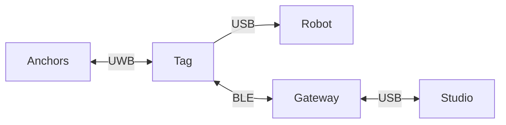
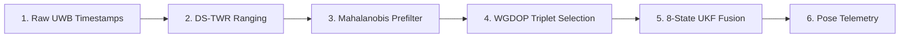

<div align="center">

# UWB-RTLS
### High-Precision Indoor Real-Time Location System for Autonomous Mobile Robots

<a href="https://phuongmt08.github.io/uwb-rtls/"></a>
<a href="#5-key-hardware--software-specs"></a>
<a href="#5-key-hardware--software-specs"></a>
<a href="#5-key-hardware--software-specs"></a>
<a href="#3-core-features"></a>
<a href="#4-positioning-pipeline"></a>
<a href="#3-core-features"></a>
<a href="#3-core-features"></a>
<a href="#9-project-team--credits"></a>

</div>

---

## Table of Contents

1. [Executive Summary](#1-executive-summary)
2. [System Architecture](#2-system-architecture)
3. [Core Features](#3-core-features)
4. [Positioning Pipeline](#4-positioning-pipeline)
5. [Key Hardware & Software Specs](#5-key-hardware--software-specs)
6. [Repository Structure](#6-repository-structure)
7. [Quick Start Guide](#7-quick-start-guide)
8. [Documentation Index](#8-documentation-index)
9. [Project Team & Credits](#9-project-team--credits)

---

## 1. Executive Summary

**UWB-RTLS** is an integrated indoor real-time positioning solution designed specifically for Autonomous Mobile Robots (AMRs). The system pairs fixed Ultra-Wideband (UWB) Anchors with mobile Tags mounted on moving vehicles. Using **Asymmetric Double-Sided Two-Way Ranging (DS-TWR)** and on-tag **Unscented Kalman Filter (UKF)** sensor fusion, the system provides sub-decimeter real-time localization independent of external computing infrastructure.

> **Note:** Positioning calculations execute entirely on the embedded STM32 MCU on the Tag. Desktop tools and BLE gateways are used solely for real-time visualization, telemetry monitoring, and system configuration.

---

## 2. System Architecture



> See [Firmware Architecture](docs/firmware/architecture.md) for the complete embedded layer design, RTOS task model, and data channels.

---

## 3. Core Features

| Category | Capability | Abstract Description |
| --- | --- | --- |
| **Positioning Engine** | 8-State UKF & IMU Fusion | Tight integration of UWB ranges with 6-DOF IMU motion ($\mathbf{x} = [p_x, p_y, v_x, v_y, \theta, b_{ax}, b_{ay}, b_{gz}]^T$) |
| **Range Validation** | Mahalanobis Prefilter | Rejects multipath anomalies and NLOS spikes using spatial innovation statistics |
| **Robust Weighting** | Huber-WGDOP Triplet Selection | Evaluates geometric precision (WGDOP) and down-weights weak first-path UWB signals |
| **Hardware Flexibility** | Unified Dual-Role Firmware | STM32 codebase runs as Tag or Anchor (toggle via User Button hold); Anchor ID set via 3-position DIP switch (up to 8 Anchors) |
| **Wireless Protocol** | COBS + Protobuf Messaging | Compact serialized protocol contracts shared between embedded C and Python desktop |
| **Desktop Suite** | RTLS Studio Visualization | Real-time map rendering, node configuration, telemetry logging, and diagnostic profiling |

---

## 4. Positioning Pipeline



> For mathematical formulations, state-transition matrices, and filter parameters, see [Positioning Algorithms Guide](docs/firmware/positioning_algorithms.md).

---

## 5. Key Hardware & Software Specs

### 5.1. Hardware Platform

| Component | Module | Technical Function |
| --- | --- | --- |
| **MCU** | STM32F411CEU6 (100 MHz Cortex-M4F) | RTOS tasks, DS-TWR ranging, UKF fusion |
| **UWB Radio** | Decawave DW1000 / BU01 | Precision pulse timestamping |
| **Sensor** | 6-DOF SPI IMU (Accel & Gyro) | High-rate motion prediction for UKF |
| **Wireless Bridge** | Nordic nRF52832 & nRF52840 | BLE telemetry bridge & USB gateway |

### 5.2. Software & Environment Version Matrix

| Ecosystem Layer | Tool / Component | Verified Version | Purpose |
| --- | --- | --- | --- |
| **IDE / Toolchain** | STM32CubeIDE | `v1.19.0` (or `v1.10+`) | Core IDE & bundled compiler plugins |
| **Arm Compiler** | `arm-none-eabi-gcc` | `v10.3.1` / `v13.3.rel1` | STM32F411 Cortex-M4F compiler |
| **Build Utility** | GNU Make | `v4.4.1` (ST Plugin) | Firmware & Protobuf build automation |
| **Wireless SDK** | Nordic nRF5 SDK | `v17.1.0` | BLE central/peripheral firmware |
| **Host Runtime** | Python | `v3.10+` (v3.12 verified) | Desktop GUI & Protocol generator |

---

## 6. Repository Structure

```
uwb-rtls/
├── firmware/         STM32F411 application, BLE bridge firmware, and bootloader
├── software/         RTLS Studio GUI and firmware programmer tools
├── protocol/         Protobuf message definitions (.proto) and nanopb runtime
├── hardware/         PCB designs, schematics, and antenna calibration data
└── docs/             Technical guides, system architecture, and thesis material
```

---

## 7. Quick Start Guide

> **Detailed Setup & Toolchain Guide:** For complete step-by-step instructions on setting up STM32CubeIDE plugins (`GCC_PATH`), Nordic nRF5 SDK (`SDK_ROOT`), Python virtual environment (`venv`), and troubleshooting, refer to the **[Getting Started & Setup Guide](docs/getting_started.md)**.

### 7.1. Clone Repository & Submodules
```bash
git clone --recursive https://github.com/phuongmt08/uwb-rtls.git
cd uwb-rtls
```

### 7.2. Generate Protocol Buffers Code
```powershell
make -C protocol
```

### 7.3. Build STM32 Firmware
```powershell
make -C firmware/uwb -j8
```

### 7.4. Build BLE Firmware
```powershell
make -C firmware/ble_firmware/central/armgcc
make -C firmware/ble_firmware/peripheral/armgcc
```

### 7.5. Run RTLS Studio GUI
```powershell
cd software/uwb_rtls_studio
python -m venv venv
.\venv\Scripts\Activate.ps1
pip install -r requirements.txt
python main.py
```

---

## 8. Documentation Index

- **[Live Documentation Website](https://phuongmt08.github.io/uwb-rtls/)** — Interactive MkDocs Material documentation site.
- **[Getting Started & Setup Guide](docs/getting_started.md)** — Detailed toolchain, PATH setup, and build guide.
- **[Firmware Architecture](docs/firmware/architecture.md)** — Embedded roles, layers, runtime tasks, and source structure.
- **[DS-TWR Ranging Protocol](docs/firmware/ranging_protocol.md)** — Timestamp mechanics and TDMA frame scheduling.
- **[Embedded Positioning Algorithms](docs/firmware/positioning_algorithms.md)** — Outlier rejection, Huber weighting, and UKF math.
- **[Hardware Specifications](docs/hardware/schematics_and_specs.md)** — PCB design references and specs.
- **[RTLS Studio User Guide](docs/software/rtls_studio_and_tools.md)** — Desktop application user manual.

---

## 9. Project Team & Credits

Developed at the **Faculty of Mechanical Engineering**, Ho Chi Minh City University of Technology and Engineering (**HCMUTE**).

- **Phuong Mai** — Lead Firmware & System Architecture
- **Dong Son** — Project Co-Developer
- **Trung Quan** — Project Co-Developer
