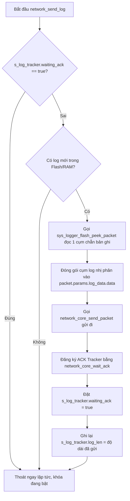

# Hướng Dẫn Debug Luồng Gửi Log BLE và Bộ Theo Dõi ACK (Tracker)

Tài liệu này phân tích **toàn bộ các biến, cấu trúc dữ liệu và logic điều khiển** liên quan đến luồng gửi log qua Bluetooth (BLE) và cơ chế bật bộ theo dõi ACK (Tracker) để phục vụ cho việc debug sự cố lỗi truyền log BLE.

---

## I. DANH SÁCH FILE LIÊN QUAN TRONG LUỒNG CODE

Để debug luồng log BLE, cậu cần tập trung vào 4 file chính sau:
1. [network_cmd.c](file:///d:/HOC/S/STM32/IDE/DATN/uwb-rtls/firmware/common/network/network_cmd.c) – Quản lý trạng thái luồng log ứng dụng và kích hoạt gửi log thô.
2. [network_core.c](file:///d:/HOC/S/STM32/IDE/DATN/uwb-rtls/firmware/common/network/network_core.c) – Định tuyến luồng mạng ứng dụng, đóng gói Protobuf và quản lý các tracker ACK.
3. [serial.c](file:///d:/HOC/S/STM32/IDE/DATN/uwb-rtls/firmware/common/serial/serial.c) – Cầu nối giao tiếp trung gian (UART/USB/BLE).
4. [ble_bridge.c](file:///d:/HOC/S/STM32/IDE/DATN/uwb-rtls/firmware/common/serial/ble_bridge.c) – Điều khiển cổng UART vật lý (UART2) kết nối trực tiếp với chip BLE nRF52832.

---

## II. CHI TIẾT TOÀN BỘ CÁC BIẾN & CẤU TRÚC DỮ LIỆU

### 1. Các biến trong [network_cmd.c](file:///d:/HOC/S/STM32/IDE/DATN/uwb-rtls/firmware/common/network/network_cmd.c)

*   `static bool s_log_stream_enabled`: 
    *   **Ý nghĩa**: Cờ trạng thái cho biết Host có đang yêu cầu nhận log thời gian thực hay không.
    *   **Giá trị**: `true` (đang bật truyền log), `false` (tắt).
*   `static uint8_t s_log_stream_dst`: 
    *   **Ý nghĩa**: Lưu địa chỉ logic của thiết bị yêu cầu nhận log để gửi trả lại chính xác.
    *   **Giá trị**: Thường là `PACKET_ADDR_HOST` (`0x05`) hoặc `PACKET_ADDR_CENTRAL` (`0x03`) khi yêu cầu qua BLE.
*   `static network_log_tracker_t s_log_tracker`:
    *   **Ý nghĩa**: Cấu trúc giám sát ACK của luồng gửi log hiện tại.
    *   **Các trường thành viên**:
        *   `bool waiting_ack`: Cờ khóa luồng. Khi bằng `true`, hệ thống đang đợi ACK của gói log vừa gửi đi; MCU cấm gửi gói log tiếp theo. Khi bằng `false`, MCU sẵn sàng gửi tiếp gói log mới.
        *   `uint32_t log_len`: Kích thước dữ liệu log nhị phân (bytes) đã gửi đi trong gói tin hiện tại. Lưu lại để khi nhận được ACK thành công sẽ xóa chính xác lượng byte này khỏi Flash/RAM.
        *   `int tracker_id`: Chỉ số (index) của bộ theo dõi ACK đang hoạt động trong mảng `ack_tracker` của `network_core`. Giá trị `-1` nghĩa là không có tracker nào đang hoạt động.

### 2. Các biến trong [network_core.c](file:///d:/HOC/S/STM32/IDE/DATN/uwb-rtls/firmware/common/network/network_core.c)

*   `network_core_t` (Cấu trúc quản lý luồng mạng của MCU):
    *   `network_ack_tracker_t ack_tracker[NETWORK_CORE_MAX_TRACKERS]`:
        *   **Ý nghĩa**: Mảng quản lý tối đa 4 tác vụ đang chờ xác nhận ACK đồng thời trên MCU.
        *   **Chi tiết từng trường của một phần tử trong mảng**:
            *   `network_core_ack_state_t state`: Trạng thái của tracker.
                *   `NETWORK_CORE_ACK_STATE_NONE` (`0`): Rảnh, sẵn sàng cấp phát.
                *   `NETWORK_CORE_ACK_STATE_WAITING` (`1`): Đang chờ gói tin ACK tương ứng từ Host.
                *   `NETWORK_CORE_ACK_STATE_FOUND` (`2`): Đã nhận được ACK hợp lệ.
                *   `NETWORK_CORE_NACK_STATE_FOUND` (`3`): Nhận phản hồi lỗi (NACK).
                *   `NETWORK_CORE_ACK_STATE_TIMEOUT` (`4`): Quá thời gian chờ mà không nhận được ACK.
            *   `protobuf_hdr_t packet_header`: Lưu bản sao Header của gói tin đã gửi, dùng để đối chiếu mã tuần tự (`packet_header.seq`) khi gói ACK gửi về.
            *   `uint32_t start_time`: Ghi lại thời điểm bắt đầu truyền gói tin (lấy từ `HAL_GetTick()`) để tính toán timeout.
            *   `uint32_t timeout`: Thời gian chờ tối đa (mili-giây), thường cấu hình bằng `WAIT_TIME_TO_RESEND_ACK_MS` (`1000` ms).
            *   `network_ack_tracker_callback_t callback`: Hàm con trỏ callback sẽ tự động kích hoạt khi trạng thái tracker thay đổi (nhận được ACK hoặc bị Timeout). Ở luồng log, nó trỏ đến `log_tracker_callback`.
            *   `void *callback_arg`: Địa chỉ biến truyền vào làm đối số cho callback, ở đây chính là địa chỉ của `s_log_tracker`.

### 3. Các biến trong [ble_bridge.c](file:///d:/HOC/S/STM32/IDE/DATN/uwb-rtls/firmware/common/serial/ble_bridge.c)

*   `static uint8_t s_rx_buf[512]`: Bộ đệm vòng tròn (Ring Buffer) chứa các byte nhận được từ chip BLE (qua UART2) trước khi đưa vào parser HDLC.
*   `static volatile uint32_t s_rx_head` & `s_rx_tail`: Con trỏ ghi (head) và con trỏ đọc (tail) của bộ đệm vòng tròn `s_rx_buf`.
*   `static uint8_t s_dma_rx_buf[256]`: Bộ đệm nhận DMA thô của cổng UART2. DMA phần cứng sẽ tự động ghi các byte nhận được từ chip BLE vào đây theo cơ chế xoay vòng.
*   `static volatile uint32_t s_last_dma_ptr`: Chỉ số vị trí ghi cuối cùng của bộ đệm DMA được xử lý ở lần kiểm tra trước đó. Dùng để tính toán lượng dữ liệu mới nhận được từ nRF52832.
*   `static hdlc_parser_t s_parser`: Bộ phân tích cú pháp khung truyền HDLC để trích xuất payload Protobuf thô từ dòng byte nhận từ UART2.

---

## III. CHI TIẾT TOÀN BỘ LOGIC HOẠT ĐỘNG (LOGIC FLOW)

### 1. Kích hoạt luồng truyền Log BLE

Khi Host BLE gửi gói tin yêu cầu lấy log:
1.  **Nhận gói tin thô**:
    *   Chip nRF52832 nhận gói tin BLE không dây từ Host, chuyển tiếp thành khung HDLC nhị phân và gửi qua cổng UART tới STM32 (UART2).
    *   Phần cứng DMA ghi trực tiếp các byte nhận được vào `s_dma_rx_buf`.
2.  **Ngắt Idle kích hoạt**:
    *   Khi đường truyền UART2 không có tín hiệu (Idle), ngắt UART2 IDLE nhảy vào hàm `ble_bridge_uart_rx_check()`.
    *   Hàm tính toán: `curr_dma_ptr = 256 - __HAL_DMA_GET_COUNTER(&hdma_usart2_rx)`.
    *   So sánh `curr_dma_ptr` với `s_last_dma_ptr` để phát hiện dữ liệu mới. Lệnh `ble_bridge_rx_push()` được gọi để đẩy toàn bộ byte mới từ `s_dma_rx_buf` vào bộ đệm vòng `s_rx_buf`.
3.  **Xử lý trong vòng lặp hệ thống**:
    *   Hàm `network_core_process()` chạy chu kỳ liên tục, gọi `network_core_process_one_stream(core, STREAM_BLE_RX)`.
    *   Hàm gọi `_read(STREAM_BLE_RX, ...)` -> trỏ đến [ble_bridge_read()](file:///d:/HOC/S/STM32/IDE/DATN/uwb-rtls/firmware/common/serial/ble_bridge.c#L134).
    *   `ble_bridge_read()` lấy từng byte từ `s_rx_buf` đẩy qua `hdlc_parse_byte(&s_parser, byte, &chunk)`.
    *   Nếu phát hiện đủ khung HDLC và checksum đúng, payload Protobuf được trích xuất và đưa vào hàm giải mã Protobuf `network_core_decode_packet()`.
4.  **Phân phối lệnh**:
    *   Hàm `network_cmd_dispatch()` nhận gói Protobuf, thấy trường lệnh là `log_data_get`.
    *   Gọi [network_cmd_log_data_get()](file:///d:/HOC/S/STM32/IDE/DATN/uwb-rtls/firmware/common/network/network_cmd.c#L731) để thiết lập:
        *   `s_log_stream_enabled = true;` (Bật cờ truyền log)
        *   `s_log_stream_dst = pkt->hdr.addr.src;` (Ghi nhớ địa chỉ Host BLE, thường là `0x05` hoặc `0x03`).
        *   Gọi lần đầu `network_send_log(s_log_stream_dst, max_payload)` để khởi động luồng truyền ngay lập tức.

---

### 2. Logic Đọc Log từ Flash/RAM và Truyền tải qua BLE (`network_send_log`)

Định kỳ trong vòng lặp chính, hàm `network_cmd_process()` kiểm tra:
`if (s_log_stream_enabled && network_cmd_host_active()) { network_send_log(s_log_stream_dst, 0xFFFFu); }`

Logic thực thi bên trong `network_send_log()` diễn ra như sau:



1.  **Khóa luồng**: `s_log_tracker.waiting_ack` được kiểm tra. Nếu là `true` (MCU vẫn đang chờ ACK của gói tin trước), hàm sẽ kết thúc ngay để tránh gửi đè dữ liệu gây mất đồng bộ.
2.  **Đọc căn biên bản ghi**:
    *   MCU gọi `sys_logger_flash_peek_packet(packet.params.log_data.data.bytes, send_len)`.
    *   Hàm này đảm bảo dữ liệu đọc ra luôn dừng đúng ở biên của bản ghi cuối cùng (được đệm chẵn 4-bytes). Nó **không di chuyển con trỏ đọc thực tế trên Flash** (`g_flash_log_read_pos`), chỉ chép tạm ra để gửi.
3.  **Mã hóa & Định tuyến gửi qua BLE**:
    *   MCU gọi `network_core_send_packet(core, dst, &packet)`.
    *   Bên trong hàm `network_core_send_packet()`:
        *   Gói tin được gán mã tuần tự gửi đi: `packet->hdr.seq = core->tx_seq++`.
        *   MCU xác định cổng truyền dựa trên `dst` (Host BLE = 5): Gọi `network_core_dst_to_tx_stream(5)` -> Trả về `STREAM_BLE_TX`.
        *   Gọi `network_core_send_ble_packet()` -> `network_core_encode_and_send()` -> [_write(STREAM_BLE_TX, ...)](file:///d:/HOC/S/STM32/IDE/DATN/uwb-rtls/firmware/common/serial/serial.c#L70).
        *   Hàm `_write` gọi hàm con trỏ đã đăng ký là [ble_bridge_write()](file:///d:/HOC/S/STM32/IDE/DATN/uwb-rtls/firmware/common/serial/ble_bridge.c#L159).
        *   `ble_bridge_write()` đóng gói dữ liệu thành khung HDLC thô và gọi `HAL_UART_Transmit(&huart2, frame, frame_len, 100)` để đẩy sang chip BLE phát đi.
4.  **Bật bộ theo dõi Tracker**:
    *   MCU đăng ký một bộ theo dõi bằng lệnh:
        `s_log_tracker.tracker_id = network_core_wait_ack(core, seq, timeout, log_tracker_callback, &s_log_tracker);`
    *   Hàm `network_core_wait_ack()` tìm kiếm một phần tử trống (`state == NONE`) trong mảng `ack_tracker` của core:
        *   Thiết lập trạng thái tracker: `t->state = NETWORK_CORE_ACK_STATE_WAITING;`
        *   Lưu mã tuần tự cần chờ: `t->packet_header.seq = seq;`
        *   Ghi nhận thời gian bắt đầu: `t->start_time = bsp_util_get_ticks();`
        *   Ghi nhận thời gian chờ tối đa: `t->timeout = timeout_ms;`
        *   Gán hàm gọi lại: `t->callback = log_tracker_callback;`
        *   Gán đối số quản lý: `t->callback_arg = &s_log_tracker;`
5.  **Bật khóa chờ**: Thiết lập `s_log_tracker.waiting_ack = true` và `s_log_tracker.log_len = read_len`.

---

### 3. Logic Nhận và Xử lý ACK từ Host BLE

Khi Host BLE nhận được gói log và phản hồi gói tin ACK:
1.  **Nhận ACK thô qua UART2**:
    *   Ngắt UART2 IDLE nhận diện gói dữ liệu phản hồi, nạp vào `s_rx_buf`.
    *   Hàm chạy chu kỳ `network_core_process()` đọc gói tin và giải mã ra message Protobuf của ACK.
2.  **Khớp mã ACK tuần tự**:
    *   Hàm `network_core_update_ack_trackers(core, &packet)` được gọi.
    *   Nó duyệt qua mảng `ack_tracker` để tìm tracker nào đang ở trạng thái `WAITING` và có `packet->params.ack.ack_seq` trùng khớp với `t->packet_header.seq`.
    *   Nếu khớp, tracker cập nhật trạng thái: `t->state = NETWORK_CORE_ACK_STATE_FOUND;`
    *   Gọi hàm callback kết thúc: [network_core_finalize_tracker()](file:///d:/HOC/S/STM32/IDE/DATN/uwb-rtls/firmware/common/network/network_core.c#L53) -> Kích hoạt `log_tracker_callback()`.
3.  **Dọn dẹp và Giải phóng bộ nhớ trong `log_tracker_callback`**:
    *   Bên trong hàm callback:
        ```c
        if ((p_tracker->state == NETWORK_CORE_ACK_STATE_FOUND) && (tracker->log_len > 0u)) {
            sys_logger_flash_consume(tracker->log_len); // Dịch chuyển con trỏ đọc thực tế của Flash
        }
        tracker->waiting_ack = false; // Mở khóa cho phép gửi gói log tiếp theo
        tracker->log_len     = 0u;
        tracker->tracker_id  = -1;
        ```
    *   Trạng thái của tracker trong mảng được chuyển về `NONE` để giải phóng vị trí cho tác vụ khác.

---

### 4. Logic Xử lý khi xảy ra Timeout (Mất gói ACK)

Nếu đường truyền BLE chập chập chờn và gói ACK bị mất:
1.  **Kiểm tra Timeout chu kỳ**:
    *   Trong `network_core_process()`, hàm `network_core_check_tracker_timeouts(core)` chạy liên tục để quét mảng tracker.
    *   Nếu một tracker có `state == WAITING` và:
        `(bsp_util_get_ticks() - t->start_time) >= t->timeout` (vượt quá 1 giây).
    *   Tracker chuyển trạng thái: `t->state = NETWORK_CORE_ACK_STATE_TIMEOUT;`
    *   Gọi callback `log_tracker_callback(t, NULL)`.
2.  **Xử lý trong callback**:
    *   Hàm nhận thấy trạng thái **không phải** là `FOUND` nên **bỏ qua việc dịch chuyển con trỏ đọc** (`sys_logger_flash_consume` không được gọi). Dữ liệu log thô cũ vẫn nằm nguyên vị trí trên Flash/RAM.
    *   Thiết lập giải phóng khóa: `tracker->waiting_ack = false;` để cho phép truyền lại.
3.  **Truyền lại (Retransmit)**:
    *   Ở chu kỳ tiếp theo của vòng lặp, do `waiting_ack` đã bằng `false`, hàm `network_send_log()` lại được gọi.
    *   Nó sẽ tiếp tục đọc từ con trỏ đọc cũ (`g_flash_log_read_pos` chưa hề dịch chuyển) và gửi lại chính xác cụm log bị lỗi đó lên Host.

---

## IV. CÁC ĐIỂM SỰ CỐ THƯỜNG GẶP KHI DEBUG BLE LOG

Nếu hệ thống log BLE của cậu đang gặp vấn đề (ví dụ: mất log, đứng luồng log sau vài giây, hoặc không gửi log), hãy kiểm tra các nguyên nhân kỹ thuật sau:

### 1. Hiện tượng treo luồng Log (Đứng log sau gói đầu tiên)
*   **Nguyên nhân**: MCU gửi gói tin log đầu tiên đi, cờ `s_log_tracker.waiting_ack` được bật lên `true`, nhưng **không bao giờ nhận lại được ACK** để chuyển về `false`. Luồng log bị khóa vĩnh viễn.
*   **Cách kiểm tra**:
    *   Kiểm tra xem Host có gửi gói tin ACK về không.
    *   Kiểm tra ngắt UART2 IDLE của cổng kết nối BLE (`ble_bridge_uart_rx_check()`) xem có nhận được byte nào từ chip nRF52832 khi Host gửi gói ACK không.
    *   **Lỗi phần cứng/driver UART2**: Xem lỗi Overrun (`ORE`) của UART2. Nếu xảy ra lỗi ORE, bộ nhận UART2 DMA sẽ dừng hoạt động, MCU sẽ không thể nhận bất cứ gói tin nào từ BLE nữa. Xem hàm `ble_bridge_uart_rx_recover()` có được gọi để tự động hồi sinh UART2 DMA hay không.

### 2. Hàm đăng ký Tracker trả về lỗi (`tracker_id == -1`)
*   **Nguyên nhân**: Mảng `ack_tracker` chỉ hỗ trợ tối đa 4 tác vụ chờ ACK đồng thời (`NETWORK_CORE_MAX_TRACKERS = 4`). Nếu các module khác trong hệ thống gửi lệnh chờ ACK mà quên giải phóng, hoặc do lỗi rò rỉ (leak) trạng thái khiến cả 4 phần tử đều bị chiếm dụng (`state != NONE`), hàm `network_core_wait_ack()` sẽ trả về `-1`.
*   **Hậu quả**: Khi `tracker_id < 0`, hệ thống log lập tức reset cờ `waiting_ack = false; log_len = 0u` và hủy bỏ phiên gửi log hiện tại để tránh deadlock.
*   **Cách kiểm tra**: Đặt breakpoint hoặc log kiểm tra xem có khi nào `network_core_find_tracker()` không tìm được slot trống nào hay không.

### 3. Tốc độ ghi log nhanh hơn tốc độ truyền BLE thô (Buffer Overflow)
*   **Nguyên nhân**: Băng thông truyền dữ liệu của BLE chậm hơn nhiều so với USB/Serial. Nếu firmware in log liên tục ở tần suất cao, tốc độ đẩy dữ liệu qua cổng UART2 kết nối BLE sẽ không đáp ứng kịp.
*   **Hậu quả**: Hàm `HAL_UART_Transmit(&huart2, ...)` trong `ble_bridge_write` sẽ liên tục bị nghẽn (Block), trả về trạng thái lỗi hoặc bị tràn bộ đệm ghi RAM khiến dữ liệu log cũ bị ghi đè liên tục trong RAM trước khi kịp ghi vào Flash.
*   **Cách khắc phục**: Giảm thiểu việc bật các log mức độ Verbose (`RLOG_D`) khi sử dụng kết nối BLE, hoặc cấu hình tăng tốc độ baudrate cổng UART2 kết nối với chip BLE nRF52.
