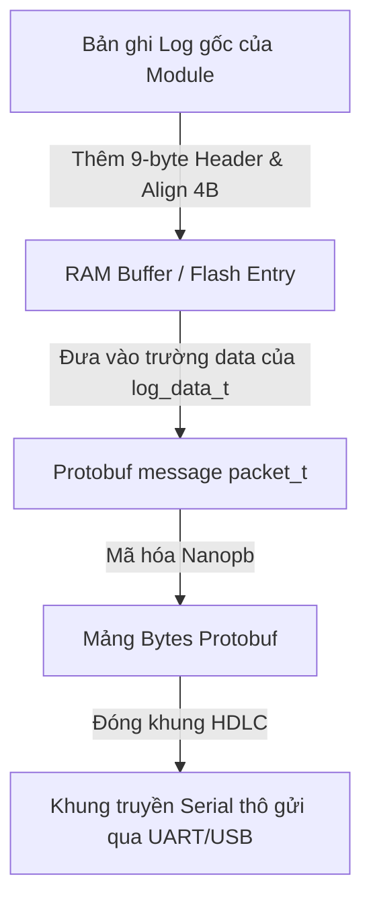
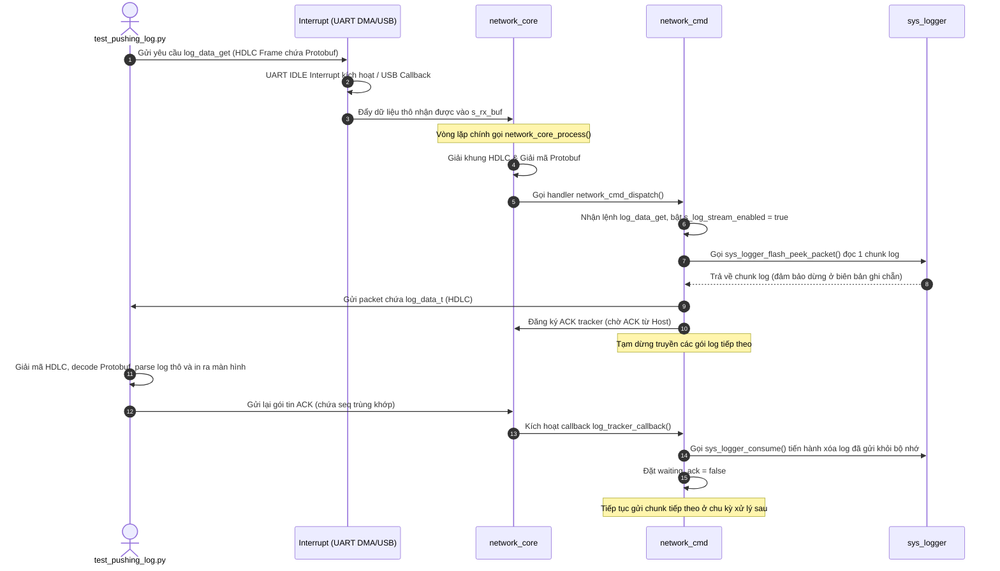

# Tài Liệu Workflow Log trong Dự Án UWB RTLS

Tài liệu này giải thích chi tiết toàn bộ quy trình (workflow) ghi, lưu trữ, truyền tải và giải mã log trong dự án **uwb-rtls**. 

---

## 1. Làm rõ thắc mắc về định dạng Log

**Câu hỏi:** *Log in ra màn hình dạng như dưới đây là từ MCU gửi nguyên văn (gửi cả dấu `==`, dấu ngoặc vuông `[]`, ngày giờ...) hay do kịch bản Python (`test_pushing_log.py`) tự xác định và định dạng lại?*
```text
[2000-01-01 07:00:00.851] [INFO ] [0x03] [BSP][CFG] CH=4 PRF=64MHz DR=2 PCode=17
[2000-01-01 07:00:01.886] [INFO ] [0x01] ===== ANCHOR #1 =====
```

### Câu trả lời:
MCU **không** gửi trực tiếp chuỗi văn bản hoàn chỉnh chứa dấu `[]`, `==` hay ngày tháng năm định dạng sẵn như trên qua cổng serial/USB. 

Thay vào đó:
1. **MCU chỉ tạo ra và lưu trữ bản ghi nhị phân (Binary Record)**: Bao gồm một Header nhị phân cố định **9 bytes** (chứa loại log, mã module, timestamp dạng số nguyên, độ dài tin nhắn) kết hợp với **chuỗi thông điệp gốc** (ví dụ: `[BSP][CFG] CH=4 PRF=64MHz DR=2 PCode=17` hoặc `===== ANCHOR #1 =====`).
2. **MCU gửi dữ liệu thô đóng gói**: Dữ liệu nhị phân này được đưa vào Protobuf, mã hóa và truyền qua khung truyền HDLC thô.
3. **Kịch bản Python (`test_pushing_log.py`) giải mã và dựng lại**: Kịch bản Python nhận gói tin nhị phân thô, bóc tách các trường dữ liệu, sau đó thực hiện các bước định dạng:
   - Dịch `LOG_TYPE` (như `0xFE`, `0xFF`, `0xFD`) thành chuỗi tương ứng `[INFO ]`, `[DEBUG]`, `[WARN ]`, `[ERROR]`.
   - Dịch `OBJ_CODE` (như `0x03`, `0x01`) thành định dạng hexa `[0x03]`.
   - Chuyển timestamp (số nguyên 48-bit tính bằng mili-giây) thành định dạng ngày giờ cụ thể `[YYYY-MM-DD HH:MM:SS.mmm]` (nếu có RTC đồng bộ) hoặc giữ nguyên số thứ tự (nếu không có RTC).
   - Thêm các mã màu ANSI (Trắng cho INFO, Cyan cho DEBUG, Vàng cho WARN, Đỏ cho ERROR) để hiển thị trực quan trên terminal.

---

## 2. Cấu trúc gói tin log gửi đi (Packet Structure)

Dữ liệu log khi truyền từ MCU lên máy tính trải qua 3 tầng đóng gói:



### Tầng 1: Khung truyền vật lý (HDLC Framing)
Để tránh mất mát và phân mảnh dữ liệu trên đường truyền Serial (UART hoặc USB CDC), toàn bộ gói tin Protobuf được bọc trong một khung HDLC tùy biến:

| Trường | Kích thước | Giá trị | Ý nghĩa |
| :--- | :--- | :--- | :--- |
| **SOF** | 1 byte | `0x55` | Điểm bắt đầu khung (Start of Frame) |
| **Type** | 1 byte | `0x00` | Loại khung (`0x00` đại diện cho Protobuf payload) |
| **Length** | 2 bytes | LSB-MSB | Độ dài của payload Protobuf bên trong (Tối đa 256 bytes) |
| **Payload** | N bytes | Biến đổi | Chuỗi bytes sau khi Serialize của gói tin Protobuf |
| **Checksum**| 1 byte | Byte | Tổng Checksum (bằng tổng tất cả các byte từ SOF đến hết Payload modulo 256) |

### Tầng 2: Gói tin ứng dụng (Protobuf Payload)
Dữ liệu ứng dụng định nghĩa trong file [protocol.proto](file:///d:/HOC/S/STM32/IDE/DATN/uwb-rtls/protocol/protos/protocol.proto). Khi MCU gửi log, nó sử dụng message `packet_t` chứa một `oneof params` là `log_data` thuộc kiểu `log_data_t`:

```protobuf
message log_data_t {
  log_type_t type   = 1; // Mặc định là LOG_TYPE_DEVICE_LOG (value = 1)
  bytes data        = 2; // Chứa chuỗi byte nhị phân thô của các bản ghi log ghép lại
}
```

### Tầng 3: Định dạng luồng dữ liệu Log nhị phân (Binary Log Stream Format)
Trong trường `data` (kiểu `bytes`) của Protobuf ở trên, MCU sẽ nhét một hoặc nhiều bản ghi log xếp liền nhau. Mỗi bản ghi được đóng khung như sau:

```text
+------------------+-------------------------------------------------------------+-------------------+
| RECORD_LEN (2B)  | RECORD (RECORD_LEN bytes)                                   | PADDING (0-3B)    |
| (LSB-MSB)        | [LOG_TYPE(1B)][OBJ_CODE(1B)][TIMESTAMP(6B)][MSG_LEN(1B)][MSG]| (Đệm cho chẵn 4B) |
+------------------+-------------------------------------------------------------+-------------------+
```

Chi tiết bên trong khối `RECORD` (Tổng cộng Header là **9 bytes** + nội dung tin nhắn):
1. **LOG_TYPE (1 byte)**: Xác định cấp độ log hoặc mã lỗi.
   - `0xFE` (254): `INFO_LOG`
   - `0xFF` (255): `DEBUG_LOG`
   - `0xFD` (253): `WARNING_LOG`
   - Các giá trị khác: Mã lỗi cụ thể (ví dụ: `0x61` là lỗi khởi tạo pin).
2. **OBJ_CODE (1 byte)**: Định danh thành phần (Module) phát sinh log (Object Code), được OR với bit nguồn thiết bị:
   - Bit `[7]` (MSB): Nguồn lỗi. `0x80` nếu log từ **Tag**, `0x00` nếu log từ **Anchor**.
   - Các bit `[6:0]`: Mã thành phần. Ví dụ: `0x03` (UWB Driver), `0x01` (Application), `0x13` (Power Manager - PM), v.v. (định nghĩa chi tiết trong [log_config.h](file:///d:/HOC/S/STM32/IDE/DATN/uwb-rtls/firmware/common/log_config.h)).
3. **TIMESTAMP (6 bytes - 48 bit)**: Số nguyên không dấu (Little Endian) ghi nhận thời gian xảy ra log tính bằng mili-giây:
   - Nếu hệ thống có chip thời gian thực RTC hoạt động và được đồng bộ: Đây là mốc thời gian thực Unix epoch (số mili-giây tính từ 1970).
   - Nếu hệ thống không có RTC: Đây là một số thứ tự tăng dần (`log_seq_num++`) đóng vai trò đếm thứ tự log.
4. **MSG_LEN (1 byte)**: Độ dài của chuỗi ký tự log (tối đa 180 bytes).
5. **MSG (MSG_LEN bytes)**: Chuỗi ký tự ASCII/UTF-8 nguyên bản của tin nhắn log (không chứa ký tự xuống dòng `\n` hay dấu kết thúc chuỗi `\0`).

---

## 3. Quy trình ghi log và lưu trữ (RAM & FLASH)

Khi một module trong firmware thực hiện lệnh ghi log, ví dụ: 
`RLOG_I(LOG_OBJECT_CODE_UWB_DRIVER, "Configuration complete (TX delay=%u)", delay);`

Quy trình hoạt động trên MCU diễn ra như sau:

```mermaid
seqdiagram
    Participant App as Module Code
    Participant Logger as sys_logger
    Participant RAM as RAM Circular Buffer
    Participant Flash as Flash Storage (S6/S7)

    App ->> Logger: RLOG_I(obj, fmt, args)
    Logger ->> Logger: vsnprintf() -> Tạo chuỗi msg (max 180B)
    Logger ->> Logger: Ghép 9B Header + msg + tính toán padding 4B
    Logger ->> RAM: Ghi [Length(2B)] + [Header(9B)] + [msg] + [Padding]
    Note over RAM: Nếu RAM đầy, tự động xóa các bản ghi cũ nhất (Pop tail)
    
    Note over Logger: Định kỳ mỗi 50ms (sys_logger_task)
    Logger ->> RAM: Đọc các bản ghi thô từ RAM
    Logger ->> Flash: Ghi append vào phân vùng Flash Log (sys_flash_log_write_at)
    Logger ->> RAM: Giải phóng vùng RAM tương ứng (Consume)
```

### Quy trình lưu RAM (RAM Circular Buffer)
- Dữ liệu log được quản lý bởi cấu trúc `sys_logger_t` nằm trong vùng RAM đặc biệt `.shared_log` (không bị xóa/reset khi MCU khởi động lại - NoInit RAM, giúp giữ log ngay cả sau khi hệ thống bị crash/reset).
- Buffer RAM hoạt động theo cơ chế **vòng tròn (circular buffer)**. 
- Khi ghi một bản ghi mới, nếu dung lượng trống không đủ, hàm `logger_drop_oldest_entry()` sẽ được gọi để giải phóng (xóa bỏ) các bản ghi cũ nhất ở đuôi (tail) cho đến khi đủ khoảng trống.

### Quy trình lưu FLASH (Flash Storage)
Nếu tính năng lưu Flash được kích hoạt (`HAVE_FLASH_STORAGE` và `ENABLE_FLASH_LOG` được định nghĩa):
- Hệ thống sử dụng phân vùng Flash Dual-Sector gồm 2 Sector lớn (thường là Sector 6 và 7 của STM32F4).
- Cấu trúc vật lý của mỗi Sector (128 KB):
  - **Metadata (40 KB)**: Lưu tuần tự các phần tử metadata `bsp_flash_metadata_entry_t` (mỗi phần tử 32 bytes). Metadata chứa thông tin offset dữ liệu, độ dài, CRC và vị trí con trỏ đọc log (`log_read_pos`).
  - **Config Data (8 KB)**: Phân vùng lưu cấu hình thiết bị.
  - **Log Data (80 KB)**: Phân vùng ghi tuần tự (append-only) các luồng log nhị phân từ RAM đổ xuống.
- **Cơ chế ghi xoay vòng và bảo vệ dữ liệu (Wear Leveling & Sector Swap)**:
  - Khi Sector hoạt động hiện tại bị đầy (hết Metadata hoặc hết 80KB dữ liệu log), hệ thống sẽ tiến hành xóa (erase) Sector rác còn lại (inactive sector).
  - Bản ghi mới sẽ được ghi đè lên đầu của Sector mới này (vị trí local offset = 0). Sector mới trở thành active.
  - **Đặc biệt**: Sector cũ vừa bị đầy **không bị xóa ngay lập tức** mà vẫn được giữ lại để Host (máy tính) có thể tiếp tục đọc nốt các log chưa được xác nhận nhận thành công (unconfirmed logs). Dữ liệu chỉ thực sự bị hủy khi Sector đó bị xóa ở chu kỳ swap tiếp theo.

---

## 4. Quy trình truyền dữ liệu Log (Pushing Workflow) và xử lý ngắt

Quy trình MCU đẩy dữ liệu log lên Host (máy tính) được thực hiện theo cơ chế **Hỏi - Đáp (Request-Response)** kết hợp **Truyền luồng chờ xác nhận (Stream-ACK)**:



### Chi tiết các bước xử lý ngắt (Interrupt) và nhận gói tin trên MCU:
1. **Ở mức Ngắt (Interrupt Level)**:
   - Dữ liệu từ cổng serial được nhận bằng bộ điều khiển DMA của STM32 (`HAL_UART_Receive_DMA`).
   - Khi dòng dữ liệu tạm ngừng truyền, ngắt **UART IDLE** (`USART1_IRQHandler`) hoặc ngắt hoàn thành DMA sẽ được kích hoạt.
   - Hàm xử lý ngắt `debug_serial_uart_rx_check()` lập tức tính toán lượng dữ liệu mới nhận được trong buffer DMA và đẩy các byte này vào bộ đệm vòng tròn nhận tin `s_rx_buf`.
   - (Nếu truyền qua USB CDC, ngắt USB sẽ gọi callback nhận dữ liệu `CDC_Receive_FS()` của thư viện USB, đẩy trực tiếp dữ liệu vào `s_rx_buf`).
2. **Ở mức Vòng lặp/Nền (Background/Task Level)**:
   - Trong vòng lặp chính của hệ thống hoặc trong task FreeRTOS, hàm `network_core_process(core)` được gọi liên tục.
   - Hàm này quét dữ liệu trong `s_rx_buf` thông qua hàm `_read(STREAM_SERIAL_RX, ...)` và nạp vào bộ giải mã HDLC `hdlc_parse_byte()`.
   - Khi nhận đủ gói tin có SOF (`0x55`) và checksum đúng, nó sẽ giải mã chuỗi Protobuf và chuyển cho hàm xử lý lệnh `network_cmd_packet_handler()`.
   - Lệnh `log_data_get` sẽ được định tuyến đến hàm `network_cmd_log_data_get()`.

---

## 5. Quy trình gửi chờ ACK chi tiết

Để tránh việc mất gói tin trên đường truyền UART/USB gây mất log, MCU triển khai mô hình **Stop-and-Wait ARQ** (Gửi và Chờ Xác Nhận):

1. **Chuẩn bị và Gửi**:
   - Khi luồng log được bật (`s_log_stream_enabled == true`), hàm `network_send_log()` được gọi.
   - Trước khi gửi, nó kiểm tra cờ `s_log_tracker.waiting_ack`. Nếu cờ này là `true` (nghĩa là gói tin log trước đó vẫn chưa được Host xác nhận), MCU sẽ **không gửi gói tin mới** và thoát ra ngay lập tức.
   - Nếu không bận, MCU sử dụng `sys_logger_flash_peek_packet()` để đọc một cụm log thô từ Flash (hoặc RAM). Hàm này rất quan trọng vì nó đọc dữ liệu nhưng **không di chuyển con trỏ đọc** và luôn tính toán sao cho cụm dữ liệu kết thúc khớp với biên của một bản ghi log hoàn chỉnh (không cắt đôi bản ghi ở giữa).
   - MCU đóng gói cụm dữ liệu này vào `log_data_t`, gửi đi, đồng thời thiết lập:
     - `s_log_tracker.waiting_ack = true`
     - `s_log_tracker.log_len = read_len` (ghi nhớ độ dài đã gửi để lát nữa xóa đúng lượng dữ liệu này)
     - Đăng ký một bộ theo dõi ACK (`network_core_wait_ack`) với mã số tuần tự (`packet.hdr.seq`) và thời gian chờ timeout (`WAIT_TIME_TO_RESEND_ACK_MS`).

2. **Host xử lý và phản hồi**:
   - Python script nhận gói tin chứa log, xử lý và in ra màn hình.
   - Ngay lập tức, Python script gửi ngược lại MCU một gói tin ACK (`pb.PACKET_ACK_RESPONSE_ACK`) mang mã số tuần tự `ack_seq` khớp với `seq` của gói tin log vừa nhận.

3. **MCU nhận ACK và dọn dẹp bộ nhớ**:
   - Khi gói tin ACK từ Host quay về MCU, hệ thống định tuyến nó đến bộ theo dõi tracker và kích hoạt hàm callback `log_tracker_callback()`.
   - Trong callback, nếu trạng thái ACK thành công (`p_tracker->state == NETWORK_CORE_ACK_STATE_FOUND`):
     - Gọi `sys_logger_flash_consume(tracker->log_len)` (hoặc `sys_logger_ram_consume` nếu chạy chế độ RAM): dịch chuyển con trỏ đọc `g_flash_log_read_pos` tiến lên một lượng bằng đúng kích thước gói tin đã gửi thành công, đồng thời lưu con trỏ đọc mới này vào Metadata của Flash để phòng trường hợp MCU bị mất điện giữa chừng. Dữ liệu cũ chính thức bị coi là đã dọn dẹp.
   - Xóa cờ chờ đợi: đặt `s_log_tracker.waiting_ack = false`.
   - Ở chu kỳ xử lý tiếp theo của vòng lặp, MCU sẽ tự động gửi tiếp chunk log mới.

4. **Xử lý khi xảy ra Timeout (Mất gói)**:
   - Nếu sau thời gian timeout (`WAIT_TIME_TO_RESEND_ACK_MS`) mà MCU không nhận được ACK từ Host, tracker của hệ thống sẽ tự động chuyển sang trạng thái `NETWORK_CORE_ACK_STATE_TIMEOUT` và kích hoạt callback.
   - Callback sẽ chỉ reset cờ `waiting_ack = false` mà **không di chuyển con trỏ đọc** (không gọi `consume`).
   - Ở chu kỳ kế tiếp, MCU sẽ đọc lại đúng cụm log cũ từ vị trí con trỏ đọc hiện tại và gửi lại (Retransmit). Cơ chế này đảm bảo không bao giờ bị mất bất kỳ dòng log nào ngay cả khi cáp kết nối bị chập chờn.

---

## 6. Tổng kết bảng mã thành phần Log (Object Code)

Dưới đây là bảng tra cứu nhanh mã thành phần `obj_code` (Byte số 1 của bản ghi log nhị phân) để biết dòng log được sinh ra từ module nào trong mã nguồn C:

| Mã Hex | Tên Module trong C | Mô tả chức năng |
| :--- | :--- | :--- |
| **`0x00`** | `LOG_OBJECT_CODE_BOOTLOADER` | Mã khởi động thiết bị (Bootloader) |
| **`0x01`** | `LOG_OBJECT_CODE_APPLICATION` | Ứng dụng chính (Anchor/Tag Main App) |
| **`0x02`** | `LOG_OBJECT_CODE_NETWORK` | Tầng truyền thông mạng Protobuf/HDLC |
| **`0x03`** | `LOG_OBJECT_CODE_UWB_DRIVER` | Driver điều khiển chip Decawave DW1000 |
| **`0x04`** | `LOG_OBJECT_CODE_RANGING` | Tiến trình đo khoảng cách UWB |
| **`0x05`** | `LOG_OBJECT_CODE_POSITIONING` | Thuật toán tính toán tọa độ |
| **`0x06`** | `LOG_OBJECT_CODE_SERIAL` | Tầng giao tiếp UART/USB thô |
| **`0x08`** | `LOG_OBJECT_CODE_IMU` | Driver cảm biến gia tốc/IMU |
| **`0x09`** | `LOG_OBJECT_CODE_BLE` | Điều khiển Bluetooth chip nRF52832 |
| **`0x0D`** | `LOG_OBJECT_CODE_FLASH` | Phân vùng ghi đọc bộ nhớ Flash STM32 |
| **`0x0F`** | `LOG_OBJECT_CODE_TASK` | Bộ quản lý Task & Hệ điều hành FreeRTOS |
| **`0x10`** | `LOG_OBJECT_CODE_ANCHOR` | Tiến trình logic riêng của Anchor |
| **`0x11`** | `LOG_OBJECT_CODE_TAG` | Tiến trình logic riêng của Tag |
| **`0x13`** | `LOG_OBJECT_CODE_PM` | Trình quản lý nguồn điện và telemetry pin (Power Manager) |
| **`0x14`** | `LOG_OBJECT_CODE_FUSION` | Thuật toán bộ lọc Kalman/Sensor Fusion |
| **`0x15`** | `LOG_OBJECT_CODE_SYS_CFG` | Đọc ghi cấu hình hệ thống |
| **`0x16`** | `LOG_OBJECT_CODE_BATTERY` | Driver đo dung lượng pin |
| **`0x7F`** | `LOG_OBJECT_CODE_SPECIAL` | Bản ghi sự kiện đặc biệt (Debug thô / Timestamp) |
