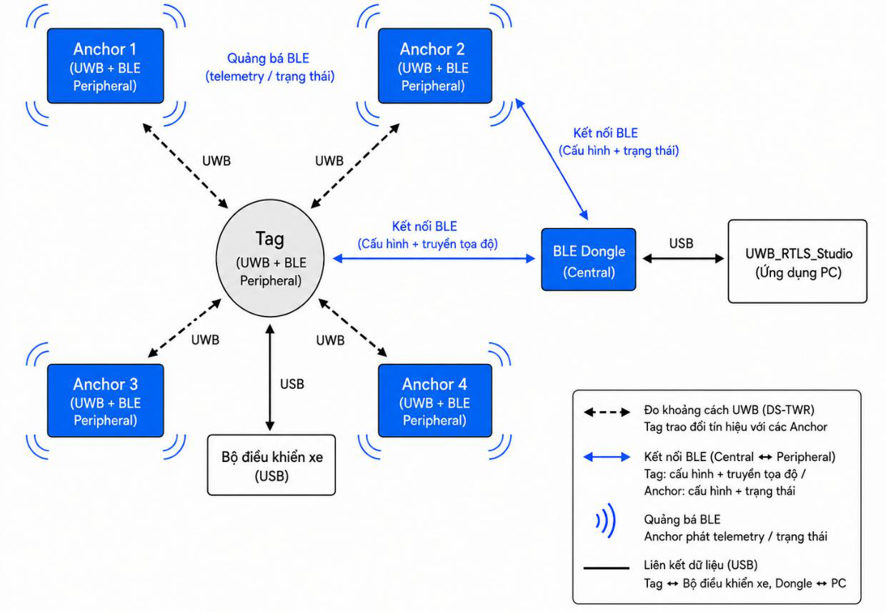
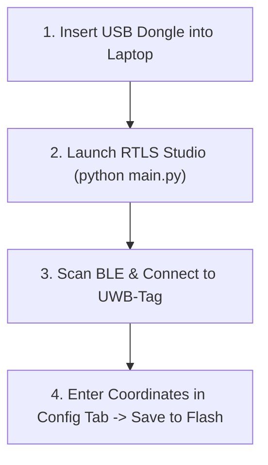

# System Deployment & Setup Guide

[Documentation Home](README.md) · [Getting Started](getting_started.md) · [Hardware Specs](hardware/schematics_and_specs.md) · [RTLS Studio Guide](software/rtls_studio_and_tools.md)

This guide provides a practical, step-by-step procedure for deploying the **UWB-RTLS** system in a room or warehouse in under 15 minutes.

---

## 1. System Deployment Topology

<div align="center">



</div>

| Entity | Hardware | Function in Deployment |
| --- | --- | --- |
| **Anchors (0..N)** | Anchor Boards + Tripods | Fixed UWB reference beacons mounted at room perimeter |
| **Tag Node** | Tag Board on AMR | Mobile unit performing onboard DS-TWR ranging & 8-State UKF fusion |
| **Gateway** | nRF52840 USB Dongle | Wireless BLE bridge streaming telemetry to laptop PC |
| **Host GUI** | RTLS Studio (PyQt6) | Desktop map monitoring, anchor coordinate configuration & logging |

---

## 2. Step 1: Configure Node Roles & Anchor IDs

### 2.1. Tag vs. Anchor Mode (User Button)

- **Hold User Button (~3s)**: Toggles node between **Tag Mode** and **Anchor Mode** (LED flashes 3 times, saves to Flash, and reboots).
- **Single Click**: Toggles active UWB ranging on/off.

### 2.2. Anchor ID Selection (3-position DIP Switch `SW1`)

Anchor IDs ($0 \dots 7$) are set via binary encoding: $\text{ID} = \text{SW1} \cdot 1 + \text{SW2} \cdot 2 + \text{SW3} \cdot 4$.

| Anchor ID | `0` | `1` | `2` | `3` | `4` | `5` | `6` | `7` |
| :---: | :---: | :---: | :---: | :---: | :---: | :---: | :---: | :---: |
| **Binary (`SW1..SW3`)** | `000` | `100` | `010` | `110` | `001` | `101` | `011` | `111` |
| **Switch States (1, 2, 3)** | OFF, OFF, OFF | ON, OFF, OFF | OFF, ON, OFF | ON, ON, OFF | OFF, OFF, ON | ON, OFF, ON | OFF, ON, ON | ON, ON, ON |

---

## 3. Step 2: Physical Mounting Guidelines

```
  Y (Room Depth)
  ▲
  │   [ Anchor 3 ] ───────────────────────── [ Anchor 2 ]
  │        │                                      │
  │        │       Convex Hull Operating Zone     │
  │        │          (Robot always inside)       │
  │        │                                      │
  │   [ Anchor 0 ] ───────────────────────── [ Anchor 1 ]
  └────────────────────────────────────────────────────────► X (Room Width)
```

| Rule | Requirement | Engineering Reason |
| --- | --- | --- |
| **Anchor Height** | $z_A = 1.8 \dots 2.2\text{ m}$ (Head height) | Keeps line-of-sight (LOS) above moving pedestrians ($\sim 1.65\text{ m}$). |
| **Height Difference** | $\Delta z = |z_A - z_T| \ge 1.0\text{ m}$ | Inclined RF rays clear low ground obstacles (pallets, desks). |
| **Metal Clearance** | $\ge 20 \dots 30\text{ cm}$ from metal/concrete | Prevents multipath reflections and antenna detuning ($+0.2..1.0\text{ m}$ error). |
| **Convex Hull** | Robot strictly inside anchor polygon | Prevents exponential GDOP geometric precision degradation. |

---

## 4. Step 3: Measure Anchor Coordinates (Surveying)

Measure the 3D coordinates $(X, Y, Z)$ of all Anchors relative to your defined global room coordinate frame $\{G\}$ using a laser distance meter:

### Example Room Setup ($8.0\text{ m} \times 5.0\text{ m}$)

| Anchor Node | X (Width) | Y (Depth) | Z (Height) | Placement Position |
| :---: | :---: | :---: | :---: | --- |
| **Anchor 0** | `1.00 m` | `1.00 m` | `2.00 m` | Front-left area |
| **Anchor 1** | `7.00 m` | `1.00 m` | `2.00 m` | Front-right area |
| **Anchor 2** | `7.00 m` | `4.50 m` | `2.00 m` | Back-right area |
| **Anchor 3** | `1.00 m` | `4.50 m` | `2.00 m` | Back-left area |

---

## 5. Step 4: Mount Tag on Robot & Connect USB

1. **Mount Tag Board**: Secure horizontally on top of the robot chassis ($z_{\text{tag}} \approx 0.3 \dots 0.5\text{ m}$) using plastic standoffs ($>10\text{ cm}$ clearance from metal plates).
2. **Robot Interface**: Connect USB Type-C to the robot computer (`/dev/ttyACM0` on Linux) for real-time $10\text{ Hz}$ pose stream (`px, py, vx, vy, yaw`).

---

## 6. Step 5: Commission via RTLS Studio



1. Insert nRF52840 USB Dongle into laptop.
2. Launch RTLS Studio:
   ```powershell
   cd software/uwb_rtls_studio
   .\venv\Scripts\Activate.ps1
   python main.py
   ```
3. Click **Scan BLE** $\rightarrow$ Connect to **UWB-Tag**.
4. Go to **Tab 3: Config** $\rightarrow$ Fill in $(X, Y, Z)$ coordinates $\rightarrow$ Click **Save to Flash**.

---

## 7. Step 6: Live Verification & Testing

1. Go to **Tab 2: Live Tracking** $\rightarrow$ Click **Start Ranging**.
2. Verify 4 blue anchor dots and red tag marker appear on the 2D map.
3. Drive robot $2\text{ meters}$ forward $\rightarrow$ Verify marker moves $2\text{ meters}$ on screen with error $<\pm 10\text{ cm}$.

---

## 8. Troubleshooting

| Symptom | Root Cause | Solution |
| --- | --- | --- |
| **No distance to Anchor 2** | Wrong DIP switch or unpowered. | Set DIP switch (`SW2 = ON`), verify LED blinking. |
| **Node is in Anchor mode** | Board was set to Anchor previously. | Hold User Button 3s until LED flashes 3 times to switch to Tag mode. |
| **Position is flipped** | $X$ and $Y$ coordinates swapped. | Double check Anchor 1 vs Anchor 3 coordinates in Config tab. |
| **Position jumps / large error** | Anchor mounted directly on metal. | Move Anchor $\ge 20\text{ cm}$ away from metal frames or concrete walls. |
