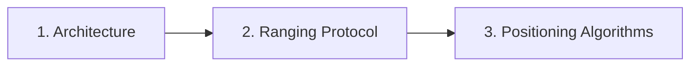

# Firmware Documentation Guide

[Documentation Home](../README.md) · [Getting Started](../getting_started.md)

This section details the embedded firmware running on the STM32F411 microcontrollers, from low-level hardware abstraction up to real-time positioning algorithms and sensor fusion.

---

## 1. Reading Order



1. **[Embedded Firmware Architecture](architecture.md)**
   - Role selection (Tag vs. Anchor via DIP switch).
   - Layered architecture (HAL $\rightarrow$ BSP $\rightarrow$ Middleware $\rightarrow$ Services $\rightarrow$ App).
   - FreeRTOS runtime task model and inter-task communication.

2. **[UWB Ranging Protocol](ranging_protocol.md)**
   - Asymmetric Double-Sided Two-Way Ranging (DS-TWR) message exchange.
   - TDMA superframe slot timing and multi-Anchor scheduling.
   - Outlier detection and timestamp arithmetic.

3. **[Embedded Positioning Algorithms](positioning_algorithms.md)**
   - Spatial Mahalanobis innovation prefiltering.
   - Robust Huber weighting and WGDOP Anchor triplet selection.
   - 8-State Unscented Kalman Filter (UKF) with 6-DOF IMU sensor fusion.

---

## 2. Architecture at a Glance

```
Fixed Anchors (0..N)
      ↕  UWB DS-TWR (10 Hz TDMA)
Mobile Robot Tag ──► Onboard 8-State UKF ──► USB CDC ──► Robot Controller
      ↕
BLE Node Bridge ──► BLE 5.0 ──► USB Dongle Gateway ──► RTLS Studio GUI
```

> **Core Principle:** Positioning calculations execute 100% onboard the Tag's STM32 MCU. Desktop tools and BLE gateways are strictly used for live visualization and configuration.
