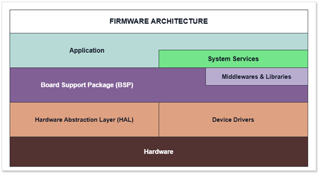

# Embedded Firmware Architecture

[Documentation home](../README.md) | [Firmware guide](README.md) | [Ranging protocol](ranging_protocol.md)

One STM32 firmware image supports both Tag and Anchor roles. Configuration selects the runtime behavior; hardware access and platform services remain shared.

## Runtime Roles

| Concern | Tag | Anchor |
|---|---|---|
| UWB | Initiates scheduled DS-TWR exchanges | Responds to DS-TWR exchanges |
| Positioning | Runs preprocessing, Anchor selection and UKF | Disabled |
| IMU | Supplies UKF prediction data | Platform service only |
| Communication | Commands and positioning telemetry | Configuration and status |

## Firmware Structure

```text
firmware/uwb/
|-- app/                  Tag and Anchor application state machines
|-- sys/                  Ranging, fusion, configuration, logging and power services
|-- middlewares/          TDMA, filters, trilateration and reusable state machines
|-- bsp/                  Board-level UWB, IMU, Flash, battery and I/O access
|-- deca/                 DW1000 driver adaptation
|-- Drivers/              STM32 HAL and CMSIS
|-- Middlewares/          FreeRTOS and third-party libraries
|-- USB_DEVICE/           USB CDC device stack
`-- Core/
    |-- Src/freertos.c    Tasks, queues, semaphores and mutexes
    `-- Inc/              Shared RTOS handles and application interfaces
```

Role logic stays in `app/`; system workflows stay in `sys/`; hardware access stays behind `bsp/`. This is the practical dependency boundary represented by thesis Figure 4.3.

<details>
<summary><strong>Thesis Figure 4.3: firmware layers</strong></summary>



</details>

## FreeRTOS Execution Architecture

The firmware uses a **preemptive, priority-based scheduler** on a single-core STM32F411. Tasks do not execute in parallel. The highest-priority task in the Ready state owns the CPU; queues, semaphores and delays move inactive tasks to the Blocked state.

```text
Higher urgency
|
|-- Realtime       UwbRanging
|-- High           SensorFusion
|-- Normal         Network
|-- BelowNormal    SysMonitoring
`-- Low
    |-- FlashStorage
    |-- IO
    `-- PM
Lower urgency
```

This ordering protects DS-TWR deadlines first, then positioning computation. Communication, monitoring, storage and power services run when the real-time path is blocked.

### Task Responsibilities

| Task | Priority | Stack | Activation | Responsibility |
|---|---:|---:|---|---|
| `UwbRanging` | Realtime | 6144 B | DW1000 semaphore or dynamic ranging deadline | Dispatches the DW1000 ISR work and advances the Tag/Anchor state machine |
| `SensorFusion` | High | 8192 B | Tag only; waits up to 20 ms for a UWB frame | Reads IMU data, predicts the UKF, preprocesses ranges, selects Anchors and performs the range update |
| `Network` | Normal | 4096 B | Service loop with 2 ms delay | Processes commands, serial transport and BLE peripheral service |
| `SysMonitoring` | BelowNormal | 2048 B | Every 30 s | Samples CPU, heap and task stack health, then publishes RTOS telemetry |
| `FlashStorage` | Low | 1536 B | Every 2 s | Flushes buffered logs to Flash when Flash logging is enabled |
| `IO` | Low | 1536 B | Button semaphore or 100 ms timeout | Handles button events, LED timing, ranging toggle and role-change reboot |
| `PM` | Low | 2560 B | Every 100 ms | Runs battery/power policy and uses SPI only when ranging is idle |

### Real-Time Ranging Path

```text
DW1000 EXTI interrupt
`-- release g_uwb_isr_sem
    `-- UwbRanging wakes at Realtime priority
        |-- lock g_spi1_mutex
        |-- dispatch DW1000 event
        |-- run Tag or Anchor state machine
        |-- unlock g_spi1_mutex
        `-- block until the next interrupt or protocol deadline
```

The hardware interrupt only signals work. Protocol processing runs in task context, where the state machine can safely use drivers, logging and RTOS services. A dynamic timeout also wakes `UwbRanging` when the next protocol deadline arrives without an interrupt.

### Tag Positioning Path

```text
UwbRanging / app_tag
`-- completed ranging frame
    `-- g_uwb_distance_queue [4 frames]
        `-- SensorFusion
            |-- discard queued stale frames; retain the newest frame
            |-- read IMU sample
            |   `-- g_imu_data_queue [8 samples]
            |       `-- drain samples and retain the newest for prediction
            |-- UKF prediction
            |-- range projection and prefilter
            |-- robust weights and Anchor-triplet selection
            |-- trilateration for initialization/diagnostics
            |-- UKF update from three ranges
            `-- publish fusion telemetry
```

`SensorFusion` exits immediately on an Anchor. Therefore Anchor firmware keeps the ranging, network, monitoring, I/O and power tasks but does not allocate runtime CPU to the positioning loop.

### Synchronization and Resource Ownership

| RTOS object | Producer / requester | Consumer / owner | Contract |
|---|---|---|---|
| `g_uwb_isr_sem` | DW1000 EXTI, ranging-control requests and IO ranging toggle | `UwbRanging` | Transfers UWB events into task context without performing long work in the ISR |
| `g_io_btn_sem` | Button EXTI | `IO` | Wakes button processing immediately; 100 ms timeout also services LED timing |
| `g_uwb_distance_queue` | `app_tag` | `SensorFusion` | Capacity 4; transfers complete range frames without sharing a mutable frame buffer |
| `g_imu_data_queue` | Sensor-fusion IMU acquisition | UKF prediction | Capacity 8; decouples sampling from prediction and allows stale samples to be drained |
| `g_spi1_mutex` | UWB, IMU and PM code | Current lock holder | Serializes the shared SPI bus; UWB holds it only around DW1000 dispatch |
| `g_logger_mutex` | Any logging task | Logger | Protects the shared RAM logging state |
| RAM log buffer | Logger | `FlashStorage` | Defers slow Flash writes away from the UWB timing path |

### Scheduling Semantics

| Situation | Scheduler behavior | Design consequence |
|---|---|---|
| DW1000 interrupt arrives | `UwbRanging` becomes Ready and preempts lower-priority work | Ranging deadlines take precedence over fusion and services |
| No UWB event is pending | `UwbRanging` blocks on its semaphore with a deadline timeout | CPU is available to other tasks |
| Several UWB frames accumulate | `SensorFusion` drains the queue and processes only the newest | Bounds latency instead of replaying obsolete positions |
| SPI is busy | IMU/UWB waits on the mutex; PM uses a non-blocking attempt | Power telemetry cannot delay active ranging |
| Log data is produced | Data remains in RAM until the background flush | Flash latency is removed from the critical UWB path |

### Timing: Thesis Versus Current Firmware

| Item | Thesis Table 4.1 | Current implementation |
|---|---|---|
| `UwbRanging` | UWB semaphore or dynamic timeout | Same |
| `SensorFusion` | 20 ms cycle plus queue data | Queue wait up to 20 ms, processing, then 20 ms delay |
| `Network` | 5 ms periodic service | 2 ms delay |
| `SysMonitoring` | 30 s | Same |
| `FlashStorage` | 2 s | Same |
| `PM` | 100 ms | Same |
| `IO` | Button semaphore and 100 ms timeout | Same |

The `SensorFusion` loop is **not a guaranteed 50 Hz periodic task**. Its iteration time includes queue blocking, computation and the final 20 ms delay. SystemView measurements must report active execution separately from Blocked time.

## Source Traceability

| Concern | Source |
|---|---|
| Tasks, priorities and RTOS objects | `firmware/uwb/Core/Src/freertos.c` |
| ISR-to-task UWB signaling | `firmware/uwb/bsp/bsp_uwb.c` |
| Completed range-frame producer | `firmware/uwb/app/app_tag.c` |
| IMU queue and UKF ownership | `firmware/uwb/sys/sys_sensor_fusion.c` |
| Button ISR signaling | `firmware/uwb/bsp/bsp_io.c` |
| Thesis design | Chapter 4.2.2.2 and Table 4.1 in [the thesis](../thesis/thesis_final.pdf) |

## Continue Reading

- [UWB ranging protocol](ranging_protocol.md)
- [Embedded positioning algorithms](positioning_algorithms.md)
