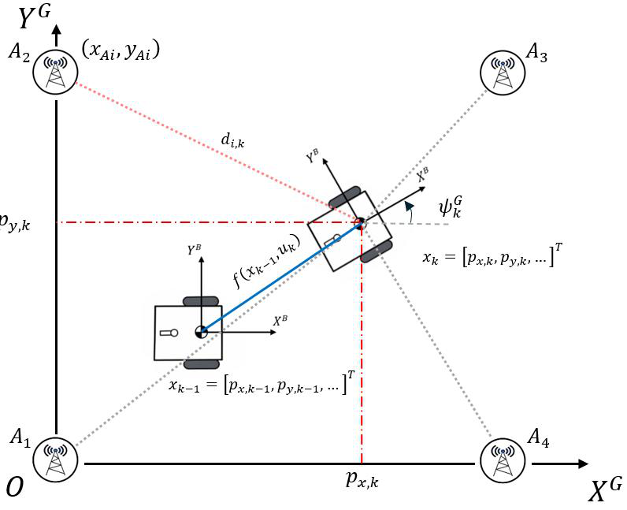
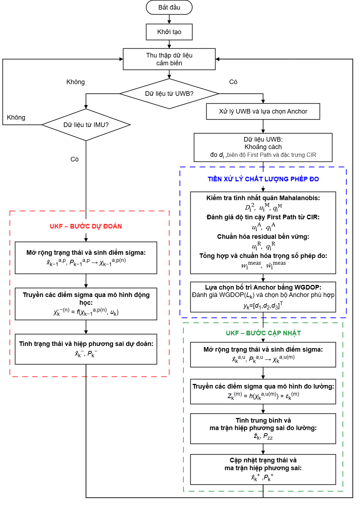
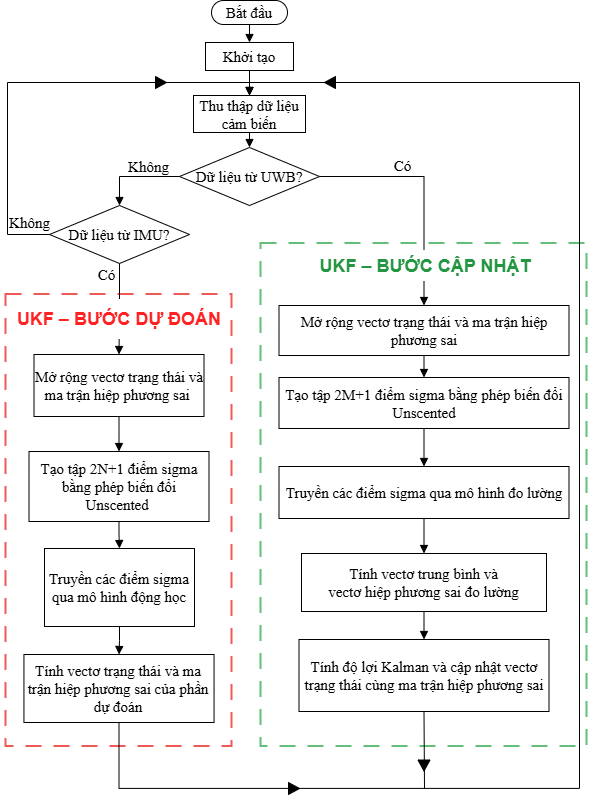
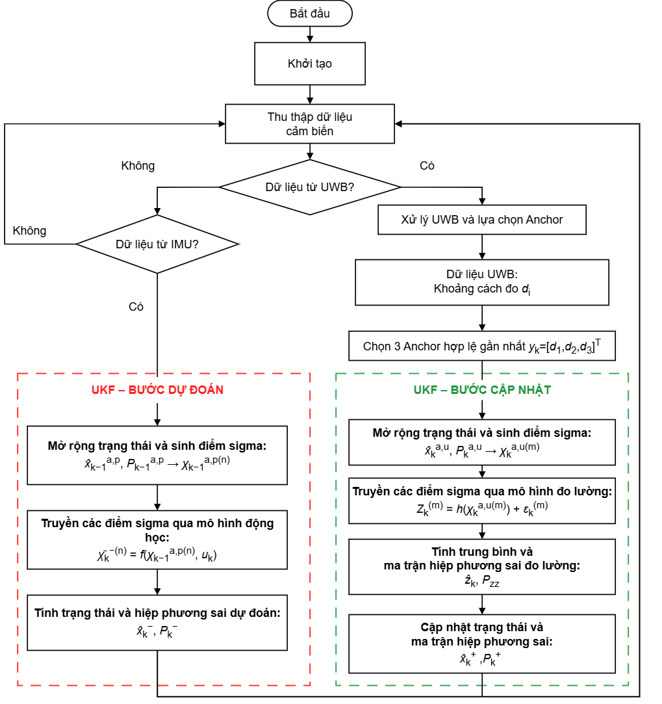

# Embedded Positioning Algorithm

[Firmware guide](README.md) | [Architecture](architecture.md) | Previous: [Ranging](ranging_protocol.md)

The positioning system contains two separate algorithmic modules:

| Module | Responsibility |
|---|---|
| **UKF State Estimator** | Predict and update the Tag motion state |
| **UWB Measurement Front End** | Validate, filter, weight and select UWB ranges |

The front end does not estimate the final pose. The UKF does not decide which Anchors are trustworthy. Their interface is a selected three-range vector and its covariance.

## 1. Positioning Problem

The Tag moves in the global frame $\{G\}$. IMU data is measured in the body frame $\{B\}$. Fixed Anchors constrain the Tag position through UWB ranges.

| Input | Information provided |
|---|---|
| Acceleration $\mathbf a^B$ | Short-term velocity and position change |
| Angular rate $\omega_z^B$ | Short-term yaw change |
| Anchor coordinate $\mathbf a_i$ | Fixed point in the global map |
| UWB range $d_i$ | Distance from the Tag to Anchor $i$ |

Yaw is zero along positive $X^G$ and increases counter-clockwise.

## 2. Mathematical Model

### 2.1 State vector

$$
\boxed{
\mathbf x=
\begin{bmatrix}
p_x&p_y&v_x&v_y&\theta&b_{ax}&b_{ay}&b_{gz}
\end{bmatrix}^{\mathsf T}
}
$$

| State | Meaning |
|---|---|
| $\mathbf p^G=[p_x,p_y]^{\mathsf T}$ | Global position |
| $\mathbf v^G=[v_x,v_y]^{\mathsf T}$ | Global velocity |
| $\theta$ | Global yaw |
| $\mathbf b_a=[b_{ax},b_{ay}]^{\mathsf T}$ | Accelerometer bias |
| $b_{gz}$ | Z-axis gyroscope bias |

### 2.2 Motion model

The body-to-global planar rotation is

$$
\mathbf R_B^G(\theta)=
\begin{bmatrix}
\cos\theta&-\sin\theta\\
\sin\theta& \cos\theta
\end{bmatrix}.
$$

The continuous process model is

$$
\boxed{
\begin{aligned}
\dot{\mathbf p}^{G} &= \mathbf v^{G},\\
\dot{\mathbf v}^{G} &=
\mathbf R_B^G(\theta)
\left(\mathbf a^B-\mathbf b_a-\mathbf n_a\right),\\
\dot\theta &=
\omega_z^B-b_{gz}-n_g,\\
\dot{\mathbf b}_a &= \mathbf w_{ba},\\
\dot b_{gz} &= w_{bg}.
\end{aligned}
}
$$

The IMU drives the motion state. Bias states model slowly changing offsets; process-noise terms represent unobserved motion and bias variation.

### 2.3 UWB observation model

For Anchor $i$ at $\mathbf a_i=[a_{x,i},a_{y,i}]^{\mathsf T}$:

$$
\hat d_i=h_i(\mathbf x)
=
\left\lVert
\mathbf p^G-\mathbf a_i
\right\rVert_2.
$$

The physical measurement is

$$
\boxed{
d_i=
\left\lVert
\mathbf p^G-\mathbf a_i
\right\rVert_2
+b_i^{\mathrm{NLOS}}
+\varepsilon_i
}
$$

$\varepsilon_i$ is random range noise. $b_i^{\mathrm{NLOS}}$ represents positive bias caused by obstruction or multipath. It is treated as a measurement disturbance, not an additional UKF state.

### 2.4 Noise model

Prediction uses

$$
\mathbf Q=
\operatorname{diag}
\left(0.04,\;0.04,\;10^{-10}\right).
$$

The range update uses

$$
\mathbf R_k=
\operatorname{diag}
\left(R_{1,k},R_{2,k},R_{3,k}\right).
$$

The UWB front end determines each $R_{i,k}$ from measurement quality.

## 3. Algorithm Interfaces

| Module | Inputs | Outputs |
|---|---|---|
| UKF prediction | Previous posterior, IMU sample, $\mathbf Q$ | Predicted state $\mathbf x_k^-$ and covariance $\mathbf P_k^-$ |
| UWB front end | Raw range frame, Anchor layout, predicted position/covariance | Selected Anchors, $\mathbf d_k$, $\mathbf R_k$ |
| UKF update | $\mathbf x_k^-$, $\mathbf P_k^-$, selected Anchors, $\mathbf d_k$, $\mathbf R_k$ | Posterior $\mathbf x_k^+$ and $\mathbf P_k^+$ |

The predicted state is exposed to the front end only as a reference for range consistency. The selected ranges and covariance are returned to the UKF as one measurement package.

## Part I - UKF State Estimator

### 4. Unscented Transform

The UKF propagates deterministic sigma points through nonlinear models. For augmented dimension $L$:

$$
\lambda=\alpha^2(L+\kappa)-L,
\qquad
\alpha=1,\quad\beta=2,\quad\kappa=0.
$$

From augmented mean $\mathbf x^a$ and covariance $\mathbf P^a$:

$$
\begin{aligned}
\boldsymbol\chi_0^a &= \mathbf x^a,\\
\boldsymbol\chi_j^a &=
\mathbf x^a+
\left[\sqrt{(L+\lambda)\mathbf P^a}\right]_j,\\
\boldsymbol\chi_{j+L}^a &=
\mathbf x^a-
\left[\sqrt{(L+\lambda)\mathbf P^a}\right]_j.
\end{aligned}
$$

The sigma-point weights are

$$
\begin{aligned}
W_0^{(m)} &= \frac{\lambda}{L+\lambda},\\
W_0^{(c)} &= W_0^{(m)}+1-\alpha^2+\beta,\\
W_j^{(m)} &= W_j^{(c)}
=\frac{1}{2(L+\lambda)}.
\end{aligned}
$$

Both UKF operations augment eight states with three noise variables. Therefore $L=11$ and each transform uses $2L+1=23$ sigma points.

### 5. UKF Initialization

The range-only estimator needs an initial Cartesian position.

| Quantity | Initial value |
|---|---|
| Position | Coordinate-wise median of 20 trilateration results after discarding 10 early results |
| Selected ranges | Median of the corresponding 20 accepted triplets |
| Velocity | $\mathbf v_0=\mathbf 0$ |
| Yaw | Cached initial yaw |
| IMU biases | IMU calibration and conditioning result |

The initial covariance is

$$
\mathbf P_0=
\operatorname{diag}
\left(
0.4,\;0.4,\;0.1,\;0.1,\;
10^{-10},\;0.001,\;0.001,\;10^{-10}
\right).
$$

Three-range initialization solves

$$
\left\lVert
\mathbf p-\mathbf a_i
\right\rVert_2^2=d_i^2,
\qquad i\in\{1,2,3\}.
$$

Subtracting the first circle equation gives the linear system

$$
\underbrace{
2\begin{bmatrix}
(\mathbf a_2-\mathbf a_1)^{\mathsf T}\\
(\mathbf a_3-\mathbf a_1)^{\mathsf T}
\end{bmatrix}}_{\mathbf A}
\mathbf p
=
\underbrace{
\begin{bmatrix}
d_1^2-d_2^2+\lVert\mathbf a_2\rVert^2-\lVert\mathbf a_1\rVert^2\\
d_1^2-d_3^2+\lVert\mathbf a_3\rVert^2-\lVert\mathbf a_1\rVert^2
\end{bmatrix}}_{\mathbf b}.
$$

When $\mathbf A$ is nonsingular, $\mathbf p=\mathbf A^{-1}\mathbf b$. After initialization, trilateration is used only as a geometry and diagnostic probe.

### 6. UKF Prediction

#### 6.1 Discrete motion

The implementation averages consecutive IMU samples:

$$
\begin{aligned}
\bar\omega_z &=
\frac{\omega_{z,k-1}+\omega_{z,k}}{2}-b_{gz},\\
\theta_k^- &=
\operatorname{wrap}
\left(\theta_{k-1}+\bar\omega_z\Delta t\right),\\
\mathbf a_{k-1}^{G} &=
\mathbf R_B^G(\theta_{k-1})
\left(\mathbf a_{k-1}^{B}-\mathbf b_a\right),\\
\mathbf a_k^{G} &=
\mathbf R_B^G(\theta_k^-)
\left(\mathbf a_k^{B}-\mathbf b_a\right),\\
\bar{\mathbf a}^{G} &=
\frac{\mathbf a_{k-1}^{G}+\mathbf a_k^{G}}{2},\\
\mathbf p_k^- &=
\mathbf p_{k-1}
+\mathbf v_{k-1}\Delta t
+\frac{1}{2}\bar{\mathbf a}^{G}\Delta t^2,\\
\mathbf v_k^- &=
\mathbf v_{k-1}
+\bar{\mathbf a}^{G}\Delta t.
\end{aligned}
$$

#### 6.2 Sigma-point propagation

Each augmented sigma point passes through the motion model:

$$
\boldsymbol\chi_{k,j}^{-}
=
f\left(
\boldsymbol\chi_{k-1,j}^{+},
\mathbf u_k,
\mathbf n_{k,j}
\right).
$$

The predicted state and covariance are

$$
\begin{aligned}
\hat{\mathbf x}_k^- &=
\sum_j W_j^{(m)}
\boldsymbol\chi_{k,j}^-,\\
\mathbf P_k^- &=
\sum_j W_j^{(c)}
\left(
\boldsymbol\chi_{k,j}^--\hat{\mathbf x}_k^-
\right)
\left(
\boldsymbol\chi_{k,j}^--\hat{\mathbf x}_k^-
\right)^{\mathsf T}.
\end{aligned}
$$

#### 6.3 Stationary constraint

After more than 10 stationary samples, ZUPT constrains velocity:

$$
\mathbf v_k^-\leftarrow\mathbf 0,
\qquad
P_{v_xv_x}=P_{v_yv_y}=10^{-4}.
$$

ZUPT limits drift but does not generate a position measurement.

### 7. UKF Range Update

The UKF receives one measurement package from the UWB front end:

$$
\mathbf d_k=
\begin{bmatrix}
d_1&d_2&d_3
\end{bmatrix}^{\mathsf T},
\qquad
\mathbf R_k=
\operatorname{diag}
\left(R_1,R_2,R_3\right).
$$

For update sigma point $j$ and selected Anchor $i$:

$$
Z_{i,j}=
\left\lVert
\boldsymbol\chi_{\mathbf p,j}
-\mathbf a_i
\right\rVert_2+n_{i,j}.
$$

The predicted measurement and covariance are

$$
\begin{aligned}
\hat{\mathbf d}_k &=
\sum_j W_j^{(m)}\mathbf Z_j,\\
\mathbf P_{dd} &=
\sum_j W_j^{(c)}
\left(
\mathbf Z_j-\hat{\mathbf d}_k
\right)
\left(
\mathbf Z_j-\hat{\mathbf d}_k
\right)^{\mathsf T},\\
\mathbf P_{xd} &=
\sum_j W_j^{(c)}
\left(
\boldsymbol\chi_j-\hat{\mathbf x}_k^-
\right)
\left(
\mathbf Z_j-\hat{\mathbf d}_k
\right)^{\mathsf T}.
\end{aligned}
$$

The posterior update is

$$
\boxed{
\begin{aligned}
\mathbf K_k &=
\mathbf P_{xd}\mathbf P_{dd}^{-1},\\
\mathbf x_k^+ &=
\mathbf x_k^-
+\mathbf K_k
\left(
\mathbf d_k-\hat{\mathbf d}_k
\right),\\
\mathbf P_k^+ &=
\mathbf P_k^-
-\mathbf K_k
\mathbf P_{xd}^{\mathsf T}.
\end{aligned}
}
$$

Covariance symmetry, diagonal floors and innovation jitter protect the single-precision matrix operations.

The range function directly observes position. Velocity, yaw and bias can change only through cross-covariance with position; yaw propagation itself comes from the gyroscope.

## Part II - UWB Measurement Front End

### 8. Range Validation and Projection

The front end first creates a compact set of unique planar candidates.

| Check | Candidate is rejected when |
|---|---|
| Frame validity | Anchor result is not marked valid |
| Anchor identity | ID is outside the configured layout |
| Coordinate lookup | Anchor position is unavailable |
| Planar geometry | $d_{3D,i}^2<(a_{z,i}-z_{\mathrm{Tag}})^2$ |
| Duplicate detection | The Anchor already exists in the candidate set |

The slant range is projected as

$$
d_i=
\sqrt{
d_{3D,i}^{\,2}
-
\left(a_{z,i}-z_{\mathrm{Tag}}\right)^2
}.
$$

### 9. Spatial Consistency Prefilter

The front end receives predicted position $\mathbf p_k^-$ and position covariance $\mathbf P_{p,k}^-$ from the UKF.

#### 9.1 Innovation

$$
\nu_i=
d_i-
\left\lVert
\mathbf p_k^--\mathbf a_i
\right\rVert_2.
$$

The position Jacobian is

$$
\mathbf H_i=
\frac{1}{\hat d_i}
\begin{bmatrix}
p_x^--a_{x,i}&p_y^--a_{y,i}
\end{bmatrix}.
$$

Innovation variance and squared Mahalanobis distance are

$$
\begin{aligned}
S_i &=
\mathbf H_i
\mathbf P_{p,k}^-
\mathbf H_i^{\mathsf T}
+R_{\mathrm{gate}},\\
D_i^2 &=
\frac{\nu_i^2}
{\max(S_i,S_{\min})}.
\end{aligned}
$$

#### 9.2 Hysteresis

| Anchor state | Transition |
|---|---|
| Accepted | Reject when $D_i^2>6$ |
| Rejected | Recover when $D_i^2<5$ |
| Weak UKF reference | Skip gating when $\sqrt{P_{xx}+P_{yy}}>0.50\,\mathrm m$ |

Separate reject and recovery thresholds prevent state chatter.

#### 9.3 Controlled rescue

When fewer than three candidates remain, the least inconsistent rejected range may be restored only if

$$
D_i^2\le25
\qquad\text{and}\qquad
\text{reject streak}_i\ge2.
$$

The rescued flag remains attached to the range and forces conservative covariance at the module output.

### 10. Measurement Precision

Each accepted range receives

$$
\boxed{
w_i=
\frac{
q_i^M q_i^A q_i^R
}{
\sigma_i^2
}
}
$$

| Term | Evidence represented |
|---|---|
| $1/\sigma_i^2$ | Distance-dependent base precision |
| $q_i^M$ | Spatial consistency |
| $q_i^A$ | First-path radio confidence |
| $q_i^R$ | Robust frame residual |

#### 10.1 Common influence function

$$
q(u;c)=
\begin{cases}
1,&|u|\le c,\\
\max\left(0.10,\dfrac{c}{|u|}\right),&|u|>c.
\end{cases}
$$

#### 10.2 Range variance

$$
\bar\sigma_i=
\min\left(
\sqrt{0.10^2+(0.015d_i)^2},
0.35
\right).
$$

$$
\sigma_i^2=
\begin{cases}
\bar\sigma_i^2,&\text{normal range},\\
4\bar\sigma_i^2,&\text{rescued range}.
\end{cases}
$$

#### 10.3 Spatial influence

$$
q_i^M=
q\left(
\sqrt{D_i^2};
\sqrt{5}
\right).
$$

#### 10.4 First-path influence

For session confidence $c_i^{FP}\in[0,1]$:

$$
u_i^A=1-c_i^{FP},
\qquad
q_i^A=q(u_i^A;0.35).
$$

Missing radio-quality data uses a conservative deficit of $0.5$.

#### 10.5 Robust residual influence

Residual evidence requires a trusted reference and at least four candidates:

$$
r_i=
d_i-
\left\lVert
\mathbf p_{\mathrm{ref}}-\mathbf a_i
\right\rVert_2.
$$

$$
\begin{aligned}
\tilde r &=
\operatorname{median}(r_i),\\
\sigma_{\mathrm{MAD}} &=
1.4826
\operatorname{median}
\left(
|r_i-\tilde r|
\right),\\
u_i^R &=
\frac{
|r_i-\tilde r|
}{
\max(\sigma_{\mathrm{MAD}},\sigma_i)
},\\
q_i^R &= q(u_i^R;1.50).
\end{aligned}
$$

With fewer than four candidates, $q_i^R=1$.

### 11. Anchor-Triplet Selection

Every combination of three accepted Anchors is evaluated.

#### 11.1 Geometry gate

$$
g=
\frac{
\left|
(\mathbf a_B-\mathbf a_A)
\times
(\mathbf a_C-\mathbf a_A)
\right|
}{
\max\left(
\lVert\mathbf a_B-\mathbf a_A\rVert^2,
\lVert\mathbf a_C-\mathbf a_A\rVert^2,
\lVert\mathbf a_C-\mathbf a_B\rVert^2
\right)
}.
$$

A triplet is rejected when $g<0.15$.

#### 11.2 Weighted geometry

$$
\mathbf W=
\operatorname{diag}
\left(w_1,w_2,w_3\right),
\qquad
\mathbf C_p=
\left(
\mathbf H^{\mathsf T}\mathbf W\mathbf H
\right)^{-1}.
$$

$$
\operatorname{WGDOP}
=
\sqrt{
\operatorname{tr}
\left(\mathbf C_p\right)
}.
$$

Lower WGDOP means stronger geometry after range confidence is included.

#### 11.3 Residual score and switch hysteresis

For a trilaterated probe $\mathbf p_{\mathrm{probe}}$:

$$
e_{\mathrm{RMS}}
=
\sqrt{
\frac{1}{N}
\sum_{i=1}^{N}
\left(
\lVert
\mathbf p_{\mathrm{probe}}-\mathbf a_i
\rVert
-d_i
\right)^2
}.
$$

The composite score is

$$
J=
\operatorname{WGDOP}
+0.5e_{\mathrm{RMS}}.
$$

The previous triplet is retained when

$$
J_{\mathrm{previous}}
\le
1.10J_{\mathrm{best}}+0.02.
$$

### 12. Front-End Output Contract

The selected three ranges are converted into the exact package consumed by the UKF:

$$
\mathbf d_k=
\begin{bmatrix}
d_1&d_2&d_3
\end{bmatrix}^{\mathsf T}.
$$

$$
R_{ii}=
\begin{cases}
0.25,&\text{rescued Anchor},\\
\operatorname{clamp}
\left(
\dfrac{1}{w_i},
0.0025,
0.25
\right),
&\text{otherwise}.
\end{cases}
$$

| Output | Consumer |
|---|---|
| Three Anchor IDs and coordinates | UKF measurement function |
| Range vector $\mathbf d_k$ | UKF innovation |
| Covariance $\mathbf R_k$ | Augmented UKF measurement noise |
| Quality diagnostics | Telemetry and fault analysis |

## Part III - Runtime Integration

### 13. Execution Order

| Event | Module invoked | Result |
|---|---|---|
| IMU data available | UKF prediction | Refresh $\mathbf x_k^-$ and $\mathbf P_k^-$ |
| UWB frame available | UWB front end | Produce selected Anchors, $\mathbf d_k$ and $\mathbf R_k$ |
| Valid front-end package | UKF update | Produce $\mathbf x_k^+$ and $\mathbf P_k^+$ |
| No valid UWB package | No UKF update | Retain predict-only state |

This runtime order does not merge the two algorithms. The front end uses the latest UKF prior only as a statistical reference; the UKF receives only the final measurement package.

### 14. Result and Diagnostics

| Output group | Contents |
|---|---|
| Navigation | Position, velocity and yaw |
| Measurement quality | Accepted, rejected and rescued Anchors |
| Selection quality | Selected mask, WGDOP, geometry and residual |
| Filter health | Position covariance, update status and error counters |

SensorFusion is queue-driven. Queue blocking, computation and explicit delay are separate timing components; the loop is not a guaranteed fixed-rate 50 Hz task.

## Source Traceability

| Component | Firmware source |
|---|---|
| Runtime integration | firmware/uwb/Core/Src/freertos.c |
| UKF state estimator | firmware/uwb/sys/sys_sensor_fusion.c |
| Spatial prefilter | firmware/uwb/middlewares/mw_filter.c |
| Precision and Anchor selection | firmware/uwb/middlewares/mw_trilateration.c |
| Numerical parameters | firmware/uwb/sys/positioning_config.h |
