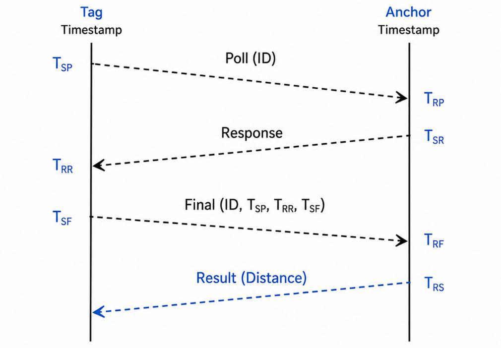
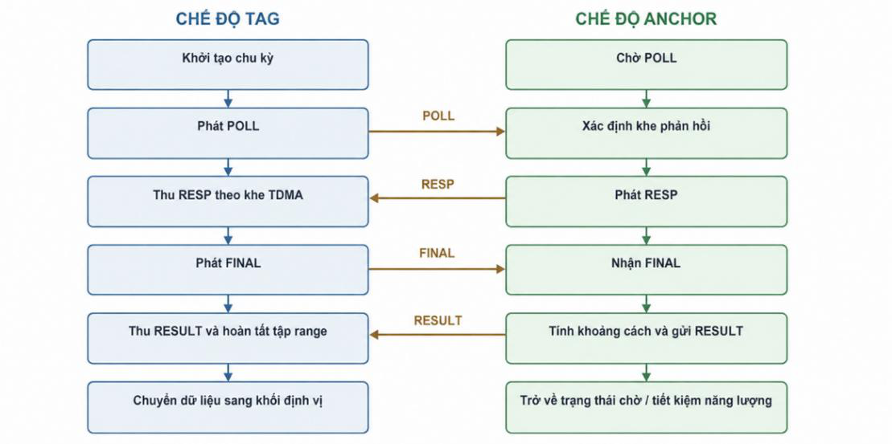
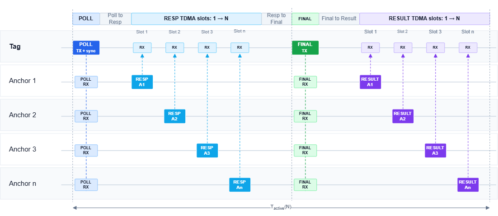
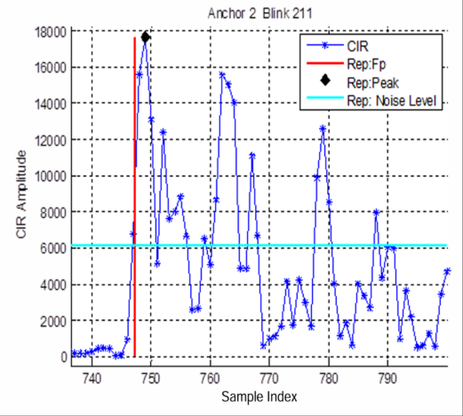
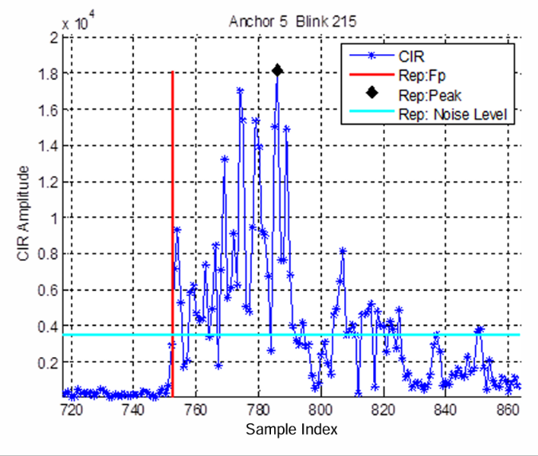

# UWB Ranging Protocol

[Firmware Guide](README.md) · [Architecture](architecture.md) · [Positioning Algorithms](positioning_algorithms.md)

The STM32 firmware uses asymmetric Double-Sided Two-Way Ranging (DS-TWR) over the Decawave DW1000 transceiver. A Tag initiates an RF exchange and an Anchor returns timestamp metadata to calculate the flight time while cancelling out clock-drift errors.

---

## 1. Message Exchange & Timestamp Mechanics

One successful ranging exchange executes a 4-message transaction:

1. `POLL`: The Tag broadcasts a ranging request.
2. `RESP`: The addressed Anchor acknowledges with its arrival timestamp.
3. `FINAL`: The Tag transmits round-trip timestamps for the first two legs.
4. `RESULT`: The Anchor computes the distance and transmits the calculated result and channel metrics back to the Tag.

The protocol captures six 40-bit DW1000 hardware timestamps:
- Tag timestamps: `poll_tx`, `resp_rx`, `final_tx`
- Anchor timestamps: `poll_rx`, `resp_tx`, `final_rx`

From these timestamps, round-trip intervals $R_a, R_b$ and reply intervals $D_a, D_b$ are computed. The asymmetric time-of-flight formulation is:

$$\text{ToF} = \frac{R_a \times R_b - D_a \times D_b}{R_a + R_b + D_a + D_b}$$

$$\text{Distance} = \text{ToF} \times c$$

---

## 2. Runtime State Flow

The Tag state machine schedules target Anchors sequentially, transmits `POLL`, listens for `RESP`, dispatches `FINAL`, and parses `RESULT`.

Unexpected sequence numbers, CRC mismatches, timestamp overflow errors, or reply timeouts terminate only the active transaction. The TDMA scheduler immediately advances to the next slot rather than stalling the whole cycle.

---

## 3. TDMA Timing & Superframe Budget

The multi-Anchor scheduler is governed by the following timing constants:

| Parameter | Duration | Purpose |
| --- | :---: | --- |
| **Slot Duration** | $2,000\,\mu\text{s}$ | Active message exchange window per Anchor |
| **Poll-to-Response Delay** | $2,500\,\mu\text{s}$ | Anchor turnaround time |
| **Response-to-Final Delay** | $5,000\,\mu\text{s}$ | Tag final packet compilation delay |
| **Final-to-Result Delay** | $6,000\,\mu\text{s}$ | Anchor ToF math & transmission delay |
| **Superframe Guard** | $1,000\,\mu\text{s}$ | Inter-frame settling guard |

The total superframe period for $N$ Anchors is parameterized as:

$$T_{\text{superframe}} = 17,500\,\mu\text{s} + 6,000\,\mu\text{s} \times N_{\text{anchors}}$$

- **4 Anchors**: $41.5\text{ ms}$
- **6 Anchors**: $53.5\text{ ms}$
- **8 Anchors**: $65.5\text{ ms}$

---

## 4. Zones and Anchor Capacity

- **Zone Configuration**: Binds a Tag to a designated Anchor constellation.
- **Constellation Capacity**: Current zone messages support up to 6 simultaneous Anchors per zone.

---

## 5. Channel Impulse Response (CIR) & Signal Quality

Each `RESULT` packet carries physical RF channel quality metrics derived from the DW1000 Channel Impulse Response (CIR):

| Line-of-Sight (LOS) CIR Sample | Non-Line-of-Sight (NLOS) CIR Sample |
| :---: | :---: |
|  |  |

- **First Path Signal Power (FPL)**: Signal level of the direct line-of-sight path.
- **Receive Signal Power (RXL)**: Total integrated RF energy.
- **Power Differential $(\Delta P = RXL - FPL)$**: Primary indicator used by the positioning prefilter to detect Non-Line-of-Sight (NLOS) and multipath obstruction.

---

## 6. Failure & Partial-Data Recovery

- Timed-out Anchors are dropped from the active measurement array for the current frame.
- The pipeline proceeds to trilateration and UKF fusion whenever at least 3 valid Anchor ranges are collected.

---

## 7. Next Steps

Proceed to **[Embedded Positioning Algorithms](positioning_algorithms.md)** to see how raw ranges are prefiltered and fused with IMU measurements.
