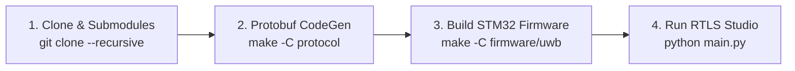

# UWB-RTLS Getting Started & Environment Setup Guide

[Documentation Home](README.md) · [Firmware Architecture](firmware/architecture.md)

This guide provides a high-level, step-by-step walkthrough for configuring build toolchains, submodules, and software environments for the **UWB-RTLS** repository.

---

## Table of Contents

1. [Environment & Version Matrix](#1-environment--version-matrix)
2. [High-Level Setup Flow](#2-high-level-setup-flow)
3. [Step 1: Clone Repository & Submodules](#3-step-1-clone-repository--submodules)
4. [Step 2: Generate Protocol Buffers Code](#4-step-2-generate-protocol-buffers-code)
5. [Step 3: Toolchain Setup & STM32 Firmware Build](#5-step-3-toolchain-setup--stm32-firmware-build)
6. [Step 4: Build BLE Firmware](#6-step-4-build-ble-firmware)
7. [Step 5: Setup Virtual Environment & Run RTLS Studio](#7-step-5-setup-virtual-environment--run-rtls-studio)
8. [Troubleshooting](#8-troubleshooting)

---

## 1. Environment & Version Matrix

| Ecosystem Layer | Tool / Component | Verified Version | Purpose |
| --- | --- | --- | --- |
| **IDE / Toolchain** | STM32CubeIDE | `v1.19.0` (or `v1.10+`) | Core IDE & bundled compiler plugins |
| **Arm Compiler** | `arm-none-eabi-gcc` | `v10.3.1` / `v13.3.rel1` | STM32F411 Cortex-M4F compiler |
| **Build Utility** | GNU Make | `v4.4.1` (ST Plugin) | Firmware & Protobuf build automation |
| **Wireless SDK** | Nordic nRF5 SDK | `v17.1.0` | BLE central/peripheral firmware |
| **Host Runtime** | Python | `v3.10+` (v3.12 verified) | Desktop GUI & Protocol generator |

---

## 2. High-Level Setup Flow



---

## 3. Step 1: Clone Repository & Submodules

This repository uses submodules for `protocol/nanopb` (embedded C Protobuf compiler) and `docs` (thesis documentation).

```bash
git clone --recursive https://github.com/phuongmt08/uwb-rtls.git
cd uwb-rtls
```

> **Note:** If you already cloned without `--recursive`, run `git submodule update --init --recursive` to fetch missing submodules.

---

## 4. Step 2: Generate Protocol Buffers Code

Generate binary serialization bindings for C firmware and Python desktop software:

```powershell
make -C protocol
```

- **C Firmware Headers**: `protocol/protos/*.pb.c` and `*.pb.h`
- **Python Host Module**: `software/common/protocol_pb2.py`

---

## 5. Step 3: Toolchain Setup & STM32 Firmware Build

> **Note:** Both `arm-none-eabi-gcc.exe` and `make.exe` are bundled inside your **STM32CubeIDE** installation plugins. No standalone downloads are required.

### 5.1. Option A: Build via Command Line (PowerShell)

Set your PowerShell session paths to point to STM32CubeIDE plugins:

```powershell
# 1. Set GCC_PATH to STM32CubeIDE GNU Tools plugin
$env:GCC_PATH = "C:\ST\STM32CubeIDE_1.19.0\STM32CubeIDE\plugins\com.st.stm32cube.ide.mcu.externaltools.gnu-tools-for-stm32.13.3.rel1.win32_1.0.0.202411081344\tools\bin"

# 2. Add GCC and Make plugins to session PATH
$env:PATH = "$env:GCC_PATH;C:\ST\STM32CubeIDE_1.19.0\STM32CubeIDE\plugins\com.st.stm32cube.ide.mcu.externaltools.make.win32_2.2.0.202409170845\tools\bin;" + $env:PATH

# 3. Build firmware
make -C firmware/uwb -j8
```

*Build Artifacts (`firmware/uwb/build/`):* `uwb-rtls.elf`, `uwb-rtls.hex`, `uwb-rtls.bin`

### 5.2. Option B: Build inside STM32CubeIDE GUI

1. Open **STM32CubeIDE**.
2. **File -> Open Projects from File System...** -> Select `firmware/uwb`.
3. Press **Ctrl + B** to build.

---

## 6. Step 4: Build BLE Firmware

1. Download [Nordic nRF5 SDK v17.1.0](https://www.nordicsemi.com/Products/Development-software/nRF5-SDK).
2. Set `SDK_ROOT` and compile:

```powershell
$env:SDK_ROOT = "C:\nRF5_SDK_17.1.0_ddde5a0"
make -C firmware/ble_firmware/central/armgcc
make -C firmware/ble_firmware/peripheral/armgcc
```

---

## 7. Step 5: Setup Virtual Environment & Run RTLS Studio

Create Python virtual environment, install dependencies, and launch the GUI:

```powershell
cd software/uwb_rtls_studio

# Create & activate venv
python -m venv venv
.\venv\Scripts\Activate.ps1

# Install requirements & launch
pip install -r requirements.txt
python main.py
```

---

## 8. Troubleshooting

- **`GCC_PATH is not set`**: Ensure `$env:GCC_PATH` points to the `bin/` directory inside STM32CubeIDE plugins.
- **`make: command not found`**: Ensure the STM32CubeIDE Make plugin directory is added to `$env:PATH`.
- **`nanopb_generator.py missing`**: Run `git submodule update --init --recursive`.
- **`No module named protocol_pb2`**: Run `make -C protocol` before starting RTLS Studio.
