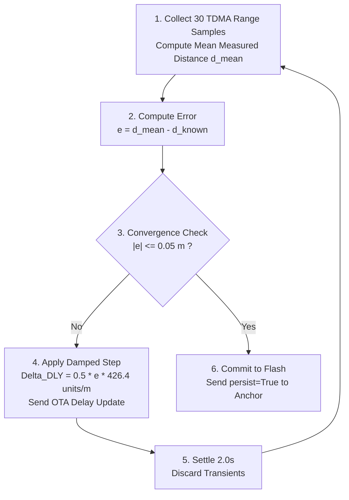
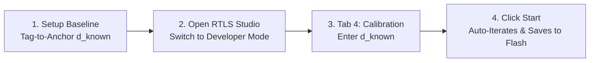

# Antenna Delay Calibration Guide

[Documentation Home](../README.md) · [Hardware Specs](schematics_and_specs.md) · [Deployment Guide](../deployment.md) · [RTLS Studio Guide](../software/rtls_studio_and_tools.md)

This guide explains the physical principles, mathematics, and step-by-step automated workflow for calibrating Ultra-Wideband (UWB) antenna delays in **UWB-RTLS**.

---

## Table of Contents

1. [Why Antenna Delay Calibration Matters](#1-why-antenna-delay-calibration-matters)
2. [The Golden Tag Calibration Principle](#2-the-golden-tag-calibration-principle)
3. [Calibration Mathematics & Damped Iteration](#3-calibration-mathematics--damped-iteration)
4. [Step-by-Step Calibration via RTLS Studio](#4-step-by-step-calibration-via-rtls-studio)
5. [Reference Values & Residual Error](#5-reference-values--residual-error)

---

## 1. Why Antenna Delay Calibration Matters

In Decawave DW1000 transceivers, timestamps are generated inside the digital baseband core. The time required for an RF pulse to travel from the digital core through the internal analog transceiver stage, PCB trace, and antenna into the air is the **Antenna Delay**:

```
[ Digital Baseband Timestamp Core ]
                │
                ▼  (Internal Analog & Driver Delay)
[ DW1000 RF Front-End Pin ]
                │
                ▼  (PCB Trace Delay: ~6.5 ps/mm)
[ Antenna & Matching Network ]
                │
                ▼  (Air Velocity: c ≈ 299,792,458 m/s)
[ Free Space RF Wavefront ]
```

- $1\text{ DW1000 unit} \approx 15.65\text{ ps}$, corresponding to $\approx 4.69\text{ mm}$ of flight distance.
- Uncalibrated nodes introduce systematic ranging errors of $+15 \dots 35\text{ cm}$, which degrade positioning accuracy if left uncompensated.

---

## 2. The Golden Tag Calibration Principle

To calibrate a multi-Anchor network cleanly without mutual dependency loops, UWB-RTLS uses the **Golden Tag** methodology:

```
[ Golden Reference Tag ] <════ Known Distance: d_known (e.g. 5.00 m) ════> [ Target Anchor ]
(Factory Default: 16187)                                                   (Auto-Tuned & Saved to Flash)
```

1. **Reference Tag**: One Tag is designated as the reference unit with default factory delays (`TX_DLY = 16187`, `RX_DLY = 16187`).
2. **Anchor Compensation**: 100% of the systematic distance bias is assigned to the target Anchor.
3. **Automated OTA Updates**: RTLS Studio automatically tunes the Anchor over-the-air via `antenna_delay_bcast_set` without requiring physical debugger connections.

---

## 3. Calibration Mathematics & Damped Iteration

The calibration engine runs on the host PC (RTLS Studio) as a closed-loop iterative optimizer:



### 3.1. Mathematical Formulations

- **Distance Error**:
  $$e = \bar{d}_{\text{measured}} - d_{\text{known}}$$

- **Damped Delay Correction**:
  $$\Delta \text{Delay} = \alpha \times e \times K_{\text{DW}}$$
  - Damping factor: $\alpha = 0.5$ (prevents oscillation).
  - Scale factor: $K_{\text{DW}} = \frac{1}{0.002345} \approx 426.4\text{ DW units/meter}$ of combined round-trip delay.

- **Convergence Criteria**:
  $$|e| \le 0.05\text{ m } (5\text{ cm}) \quad \text{or} \quad |\Delta \text{Delay}| \le 5\text{ DW units}$$

---

## 4. Step-by-Step Calibration via RTLS Studio



1. **Physical Setup**:
   - Mount the Golden Tag on a tripod at a surveyed distance from the Anchor (e.g., $d_{\text{known}} = 5.00\text{ m}$ measured with a laser meter).
   - Ensure clear line-of-sight with $>20\text{ cm}$ clearance from metal obstacles.

2. **Open RTLS Studio Calibration Tab**:
   - In the top-right header, toggle from **User Mode** to **Developer Mode**.
   - Navigate to **Tab 4: Calibration**.

3. **Run Automated Calibration**:
   - Select the target **Anchor ID** (or select **Parallel Mode** to calibrate all Anchors simultaneously).
   - Enter the known baseline distance ($d_{\text{known}}$).
   - Click **Start Calibration**.
   - The application automatically samples ranges, executes the iterative loop, and displays real-time convergence progress.

4. **Verify & Commit**:
   - Upon convergence, RTLS Studio sends a broadcast packet with `persist=True`.
   - The Anchor saves the calibrated value into internal persistent Flash memory (`sys_flash_storage`).
   - The calibrated delay is permanently applied across all subsequent reboots.

---

## 5. Reference Values & Residual Error

| Parameter | Nominal Factory Default | Typical Calibrated Range | Post-Calibration Residual Error |
| --- | :---: | :---: | :---: |
| **Combined Delay (TX + RX)** | `32374` ($16187 + 16187$) | `32800 .. 33100` | $<\pm 0.03\text{ m}$ ($3\text{ cm}$) |
| **Single-Leg Delay** | `16187` | `16400 .. 16550` | $<\pm 0.03\text{ m}$ |
