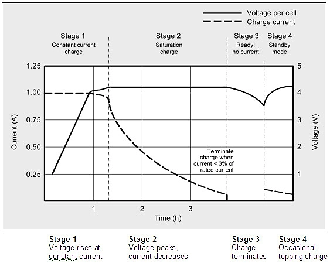
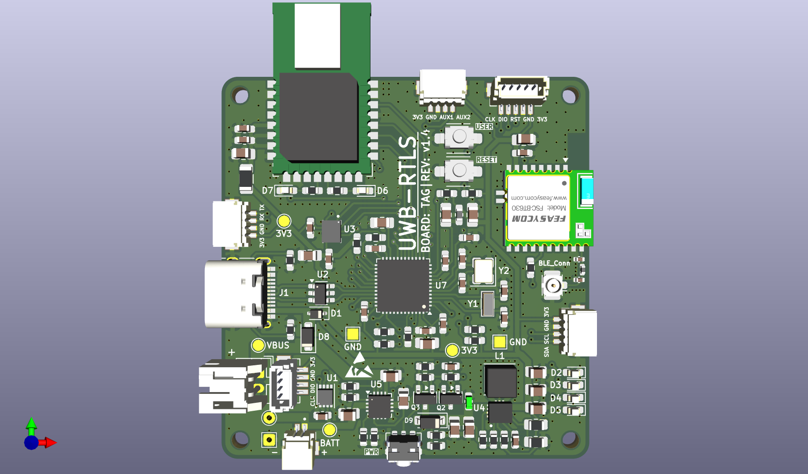
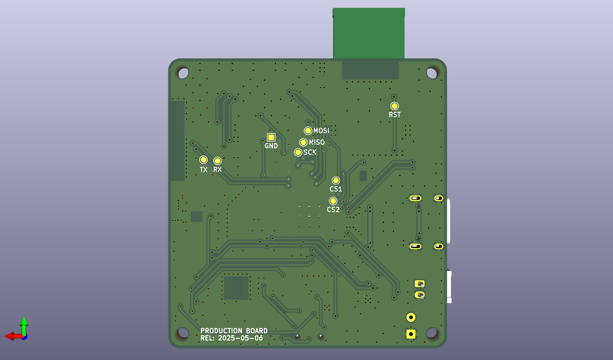
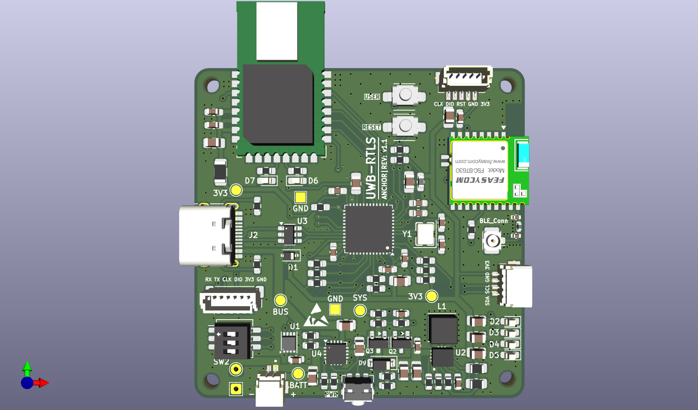
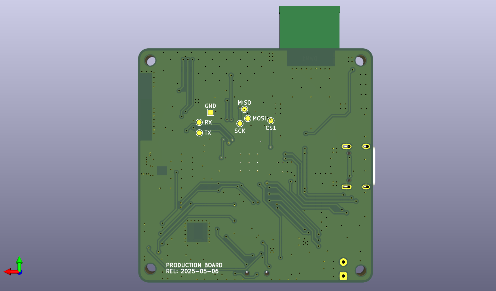

# Hardware Specifications & Schematics

[Documentation Home](../README.md) · [Getting Started](../getting_started.md) · [Antenna Calibration](antenna_calibration.md) · [Deployment Guide](../deployment.md)

This document provides visual hardware references, 3D PCB layouts, component specifications, and pinout mappings for the **UWB-RTLS** hardware ecosystem.

---

## 1. Hardware Ecosystem Overview

The UWB-RTLS system utilizes three dedicated hardware entities designed for distinct roles in the positioning infrastructure:

| Hardware Entity | Core MCU | RF / Sensing Hardware | Power Supply | Primary System Role |
| --- | --- | --- | --- | --- |
| **Tag Board** | STM32F411CEU6 | DW1000 + 6-DOF IMU + nRF52832 | 3.7V LiPo / 5V USB | Mobile ranging, UKF fusion, USB pose stream |
| **Anchor Board** | STM32F411CEU6 | DW1000 + nRF52832 + 3-bit DIP | 5.0V USB Type-C | Fixed reference beacons (ID 0..7) |
| **USB Dongle Gateway** | Nordic nRF52840 | BLE 5.0 Central Controller | USB VBUS | Wireless telemetry bridge to PC GUI |

---

## 2. Tag Board Hardware

The Tag board is mounted directly onto the Autonomous Mobile Robot (AMR). It performs real-time DS-TWR ranging, reads high-rate inertial measurements from the 6-DOF IMU, executes the onboard 8-State UKF, and streams pose telemetry over USB CDC.

| Tag PCB Front (DW1000, STM32F411, 6-DOF IMU) | Tag PCB Back (nRF52832 BLE, LiPo Circuit) |
| :---: | :---: |
|  |  |

| Subsystem | Component | Interface | Key Function |
| --- | --- | --- | --- |
| **MCU** | STM32F411CEU6 | 100 MHz Cortex-M4F | Runs FreeRTOS, DS-TWR ranging, and 8-State UKF fusion |
| **UWB Radio** | Decawave DW1000 / BU01 | SPI1 @ 20 MHz + PB0 (EXTI) | Sub-nanosecond timestamping for time-of-flight |
| **Inertial Sensor** | 6-DOF IMU (Accel + Gyro) | SPI2 @ 100 Hz | High-rate motion prediction for UKF state propagation |
| **Wireless Bridge** | Nordic nRF52832 | USART1 @ 115200 baud | BLE 5.0 telemetry broadcast and OTA configuration |
| **Robot Link** | USB Type-C OTG FS | USB CDC Virtual COM | Streams real-time pose (`px, py, vx, vy, yaw`) to robot computer |
| **User Control** | Pushbutton (`PA0`) | EXTI0 | Hold ~3s: Role toggle & reboot; Click: Toggle ranging |

---

## 3. Anchor Board Hardware

Anchor boards are installed at fixed, surveyed coordinates around the tracking perimeter. Each Anchor responds to Tag ranging polls within its allocated TDMA time slot.

| Anchor PCB Front (DW1000, STM32, 3-bit DIP) | Anchor PCB Back (nRF52832 BLE, 5V LDO Rail) |
| :---: | :---: |
|  |  |

| Subsystem | Component | Interface | Key Function |
| --- | --- | --- | --- |
| **MCU** | STM32F411CEU6 | 100 MHz Cortex-M4F | Manages DW1000 RX/TX timing and packet compilation |
| **UWB Radio** | Decawave DW1000 / BU01 | SPI1 @ 20 MHz + PB0 (EXTI) | Transmits timestamped response frames |
| **ID Selector** | 3-position DIP Switch (`SW1`) | `PB3..PB5` (Inputs) | Configures Anchor ID ($0 \dots 7$, up to 8 Anchors) |
| **Wireless Bridge** | Nordic nRF52832 | USART1 @ 115200 baud | BLE 5.0 diagnostic status reporting |
| **Power Input** | 5.0V USB Type-C | Dual High-PSRR LDOs | Supplies isolated 3.3V power to digital and RF stages |

---

## 4. MCU Pinout & Interface Mapping

| Peripheral | STM32 Pin Assignment | Connected Hardware | Function & Protocol |
| --- | --- | --- | --- |
| **SPI1** | `PA5 (SCK)`, `PA6 (MISO)`, `PA7 (MOSI)`, `PA4 (NSS)` | Decawave DW1000 | 20 MHz transceiver register read/write & frame buffer access |
| **EXTI0** | `PB0` | Decawave DW1000 `IRQ` | Hardware microsecond interrupt on TX/RX timestamp event |
| **SPI2** | `PB13 (SCK)`, `PB14 (MISO)`, `PB15 (MOSI)`, `PB12 (NSS)` | 6-DOF IMU (Tag Only) | Synchronous $100\text{ Hz}$ accelerometer and gyroscope sampling |
| **USART1** | `PA9 (TX)`, `PA10 (RX)` | Nordic nRF52832 | Bidirectional Protobuf packet transport between MCU and BLE |
| **USB OTG FS** | `PA11 (DM)`, `PA12 (DP)` | Robot Controller / PC | USB CDC pose streaming ($10\text{ Hz}$) and USB DFU flashing |
| **GPIO Button** | `PA0` (EXTI) | User Pushbutton | Hold ~3s: Toggle Tag/Anchor role & reboot; Click: Toggle ranging |
| **GPIO DIP** | `PB3..PB5` (Inputs) | 3-position DIP Switch (Anchor) | Configures Anchor ID ($0 \dots 7$, up to 8 Anchors) |
| **ADC1** | `PA1` | Battery Divider (Tag) | Real-time LiPo battery voltage sensing |

---

## 5. Hardware Projects & Manufacturing Files

All KiCad PCB project source files, schematics, and manufacturing Gerbers are organized in the repository:

| Board Project | KiCad Source Project | Schematic PDF | Production Gerbers |
| --- | --- | --- | --- |
| **Tag Board** | `hardware/tag/` | [Tag Schematic PDF](../assets/schematics/tag_schematic.pdf) | `hardware/tag/tag_genber/` |
| **Anchor Board** | `hardware/anchor/` | [Anchor Schematic PDF](../assets/schematics/anchor_schematic.pdf) | `hardware/anchor/anchor_genber/` |
