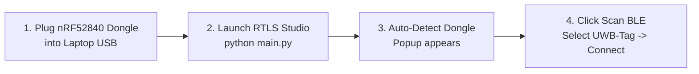
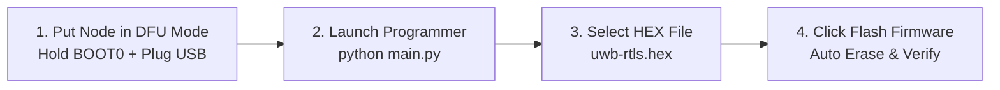

# RTLS Studio & Desktop Tools User Guide

[Documentation Home](../README.md) · [Getting Started](../getting_started.md) · [Deployment Guide](../deployment.md) · [Hardware Specs](../hardware/schematics_and_specs.md)

This user guide explains how to operate the **RTLS Studio** desktop application for real-time tracking, node configuration, and data export, as well as the **RTLS Programmer** for USB DFU firmware updates.

---

## Table of Contents

1. [Software Suite Overview](#1-software-suite-overview)
2. [Connecting to Nodes via USB Dongle](#2-connecting-to-nodes-via-usb-dongle)
3. [RTLS Studio Tab-by-Tab User Guide](#3-rtls-studio-tab-by-tab-user-guide)
4. [Session History & Data Export](#4-session-history--data-export)
5. [User Mode vs. Developer Mode](#5-user-mode-vs-developer-mode)
6. [Firmware Flashing with RTLS Programmer](#6-firmware-flashing-with-rtls-programmer)

---

## 1. Software Suite Overview

| Application | Technology | Primary Function | Typical Use Case |
| --- | --- | --- | --- |
| **RTLS Studio** | Python 3 / PyQt6 | Live 2D tracking map, anchor layout configuration, telemetry monitoring, session CSV export | Daily robot tracking, anchor coordinate setup, and log analysis |
| **RTLS Programmer** | Python 3 / PyQt6 | USB DFU firmware flashing for STM32 nodes | Updating node firmware binaries without ST-Link debugger |

---

## 2. Connecting to Nodes via USB Dongle



1. **Insert USB Dongle**: Plug the nRF52840 Dongle into your computer.
2. **Launch Application**:
   ```powershell
   cd software/uwb_rtls_studio
   .\venv\Scripts\Activate.ps1
   python main.py
   ```
3. **Connect to Tag**:
   - The app automatically detects the USB Dongle COM port via handshake.
   - Click **Scan BLE** in the connection dialog.
   - Select your **UWB-Tag** from the list and click **Connect**.
   - The main dashboard will open with active link indicators.

---

## 3. RTLS Studio Tab-by-Tab User Guide

### 3.1. Tab 1: Device Info (Telemetry)
- **What it shows**: Node ID, firmware build version, battery voltage (LiPo), MCU core temperature, and BLE signal strength (RSSI).
- **How to use**: Use this tab before testing to ensure the Tag battery has sufficient charge ($> 3.6\text{V}$) and the wireless link is strong.

### 3.2. Tab 2: Live Tracking (2D Planar Map)
- **What it shows**: Real-time 2D coordinate grid with fixed Anchor markers (blue circles) and the active Tag position (red arrow indicating robot heading/yaw).
- **How to use**:
  1. Click **Start Ranging** to begin live tracking.
  2. Use mouse scroll to **Zoom in/out** and click-and-drag to **Pan** across the room.
  3. The right-hand panel displays current coordinates $(X, Y)$, estimated velocity $(v_x, v_y)$, yaw angle, and geometric dilution of precision (WGDOP).

### 3.3. Tab 3: Configuration (Anchor Layout & Parameters)
- **What it shows**: Editable table of Anchor coordinates $(X, Y, Z)$, TDMA slot timing, and UWB radio channels.
- **How to use**:
  1. Under **Anchor Layout**, enter the surveyed $(X, Y, Z)$ positions for each Anchor in meters.
  2. Click **Save to Flash**. The configuration is committed to the Tag's internal Flash memory and preserved across reboots.

### 3.4. Tab 4: Calibration (Developer Mode Only)
- **What it shows**: Antenna delay tuning interface and raw sample collection.
- **How to use**:
  1. Place Tag and Anchor at the reference $5.78\text{ m}$ baseline distance.
  2. Click **Start Calibration Run** to collect 500 distance samples.
  3. Click **Apply Calibrated Delay** to write the computed compensation offset to Flash.

### 3.5. Tab 5: Log & History (Event Logging)
- **What it shows**: Live streaming firmware log messages with severity level filters (`INFO`, `WARN`, `ERROR`).
- **How to use**: Monitor system events, investigate ranging timeouts, or review past session bundles.

---

## 4. Session History & Data Export

When you complete a tracking run and click **[End Session]**, RTLS Studio automatically saves a timestamped session bundle:

```
data/sessions/SES_YYYYMMDD_HHMMSS_ranging/
├── session_meta.json       # Session metadata (duration, sample count, node IDs)
├── positions.csv           # 2D coordinates (timestamp, x, y, yaw, velocity, WGDOP)
├── logs.csv & logs.txt     # Complete firmware and application logs
└── config_snapshot.json    # Snapshot of anchor coordinates and system parameters
```

- **Browse History**: Open **Tab 5: Log & History** $\rightarrow$ Select any past session $\rightarrow$ Click **Open Folder** to inspect or plot in MATLAB / Python.

---

## 5. User Mode vs. Developer Mode

You can toggle between **User Mode** and **Developer Mode** using the dropdown in the top-right header:

| Feature | User Mode | Developer Mode |
| --- | :---: | :---: |
| **Device Info & Telemetry** | Full | Full |
| **Live 2D Map Tracking** | Full | Full |
| **Anchor Coordinate Setup** | Full | Full |
| **Antenna Delay Calibration Tab** | Hidden | Full Access |
| **Advanced UKF & Radio Tuning** | Hidden | Full Access |
| **Raw Protocol Event Stream** | Filtered (Clean) | Full Debug Stream |

---

## 6. Firmware Flashing with RTLS Programmer

The **RTLS Programmer** tool flashes firmware binaries directly to STM32 nodes over USB DFU without requiring an ST-Link hardware programmer.



### Step-by-Step Flashing Procedure

1. **Enter DFU Bootloader Mode**:
   - Press and hold the **BOOT0** button on the STM32 board.
   - While holding **BOOT0**, plug the USB Type-C cable into your PC, then release **BOOT0**.
   - The device enumerates as **STM32 DFU Device** (`VID:PID = 0483:DF11`).

2. **Launch RTLS Programmer**:
   ```powershell
   cd software/uwb_rtls_programmer
   python main.py
   ```

3. **Flash Firmware Binary**:
   - The tool automatically detects the connected DFU device.
   - Click **Browse** and select `firmware/uwb/build/uwb-rtls.hex`.
   - Click **Flash Firmware**. The tool performs sector erase, writes Flash memory, and verifies readback integrity.
   - Unplug and replug the USB cable to run the new firmware.
