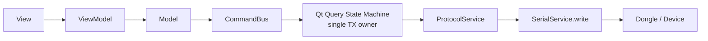

# UWB RTLS Studio - Review flow, thread, state machine và data architecture

Tài liệu này review hiện trạng của `software/uwb_rtls_studio`, `software/common`
và `protocol/protos/protocol.proto` theo đúng câu hỏi:

- Flow View -> ViewModel -> Model -> Repository -> Data hiện tại đã đúng chưa.
- Thread/background worker hiện tại có đang dùng đúng cho API/command không.
- State machine đã gom về một nơi để nhiều file dùng chung chưa.
- Define biến/config đã gom về một nơi chưa.
- Bug ngầm/rủi ro kiến trúc cần xử lý trước khi app phát triển tiếp.

## 0. Cập nhật triển khai hiện tại

Các hạng mục P0/P1 sau đã được implement:

- `QueryQueueManager` đã chuyển sang `QObject/QTimer`, không còn tự spawn
  `threading.Thread`/`threading.Timer` để gửi query tiếp theo.
- `ProtocolService.next_seq()` đã có lock để tránh race sequence.
- `utils/constants.py` đã sửa `ADDR_MCU = 0x1`, thêm `ADDR_BCAST = 0xF` và giữ
  alias `ADDR_BCAS` cho code cũ.
- `CommandCatalog` đã phủ đủ 68 oneof trong `protocol_pb2.packet_t`.
- Đã thêm builder cho `calib_status_resp`, `rtos_resource_get/resp`,
  `rtos_task_stats_get/resp` và xóa duplicate `time_sync_adv_set`.
- `RawPacketStore` đã có thêm luồng lưu `RawSerialChunk` trước decode protobuf.
- Đã thêm `ConfigRepository` để parse `sys_config_resp`, `sys_ranging_cfg_resp`,
  `sensor_fusion_cfg_resp`, `pos_calib_cfg_resp` và publish vào `SharedAppState`.
- Đã thêm `DiagnosticsRepository` để parse `calib_status_resp`, `rtos_resource_resp`,
  `rtos_task_stats_resp` và publish vào `SharedAppState`.
- `ConfigViewModel` đã nghe config từ `SharedAppState` thay vì phụ thuộc trực tiếp vào
  parser trong `DeviceModel`.
- Device Info đã merge RTOS resource snapshot vào panel telemetry qua shared state.
- `MainWindow` đã gửi `end_session`/`ble_disconnect` qua ViewModel/Model thay vì
  gọi trực tiếp `_protocol.send_command()`.
- `BYPASS_POPUPS` đã chuyển thành env flag `UWB_RTLS_BYPASS_POPUPS`, mặc định tắt.

## 1. Kết luận nhanh

Hiện tại app đang đi đúng hướng, nhưng chưa thể gọi là "đúng hết".

Phần đúng nhất hiện tại là RX flow: `SerialService` đọc bytes ở thread nền,
`ProtocolService` decode protobuf, `ProtocolPacketRepository` nhận packet, các
repository/domain model xử lý rồi đẩy state lên UI.

Trước khi implement, phần cần sửa sớm là TX/query flow:
`QueryQueueManager` dùng Python `threading.Thread` và `threading.Timer` để gọi
tiếp command. Hạng mục này đã được xử lý ở mục 0 bằng `QObject/QTimer`.

State machine và define biến đã có bước gom lại, nhưng vẫn còn phân tán:

- `QueryQueueManager` nằm ở `software/common/query_state_machine.py`.
- Shared state/job state nằm ở `software/uwb_rtls_studio/utils/app_state.py`.
- Command cache/dedupe nằm ở `software/uwb_rtls_studio/services/command_bus.py`.
- Một số constants nằm ở `utils/constants.py`, nhưng vẫn có constants lặp lại ở
  `app_state.py`, `command_bus.py`, `DeviceModel`, `ScanModel`, `RangingModel`.

Nếu app tiếp tục mở rộng full `protocol.proto`, nên ưu tiên ổn định tầng
command/state trước, rồi mới thêm nhiều API.

## 2. Flow hiện tại

### 2.1. RX flow - data từ dongle lên app

```mermaid
flowchart LR
    HW["Dongle / MCU / BLE peripheral"] -->|raw serial bytes| SS["SerialService\nreader thread"]
    SS -->|Qt signal data_received(bytes)| PS["ProtocolService"]
    PS -->|decode_from_frames| PKT["protobuf packet_t"]
    PKT --> PR["ProtocolPacketRepository"]
    PR --> RAW["RawPacketStore"]
    PR --> DR["Domain repositories\nBLE / ranging / telemetry"]
    DR --> AS["SharedAppState / Models"]
    AS --> VM["ViewModels"]
    VM --> UI["Views / Tabs"]
```

Đánh giá: đúng hướng.

Điểm cần làm rõ: `RawPacketStore` hiện đang lưu bytes từ
`packet.SerializeToString()` sau khi protobuf đã decode, chưa lưu raw serial
chunk/frame nguyên bản từ dongle. Nếu mục tiêu là data layer như "nhà chứa raw
byte", cần lưu thêm `RawSerialChunk` hoặc `RawHdlcFrame` trước bước decode.

### 2.2. TX/query flow - UI gọi command/API xuống device

Flow mong muốn:



Flow trước khi implement đã gần đúng, nhưng còn đường đi tắt:

- Nhiều ViewModel/Model đã dùng `CommandBus` hoặc `shared_app_state.enqueue_query`.
- `MainWindow` từng gọi trực tiếp
  `self._device_info_vm.model._protocol.send_command(...)` cho `end_session` và
  `ble_disconnect`; hiện đã chuyển qua ViewModel/Model/CommandBus.
- `QueryQueueManager` từng gọi `send_packet_fn()` từ Python thread/timer; hiện đã
  chuyển sang Qt-safe `QObject/QTimer`.

## 3. Trả lời trực tiếp các câu hỏi review

### 3.1. Flow data/API có đúng không?

Đúng hướng, nhưng chưa hoàn chỉnh.

Flow đúng nên là:

1. Device gửi bytes lên dongle/app.
2. Data layer lưu raw bytes hoặc raw packet gần transport nhất.
3. Repository chọn đúng parser theo `param_name` trong protobuf.
4. Model nhận domain data đã parse.
5. ViewModel validate command/API và expose state cho View.
6. View chỉ render UI, không parse protobuf/raw bytes.

Hiện tại app đã có các phần chính này, nhưng vẫn còn parsing bị lặp ở vài nơi:

- `ProtocolPacketRepository` đã dispatch packet xuống repository.
- `DeviceModel` vẫn tự parse một số packet như `ble_scan_result`,
  `ble_adv_status`, `battery_info_resp`.
- Một số tab/model có thể đọc state trực tiếp từ `shared_app_state`.

Hướng hoàn thiện: repository là nơi parse protobuf chính; model chỉ orchestration
và đổi domain data thành state/event cho ViewModel.

### 3.2. Thread cho API/command có đúng không?

RX thread đang tương đối đúng:

- `SerialService` có reader thread riêng để đọc `serial.read(256)`.
- Data được emit qua Qt signal `data_received`.
- `ProtocolService` nhận signal rồi decode.

TX/query thread trước khi implement chưa đúng hoàn toàn:

- `SerialService.write()` có lock nên tránh ghi đè byte ở mức thấp.
- `QueryQueueManager` dùng `threading.Thread` và `threading.Timer`, khiến
  `send_command()` có thể chạy từ thread nền. Hạng mục này đã được sửa.
- `ProtocolService.next_seq()` chưa có lock/queue riêng, nên nếu nhiều tab hoặc
  query timer cùng gửi command thì sequence có thể race. Hạng mục này đã được sửa.

Kết luận: RX ổn, TX/query cần gom về một owner duy nhất.

### 3.3. State machine có đang gom về một nơi chưa?

Một phần đã gom, nhưng chưa đủ.

Đã gom:

- `QueryState`, `QueryQueueManager`: nằm trong `software/common/query_state_machine.py`.
- `JobState`, `ThreadRegistry`, shared app state: nằm trong `utils/app_state.py`.

Chưa gom hết:

- BLE connection/scanning state vẫn nằm nhiều ở `DeviceModel`, scan dialog/model
  và shared state.
- Command pending/cache state nằm trong `CommandBus`.
- Query expected-response map nằm trong `QueryQueueManager.RESPONSE_MAP`, tách
  khỏi `CommandCatalog`.
- Một số command vẫn gọi trực tiếp `ProtocolService`, không đi qua state machine.

Kết luận: đã có trung tâm state, nhưng state machine chưa phải single source of
truth cho toàn app.

### 3.4. Define biến/config có đang gom về một nơi chưa?

Một phần đã gom, nhưng còn drift.

Đã có `software/uwb_rtls_studio/utils/constants.py`, nhưng vẫn còn:

- `QUERY_TIMEOUT_S`, `QUERY_MAX_RETRIES`, `POLL_*` trong `app_state.py`.
- `DEFAULT_CACHE_TTL_S`, `PENDING_TTL_S`, `INVALIDATE_ON_SEND` trong `command_bus.py`.
- Timer interval hardcode trong `DeviceModel`.
- Connect timeout hardcode trong scan model/dialog.
- History size hardcode trong ranging model.

Bug quan trọng đã phát hiện: address constants từng sai so với `protocol.proto`.

Trong `protocol.proto`:

- `PACKET_ADDR_MCU = 0x1`
- `PACKET_ADDR_BCAST = 0xF`

Trong `utils/constants.py` trước khi sửa:

- `ADDR_MCU = 0x2`
- `ADDR_BCAS = 0x9`

Nếu file này được dùng cho TX thật, command có thể đi sai đích.
Hiện `ADDR_MCU` và `ADDR_BCAST` đã được đồng bộ lại.

## 4. Bug ngầm và rủi ro ưu tiên

Bảng dưới là các bug/rủi ro đã tìm ra trong lúc review. Các hạng mục P0/P1
được liệt kê trong mục 0 đã được implement.

| Ưu tiên | Khu vực | Vấn đề | Rủi ro | Hướng xử lý |
| --- | --- | --- | --- | --- |
| P0 | TX/query thread | `QueryQueueManager` gọi `_send_next()` và `send_packet_fn()` từ Python thread/timer | Race sequence, lỗi UI/Qt khó tái hiện, nhiều tab gửi command dễ đụng nhau | Đổi sang Qt `QObject` + `QTimer` hoặc TX queue duy nhất chạy trong Qt main thread |
| P0 | Protocol address | `ADDR_MCU`, `ADDR_BCAS` trong `utils/constants.py` sai với proto | Gửi command sai destination nếu dùng constants này | Đồng bộ constants từ `common.transport.VvAddress` hoặc generate từ proto |
| P0 | Direct protocol call | `MainWindow` gọi thẳng `_protocol.send_command()` | Bỏ qua CommandBus, cache, state machine, retry, invalidation | Đưa `end_session`, `ble_disconnect` qua model/CommandBus |
| P1 | Sequence number | `ProtocolService.next_seq()` chưa lock | Race khi nhiều source gửi command cùng lúc | Bảo vệ bằng lock hoặc chỉ cho TX queue gọi `send_command()` |
| P1 | Full protocol coverage | `CommandCatalog` chưa phủ hết oneof trong `protocol.proto` | API gọi từ UI có thể báo unknown hoặc không parse được response | Tạo matrix command/response; thêm `calib_status_resp`, RTOS resource/task stats và các oneof còn thiếu |
| P1 | Command duplicate | `time_sync_adv_set()` bị định nghĩa 2 lần trong `commands.py` | Definition sau ghi đè definition trước, behavior không rõ | Xóa duplicate, giữ một builder có tham số rõ ràng |
| P1 | Raw data store | `RawSerialChunk` có nhưng chưa được append; store hiện lưu protobuf serialized bytes | Chưa đúng mô hình "data layer chứa raw byte từ device" | Lưu raw serial chunk/frame trước decode, sau đó lưu decoded packet riêng |
| P1 | BYPASS_POPUPS | `BYPASS_POPUPS = 1` trong `main.py` | Production có thể chạy mock connected device, query sai trạng thái thật | Đưa về config/dev flag, default production là `False` |
| P1 | Thread registry | `main.py` register serial reader trước khi `serial_service.open()` tạo thread | Registry có thể không track reader thread thật | Register trong `SerialService.open()` sau khi start thread |
| P2 | Parser ownership | Repository và `DeviceModel` cùng parse một số packet | State bị cập nhật hai nguồn, khó debug khi UI lệch | Repository parse một lần, model consume domain event/state |
| P2 | Response map drift | `QueryQueueManager.RESPONSE_MAP` tách khỏi `CommandCatalog` | Thêm API mới dễ quên map response | Gom expected response vào `CommandSpec` |
| P2 | Cache semantics | `CommandBus.cache_hit` chỉ emit packet cached, không tự replay qua repository/shared state | ViewModel mới có thể không nhận state nếu chỉ chờ response mới | Chuẩn hóa interface: request trả cached value hoặc model đọc shared state rõ ràng |
| P2 | BLE identity merge | `ble_adv_status.device_id` đang được merge với `ble_scan_result.serial_number` | Nếu firmware định nghĩa khác nhau, UI scan/live sẽ ghép sai device | Xác nhận contract firmware; tạo key mapper rõ ràng |

## 5. Kiến trúc mục tiêu nên hướng tới

### 5.1. Nguyên tắc đơn giản, không over engineering

Dự án của bạn trọng tâm là firmware/hardware. Vì vậy app không nên biến thành
một framework software quá nặng. Chỉ cần giữ 5 nguyên tắc:

1. Một nơi duy nhất gửi command xuống serial.
2. Một nơi duy nhất decode protobuf packet.
3. Repository là nơi parse protobuf thành domain data.
4. Shared state là cache/domain state cho nhiều tab dùng chung.
5. View/ViewModel không parse raw bytes và không gọi serial trực tiếp.

### 5.2. Data layer đúng nghĩa raw warehouse

Nên tách 2 loại dữ liệu:

| Loại | Nằm ở đâu | Mục đích |
| --- | --- | --- |
| `RawSerialChunk` hoặc `RawHdlcFrame` | `data/raw_packet_store.py` | Debug bytes thật từ dongle, replay lỗi transport |
| `RawPacket` | `data/raw_packet_store.py` | Debug protobuf packet đã decode, tra `param_name`, src/dst/seq |
| Parsed domain state | repository/model/shared state | UI dùng để hiển thị |

Với `ble_adv_status_t`, flow đúng là:

1. App nhận full packet `ble_adv_status`.
2. Data layer lưu raw packet.
3. `BleScanRepository` hoặc telemetry repository parse full field:
   `device`, `device_id`, `bat_soc_percent`, `status_flags`, `warning_count`,
   `error_count`, `local_timestamp_ms`.
4. Nơi nào cần pin thì đọc `bat_soc_percent`.
5. Nơi nào cần warning/error thì đọc `warning_count`, `error_count`,
   `status_flags`.
6. Live tab hoặc scan tab cùng dùng một source state, không gọi command riêng
   nếu data đã có.

## 6. Plan hoàn thiện theo phase

### Phase 1 - Sửa correctness trước

Mục tiêu: app không race thread, không gửi sai address, không bỏ qua command bus.

Checklist:

- Sửa `ADDR_MCU = 0x1`, `ADDR_BCAST = 0xF`; đổi typo `ADDR_BCAS`.
- Đưa `BYPASS_POPUPS` thành dev flag/config, default tắt.
- Thay direct calls trong `MainWindow` bằng method ở model/viewmodel:
  `request_end_session()`, `request_ble_disconnect()`.
- Bảo vệ `ProtocolService.next_seq()` bằng lock.
- Chọn một TX owner:
  - Cách nhẹ nhất: `CommandBus` là nơi duy nhất gọi `ProtocolService.send_command`.
  - Cách chắc hơn: tạo `TxCommandQueue(QObject)` dùng `QTimer`/queued signal.
- Không gọi `send_command()` từ `threading.Timer`.

### Phase 2 - Gom command spec và response map

Mục tiêu: full `protocol.proto` API có thể được validate trước khi gọi.

Checklist:

- Mở rộng `CommandSpec`:
  - `tag`
  - `param_name`
  - `builder`
  - `expected_response`
  - `default_dst`
  - `is_query`
  - `cache_ttl_s`
- Chuyển `QueryQueueManager.RESPONSE_MAP` vào `CommandCatalog`.
- Thêm command còn thiếu so với proto:
  - `calib_status_resp`
  - `rtos_resource_get`
  - `rtos_resource_resp`
  - `rtos_task_stats_get`
  - `rtos_task_stats_resp`
- Xóa duplicate `time_sync_adv_set`.
- Viết check nhỏ để assert mọi oneof tag trong proto đều có spec hoặc được đánh
  dấu rõ là RX-only/internal.

### Phase 3 - Chuẩn hóa state machine dùng chung

Mục tiêu: state không bị chia nhiều nơi khiến tab này đúng tab kia sai.

Checklist:

- Giữ `QueryState` trong `common/query_state_machine.py`, nhưng đổi implementation
  sang Qt-safe.
- Tách app state theo domain nếu file quá lớn:
  - `connection_state`
  - `telemetry_state`
  - `config_state`
  - `ranging_state`
  - `calibration_state`
- `SharedAppState` vẫn là facade dùng chung cho UI.
- BLE scan/connect state nên có enum/state rõ ràng:
  - `IDLE`
  - `SCANNING`
  - `CONNECTING`
  - `CONNECTED`
  - `DISCONNECTING`
  - `ERROR`
- Mọi tab subscribe state, không tự giữ bản state riêng nếu không cần.

### Phase 4 - Làm data/repository thành source of truth

Mục tiêu: data từ device lên được bóc tách dần từ raw -> protobuf -> domain.

Checklist:

- Append `RawSerialChunk` trong `SerialService` hoặc `ProtocolService` trước decode.
- Giữ `RawPacket` sau decode để debug theo `param_name`.
- Mỗi packet type có một owner parser:
  - BLE scan/status -> `BleScanRepository`
  - Battery/device info/RTOS -> `TelemetryRepository` hoặc repository tương ứng
  - Ranging result/status -> `RangingRepository`
  - Config/layout/calib config -> config repository
- Model nhận data đã parse hoặc đọc shared state, không parse protobuf trùng lặp.
- Với field lớn như `ble_adv_status`, repository parse full data một lần rồi
  publish state từng phần cho nơi cần dùng.

### Phase 5 - Test và debug tool nhẹ

Mục tiêu: dễ debug với firmware/hardware thật.

Checklist:

- Unit test command catalog vs proto oneof.
- Unit test query timeout/retry/success.
- Unit test malformed packet không crash app.
- Debug view/log cho recent raw packets:
  - time
  - src/dst
  - seq
  - param_name
  - payload hex length
- Log TX/RX theo cùng format:
  - `TX seq=... dst=... cmd=...`
  - `RX seq=... src=... param=...`

## 7. Thứ tự sửa đề xuất

Nên sửa theo thứ tự này để giảm bug lan truyền:

1. Sửa constants address và bỏ direct `send_command` trong UI.
2. Làm TX/query state machine Qt-safe hoặc tạo TX queue duy nhất.
3. Gom `CommandSpec` + expected response map.
4. Phủ hết API trong `protocol.proto`.
5. Lưu raw serial bytes thật vào data layer.
6. Dọn parser ownership: repository parse, model/viewmodel consume.
7. Thêm test nhỏ cho catalog/query/raw store.

## 8. Kết luận

Kiến trúc hiện tại đã có nền tốt cho mô hình bạn muốn: data layer chứa raw data,
repository bóc protobuf/domain data, shared state giúp nhiều tab dùng chung một
command/result.

Nhưng trước khi mở rộng full protocol, cần sửa ba điểm lõi:

- TX/query phải có một luồng gửi command duy nhất và thread-safe.
- Command/response spec phải là single source of truth.
- Constants/state phải gom lại để không bị drift giữa các file.

Sau khi sửa ba điểm này, app sẽ hợp với hướng firmware/hardware hơn: ít layer
thừa, dễ debug bằng log TX/RX, và mỗi API trong `protocol.proto` có đường đi rõ
từ UI xuống device rồi từ device lên UI.
