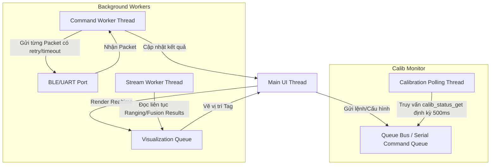
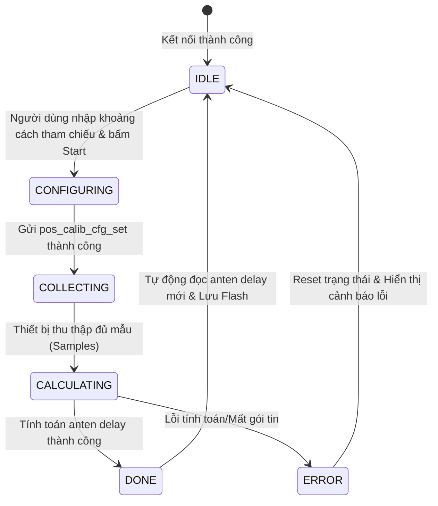

# Kế Hoạch Hoàn Thiện Geofencing Và Tích Hợp Anchor Layout Trong UWB RTLS Studio

## 1. Mục tiêu

Tài liệu này mô tả kế hoạch hoàn thiện tính năng `Geofencing` trong `UWB RTLS Studio` theo hướng:

- Cho phép người dùng **định nghĩa anchor layout trực tiếp ngay trong màn hình geofencing/map editor**
- Không cần phải chuyển sang tab `Config` chỉ để nhập vị trí anchor
- Giữ nguyên cơ chế backend/API hiện tại khi `read/write` xuống thiết bị
- Biến geofencing editor thành một **công cụ authoring không gian hoàn chỉnh**, bao gồm:
  - Room
  - Wall
  - Anchor
  - Rule Zone

Mục tiêu cuối cùng là để người vận hành có thể:

1. Mở màn hình geofencing
2. Vẽ bản đồ không gian
3. Đặt anchor trực tiếp lên bản đồ
4. Tạo các vùng rule/forbidden/allowed
5. Đọc/ghi layout và config thiết bị từ cùng một workflow


## 2. Cơ sở tham khảo

Kế hoạch này được rút ra từ 2 video tham khảo do người dùng cung cấp và các trang kỹ thuật/public page liên quan:

- Video 1: [https://www.youtube.com/watch?v=psT6PUx_qrQ](https://www.youtube.com/watch?v=psT6PUx_qrQ)
- Video 2: [https://www.youtube.com/watch?v=EvgetQl1CjY](https://www.youtube.com/watch?v=EvgetQl1CjY)
- GrowSpace Q2 Starter Kit: [https://grow-space.io/q2-starter-kit/](https://grow-space.io/q2-starter-kit/)
- GrowSpace Geofence Tech: [https://grow-space.io/technology__trashed/tech-geofence-kr/](https://grow-space.io/technology__trashed/tech-geofence-kr/)
- GrowSpace Indoor Mapping Technology: [https://grow-space.io/technology__trashed/spatial-intelligence-platform-kr/](https://grow-space.io/technology__trashed/spatial-intelligence-platform-kr/)

### 2.1 Điều rút ra từ video 1

Từ chapter công khai của video `Q2 Starter Kit`, workflow được thể hiện như sau:

- `07:46`: gán vị trí `anchor · map · gateway`
- `09:49`: thiết lập `geofence`

Điều này cho thấy:

- **Anchor layout không phải là một bước config tách biệt khỏi bản đồ**
- Anchor được xem như một phần của `spatial setup`
- Geofence là lớp logic nằm phía trên spatial layout đã có sẵn

### 2.2 Điều rút ra từ video 2

Video thứ hai tập trung vào ứng dụng security:

- Theo dõi vị trí realtime
- Xác định người được phép / không được phép vào khu vực
- Cảnh báo khi vi phạm geofence

Điểm quan trọng là:

- Rule zone chỉ có ý nghĩa khi map và anchor layout đã được định nghĩa rõ
- Geofencing cần gắn với không gian thật, không nên là một module tách rời khỏi anchor/map

### 2.3 Điều rút ra từ trang kỹ thuật

Từ trang công nghệ geofence:

- Họ dùng mô hình `Polygon-based geofencing`
- Có phân tầng:
  - Spatial data
  - Point-in-polygon
  - Event logic
  - Integration

Từ trang indoor mapping:

- Họ coi mapping là lớp dữ liệu nền
- Các đối tượng như tường, vùng, place, route... đều sống trên cùng hệ tọa độ

Kết luận kiến trúc:

> Anchor layout nên được xem là một loại đối tượng trên map, không phải chỉ là vài giá trị số nhập ở tab Config.


## 3. Vấn đề hiện tại của app

Hiện tại ứng dụng đang có tách biệt như sau:

- `Config`:
  - định nghĩa anchor layout
  - cấu hình UWB
- `Live Tracking -> Geofencing`:
  - vẽ room/wall/rule zone

Nhược điểm của cách này:

1. Người dùng phải chuyển ngữ cảnh giữa `Config` và `Geofencing`
2. Anchor layout không nhìn thấy trực tiếp trên bản đồ trong lúc dựng map
3. Vị trí anchor và hình học room/wall dễ lệch nhau
4. Khó triển khai ngoài thực địa vì thao tác không liền mạch
5. Geofencing đang mới là “vẽ vùng”, chưa phải “xây dựng không gian hoàn chỉnh”


## 4. Định hướng thiết kế mới

### 4.1 Tư duy dữ liệu

Thay vì coi geofencing chỉ là danh sách polygon, cần đổi sang tư duy:

- `Map` là nguồn dữ liệu không gian gốc
- `Geofence` là lớp rule nằm trên map
- `Anchor layout` là một phần của map

Tức là về mặt dữ liệu, cần tách thành:

- `map_objects`
  - rooms
  - walls
  - anchors
  - gateway (nếu có)
- `rule_zones`
  - allowed
  - forbidden
  - access zone
  - custom rule zone

### 4.2 Tư duy giao diện

Geofencing screen cần trở thành một `Spatial Editor`, không chỉ là `Zone Editor`.

Người dùng vào đây sẽ làm đủ 3 lớp:

1. Vẽ không gian vật lý
2. Đặt anchor lên không gian đó
3. Tạo zone/rule nghiệp vụ


## 5. Luồng thao tác mục tiêu

Luồng thao tác đề xuất:

1. Mở `Live Tracking -> Geofencing`
2. Chọn hoặc tạo map mới
3. Vẽ `Room`
4. Vẽ `Wall`
5. Chuyển sang chế độ `Place Anchor`
6. Chọn anchor từ danh sách scan được hoặc auto-create A0..A3
7. Click lên map để đặt vị trí anchor
8. Chỉnh lại tọa độ anchor bằng kéo-thả hoặc property panel
9. Sau khi spatial layout ổn định, chuyển sang `Rule Zones`
10. Vẽ allowed zone / forbidden zone / security zone
11. `Read from Device` hoặc `Write to Device` ngay trong cùng workflow

Mục tiêu UX là:

- không phải qua lại nhiều tab
- nhìn thấy trực tiếp anchor nằm ở đâu trên map
- map layout và device layout luôn đồng bộ về mặt trực quan

### 5.1 Luồng đồng bộ anchor layout giữa `user mode` và `geofencing`

Theo yêu cầu mới của người dùng, luồng phải được hiểu như sau:

1. Khi mở app lần đầu, app gọi API `get layout` từ `dst tag`
2. Sau khi lấy được anchor layout, app cập nhật ngay lên table anchor layout ở `user mode`
3. Khi chuyển sang `developer mode -> geofencing`, app có thể xóa anchor layout đang hiển thị trong canvas geofencing, vì lúc này người dùng đang vào chế độ setup layout mới
4. Việc xóa này chỉ áp dụng cho hiển thị/config làm việc của geofencing, không làm mất dữ liệu layout gốc bên `user mode` nếu geofencing chưa hoàn tất setup
5. Khi người dùng đặt xong anchors trong geofencing và chuyển lại `user mode`, app tự động cập nhật anchor layout mới lên map canvas của `user mode`
6. Nếu quay lại geofencing lần nữa, chỉ khi user thực sự thay đổi layout thì mới đồng bộ lại sang cả hai bên

Nguyên tắc quan trọng:

- `user mode` là nơi phản ánh layout hiện có và layout đã sync
- `geofencing` là nơi tạo/chỉnh sửa layout mới
- dữ liệu chỉ nên được phát tán sang cả hai bên khi layout đã thay đổi thật sự hoặc khi user xác nhận hoàn tất setup

### 5.2 Quy tắc xóa và cập nhật anchor

Để tránh conflict giữa hai luồng:

- Vào `geofencing` không nên tự động xóa layout gốc ở mức data source nếu chưa có thao tác thay thế rõ ràng từ user
- Chỉ xóa/ẩn anchor layout ở canvas geofencing nếu đó là bước chuẩn bị cho setup mới
- Sau khi user chỉnh xong, layout mới phải được đẩy ngược về `user mode` và đồng thời cập nhật shared state
- Nếu layout chưa thay đổi, không nên write lại một layout y hệt để tránh command dư thừa

### 5.3 Mục tiêu đồng bộ

Mục tiêu cuối cùng của luồng mới là:

- `get layout` một lần khi mở app
- `user mode` luôn có layout để hiển thị
- `geofencing` có thể reset layout để setup lại
- sau khi setup xong, layout mới được sync ngược lại `user mode`
- các lần vào lại geofencing sau đó chỉ đồng bộ khi có thay đổi thật


## 6. Chức năng cần bổ sung

### 6.1 Thêm object type `Anchor`

Hiện tại canvas đang có:

- room
- wall
- zone

Cần bổ sung:

- `anchor`

Anchor sẽ là một đối tượng riêng trên canvas, có:

- `anchor_id`
- `label`
- `role`
- `device_type`
- `x`
- `y`
- `z`
- trạng thái `placed / unplaced`

### 6.2 Thêm chế độ `Place Anchor`

Trong panel geofencing/map editor, thêm một mode mới:

- `Room`
- `Wall`
- `Anchor`
- `Edit`

Hành vi:

- Khi chọn `Anchor`, click lên canvas sẽ tạo hoặc đặt anchor
- Anchor có thể kéo để đổi vị trí
- Chọn anchor sẽ hiện property panel riêng

### 6.3 Hiển thị danh sách anchor scan được

Phần bên phải nên có một khu vực hiển thị:

- danh sách device scan được
- filter theo role/type nếu cần
- trạng thái:
  - đã đặt lên map
  - chưa đặt lên map

Ví dụ:

- A0 - Anchor - ID 0x0001 - Placed
- A1 - Anchor - ID 0x0002 - Unplaced
- A2 - Anchor - ID 0x0003 - Placed

### 6.4 Chế độ `Assign Anchor From Scan List`

Workflow thuận tiện ngoài thực tế:

1. App scan được danh sách anchor
2. Người dùng click một anchor trong list
3. App chuyển sang mode `Place Selected Anchor`
4. Người dùng click lên map
5. Anchor đó được gán vào vị trí tương ứng

Lợi ích:

- Không phải nhập tay ID trước rồi mới đặt
- Dễ dùng hơn khi có 4 anchor, 1 tag như mô hình của bạn

### 6.5 Hỗ trợ `Auto-create 4 Anchors`

Vì mô hình mặc định của bạn thường là:

- 1 tag
- 4 anchor

Nên nên có nút:

- `Create A0..A3`

Sau đó người dùng chỉ việc kéo thả các anchor này vào đúng vị trí trên map.

### 6.6 Property panel cho anchor

Khi chọn anchor, property panel cần cho phép sửa:

- Name / Label
- Anchor ID
- Role
- Device Type
- X
- Y
- Z

Có thể có thêm:

- nút focus vào anchor
- nút remove anchor khỏi map
- nút sync từ device


## 7. Hành vi read/write với thiết bị

### 7.1 Nguyên tắc

Theo yêu cầu của người dùng:

- **giữ nguyên cơ chế gọi API hiện tại**
- chỉ thay đổi nơi lấy dữ liệu và UX

Tức là:

- backend command/API không cần viết lại toàn bộ
- UI chỉ cần lấy `anchor_layout` từ map editor thay vì form config cũ

### 7.2 Read from Device

Khi bấm `Read from Device`, app cần:

1. Hiện khu vực chọn target device
2. Cho phép chọn:
   - anchor nào
   - role nào
   - type nào
3. Gửi lệnh đúng tới thiết bị được chọn
4. Nếu đọc được `anchor layout` thì:
   - cập nhật object anchor trên map
   - nếu chưa có object đó thì tạo mới
5. Nếu đọc được config khác thì đổ vào UI tương ứng

### 7.3 Write to Device

Khi bấm `Write to Device`, app cần:

1. Lấy object đang chọn hoặc target đang chọn
2. Nếu là anchor layout:
   - lấy `x/y/z`, `id`, `role`, `type` của anchor đó trên map
   - gọi API write tương ứng
3. Nếu là room/wall/rule zone:
   - chỉ lưu local map JSON hoặc đồng bộ logic tùy module

### 7.4 Nguyên tắc route API

Theo yêu cầu trước của người dùng:

- `anchor_layout_get/set` cho anchor
- API nào thì gọi đúng object/location đó

Do đó lớp UI mới phải map được:

- object trên map
- loại dữ liệu cần đọc/ghi
- thiết bị đích


## 8. Cấu trúc dữ liệu đề xuất

### 8.1 Map JSON

Đề xuất một cấu trúc JSON thống nhất:

```json
{
  "meta": {
    "name": "Factory Floor A",
    "grid_spacing": 1.0,
    "grid_subdivisions": 5,
    "version": 2
  },
  "map_objects": {
    "rooms": [],
    "walls": [],
    "anchors": [],
    "gateways": []
  },
  "rule_zones": []
}
```

### 8.2 Anchor object

Ví dụ:

```json
{
  "id": "anchor-map-01",
  "anchor_id": "0x0001",
  "label": "A0",
  "role": "anchor",
  "device_type": "uwb_anchor",
  "x": 0.0,
  "y": 0.0,
  "z": 2.5,
  "placed": true
}
```

### 8.3 Rule zone object

Ví dụ:

```json
{
  "id": "zone-01",
  "name": "Forbidden Meeting Room",
  "zone_type": "forbidden",
  "points": [
    [1.0, 1.0],
    [4.0, 1.0],
    [4.0, 3.0],
    [1.0, 3.0]
  ],
  "min_z": 0.0,
  "max_z": 0.0
}
```


## 9. Thay đổi UI/UX đề xuất

### 9.1 Cấu trúc panel bên phải

Đề xuất panel bên phải chia thành các section:

1. `Grid Resolution`
2. `Map Layout`
   - Room
   - Wall
   - Anchor
   - Edit
3. `Selected Object Properties`
4. `Scanned Devices`
5. `Map Actions`
6. `Device Read/Write Actions`

### 9.2 Chuyển vai trò của Config tab

Sau khi anchor layout đã vào geofencing/map editor:

- `Config` không còn là nơi nhập tay layout nữa
- `Config` chỉ nên giữ:
  - UWB radio settings
  - ranging config
  - sensor fusion params
  - calibration params

Tức là:

- `spatial layout` ở geofencing
- `radio/system config` ở config

### 9.3 Trạng thái hiển thị anchor

Anchor trên map nên có:

- icon khác room/wall
- label rõ `A0`, `A1`, `A2`, `A3`
- màu theo trạng thái:
  - đã sync
  - chưa sync
  - đang được chọn
  - scan thấy / không thấy


## 10. Kiến trúc code đề xuất trong repo hiện tại

Dựa trên cấu trúc code hiện có của project, các khu vực cần sửa chính:

### 10.1 `software/uwb_rtls_studio/views/components/position_canvas.py`

Cần mở rộng để:

- hỗ trợ render object type `anchor`
- hỗ trợ click/drag anchor
- hỗ trợ chọn anchor
- hỗ trợ hit-test anchor khác với polygon
- hỗ trợ hiển thị label anchor

### 10.2 `software/uwb_rtls_studio/views/components/zone_property_panel.py`

Cần mở rộng hoặc tách thành panel tổng quát hơn để hỗ trợ:

- room
- wall
- rule zone
- anchor

Nếu muốn sạch kiến trúc hơn, có thể đổi tên thành:

- `map_object_property_panel.py`

### 10.3 `software/uwb_rtls_studio/views/tabs/live_tracking_tab.py`

Đây sẽ là nơi cần thay đổi nhiều nhất về luồng:

- thêm mode `Anchor`
- thêm section `Scanned Devices`
- thêm logic assign anchor từ list scan
- thêm sync map <-> device
- thêm route `read/write` theo object đang chọn

### 10.4 `software/uwb_rtls_studio/views/components/geofence_editor.py`

Nếu widget này chỉ load `.ui`, cần cập nhật `.ui` để có thêm:

- nút `Anchor`
- list `Scanned Devices`
- nút `Assign`
- nhóm property cho anchor

### 10.5 `software/uwb_rtls_studio/views/ui/geofence_editor.ui`

File `.ui` cần sửa để chứa layout mới cho authoring workflow.

### 10.6 ViewModel / Data layer

Cần có model rõ ràng cho:

- room
- wall
- rule zone
- anchor

Nếu hiện tại mọi thứ đều dùng một kiểu `GeofenceZone`, nên cân nhắc:

- hoặc mở rộng model hiện tại để hỗ trợ object_type `anchor`
- hoặc tách riêng class `MapAnchor`

Khuyến nghị:

- nếu muốn làm nhanh: mở rộng model hiện tại
- nếu muốn bền hơn: tách model `MapObject` / `RuleZone` / `MapAnchor`


## 11. Kế hoạch triển khai theo giai đoạn

### Giai đoạn 1: Đưa anchor lên map editor

Mục tiêu:

- Có thể tạo, hiển thị, chọn, kéo anchor trên canvas

Việc cần làm:

- thêm object type `anchor`
- thêm render anchor
- thêm mode `Place Anchor`
- thêm property edit cơ bản cho anchor

Kết quả mong đợi:

- người dùng đặt được A0..A3 trực tiếp trên map

### Giai đoạn 2: Lưu/đọc anchor trong map JSON

Mục tiêu:

- anchor layout được lưu cùng map

Việc cần làm:

- cập nhật JSON schema
- cập nhật save/load
- cập nhật compatibility với file cũ nếu cần

Kết quả mong đợi:

- mở lại map vẫn còn anchor đúng chỗ

### Giai đoạn 3: Nối scan list với map

Mục tiêu:

- anchor scan được có thể gán trực tiếp vào map

Việc cần làm:

- thêm list scanned device trong geofence editor
- chọn device rồi click map để place
- đánh dấu placed/unplaced

Kết quả mong đợi:

- thao tác ngoài thực địa tự nhiên hơn nhiều

### Giai đoạn 4: Đồng bộ read/write với device

Mục tiêu:

- layout trên map đọc/ghi trực tiếp với thiết bị

Việc cần làm:

- map object anchor -> API request
- read device -> update anchor object
- write selected anchor -> gửi đúng ID/role/type

Kết quả mong đợi:

- không cần dùng tab Config để define anchor layout nữa

### Giai đoạn 5: Tối ưu UX

Mục tiêu:

- editor dễ dùng, ít sai thao tác

Việc cần làm:

- auto-create A0..A3
- zoom/focus vào anchor đang chọn
- cảnh báo khi anchor trùng ID
- validation khi thiếu anchor hoặc anchor chưa đặt
- gợi ý mapping anchor từ device scan


## 12. Rủi ro và lưu ý

### 12.1 Không nên trộn geofence rule với map object trong cùng một logic cứng

Nếu tiếp tục dùng chung một model đơn giản cho mọi loại object mà không tách trách nhiệm, về sau sẽ dễ rối:

- rule zone có logic riêng
- room/wall có logic riêng
- anchor là point object, không phải polygon

Nên thiết kế sao cho:

- polygon object và point object có thể cùng tồn tại
- nhưng không ép chung mọi xử lý vào một luồng duy nhất

### 12.2 Cần giữ backward compatibility nếu đã có file map cũ

Nếu app đã lưu geofence JSON theo schema cũ, cần có cơ chế:

- nếu file cũ không có `anchors`, tự load `anchors = []`
- không làm hỏng map cũ

### 12.3 Tránh coupling quá chặt với scan runtime

Anchor trên map là dữ liệu không gian có tính lâu dài.  
Device scan là dữ liệu runtime có tính tạm thời.

Do đó cần tách:

- `anchor object on map`
- `currently scanned device info`

Rồi liên kết bằng:

- `anchor_id`
- `device_id`
- `role/type`

### 12.4 Room không nên còn dính height

Theo yêu cầu hiện tại:

- `room`: 2D footprint, không cần define height
- `wall`: có thể define height

Điểm này phải giữ nhất quán xuyên suốt:

- UI
- label render
- preview 2.5D
- JSON
- property panel


## 13. Đề xuất kỹ thuật cụ thể cho repo hiện tại

### 13.1 Hướng làm nhanh, ít phá code

Nếu muốn triển khai nhanh trên codebase hiện tại:

1. Giữ `position_canvas.py` làm canvas trung tâm
2. Mở rộng object type để có thêm `anchor`
3. Dùng property panel hiện có, thêm nhánh xử lý `anchor`
4. Lưu `anchors` vào cùng file map JSON
5. Trong `live_tracking_tab.py`, thêm list scan + assign logic

Ưu điểm:

- nhanh ra kết quả
- ít refactor lớn

Nhược điểm:

- model có thể hơi cồng kềnh

### 13.2 Hướng làm bền hơn

Nếu muốn kiến trúc sạch hơn:

1. Tách `MapObject` base class
2. Tạo:
   - `RoomObject`
   - `WallObject`
   - `AnchorObject`
   - `RuleZoneObject`
3. Tách renderer/hit-test theo object type
4. Tách property panel theo selected object type

Ưu điểm:

- dễ mở rộng sau này
- ít bug logic chồng chéo hơn

Nhược điểm:

- tốn thời gian hơn

Khuyến nghị thực tế cho project hiện tại:

> Nên đi theo hướng “làm nhanh nhưng có kiểm soát” trước, tức là mở rộng từ code hiện tại, sau đó refactor dần khi tính năng anchor-on-map đã chạy ổn.


## 14. Thứ tự ưu tiên đề xuất

Thứ tự ưu tiên nên là:

1. `Anchor object on map`
2. `Save/load anchor in map JSON`
3. `Scanned device list + assign anchor`
4. `Read/write selected anchor from geofencing screen`
5. `UI polish + validation`

Không nên làm ngược lại.  
Nếu chưa có anchor object trên map mà đã cố nối API trước, UX sẽ vẫn bị rời rạc.


## 15. Kết luận

Hướng triển khai phù hợp nhất cho yêu cầu hiện tại là:

- biến geofencing editor thành một `spatial authoring tool`
- đưa `anchor layout` vào chung với `map layout`
- chỉ giữ `Config` cho các tham số radio/system, không còn là nơi define vị trí anchor

Ý tưởng lõi cần giữ là:

> Người dùng phải có thể dựng không gian thật ngay trên map: room, wall, anchor trước; rồi mới phủ logic geofence lên trên.

Đây là hướng phù hợp với:

- video tham khảo
- cách các hệ RTLS/geofence thực tế vận hành
- nhu cầu triển khai mô hình `1 tag + 4 anchor`
- mục tiêu giảm thao tác nhảy tab giữa `Config` và `Geofencing`


## 16. Đề xuất bước tiếp theo

Sau tài liệu plan này, bước tiếp theo nên là viết một tài liệu kỹ thuật cấp độ codebase với nội dung:

- sửa file nào trước
- thêm class/model nào
- signal/slot nào cần nối
- JSON schema mới ra sao
- read/write flow map vào API như thế nào

Tài liệu đó sẽ là bản thiết kế để bắt đầu implement từng phase trong repo hiện tại.


## 17. Geofencing Còn Thiếu Gì Để Hoàn Tất

Nếu nhìn ở mức sản phẩm hoàn chỉnh, geofencing của app vẫn còn thiếu một số lớp quan trọng ngoài việc vẽ được room, wall, anchor và rule zone.

### 17.1 Thiếu lớp quản lý trạng thái layout

Hiện tại cần một trạng thái rõ cho từng layout:

- `draft`: đang thiết kế trong geofencing
- `synced`: đã đẩy sang user mode hoặc thiết bị
- `dirty`: đã sửa nhưng chưa sync
- `active`: layout đang dùng cho runtime

Không có trạng thái này thì rất khó biết lúc nào nên cập nhật sang user mode, lúc nào chỉ cần giữ local trong geofencing.

### 17.2 Thiếu lớp anchor assignment theo zone

Trong thực tế triển khai, không chỉ cần anchor trên map, mà còn cần biết:

- anchor nào thuộc zone nào
- zone nào là zone gốc
- zone nào là zone con
- zone nào đang active

Với yêu cầu bạn nêu, mỗi zone tổng room có thể chứa bộ anchor riêng. Điều này cần trở thành một phần của metadata, không chỉ là geometry.

### 17.3 Thiếu lớp switch giữa zone tổng và zone con

Khi đang ở `zone 1` chuyển sang `zone 2`, hệ thống cần biết:

- zone hiện tại là zone nào
- anchor layout nào đang gắn với zone đó
- map canvas nào đang active
- runtime data stream nào phải được ưu tiên

Đây là phần nền để sau này con firmware/API khác có thể nhận một lệnh kiểu “switch layout context” rồi vào đúng zone đó.

### 17.4 Thiếu lớp rule engine rõ ràng hơn

Hiện logic geofence đang thiên về:

- polygon point-in-polygon
- allowed/forbidden

Nhưng để đủ hoàn chỉnh, cần thêm:

- rule precedence
- zone enter/exit event
- dwell time
- hysteresis
- debounce/smoothing

Phần này chưa cần làm quá sâu ngay, nhưng phải được xác định trong plan để sau này không đập lại kiến trúc.

### 17.5 Thiếu lớp validation

Geofencing hoàn chỉnh phải validate được:

- room chưa đóng kín
- wall giao nhau bất thường
- anchor trùng ID
- anchor chưa có đủ 3/4 điểm theo tiêu chuẩn setup
- rule zone nằm ngoài map
- zone chồng nhau có chủ đích hay vô tình

Nếu không có validation, người dùng rất dễ tạo layout nhìn có vẻ đúng nhưng runtime lại sai.

### 17.6 Thiếu lớp export/import rõ ràng

Nên có khả năng:

- export map/layout sang JSON
- import lại toàn bộ map
- preserve anchor + room + wall + zone + metadata

Đây là phần giúp sau này firmware hoặc tool khác đọc cùng một bộ dữ liệu.


## 18. Cái Gì Nên Là UI, Cái Gì Nên Là BE

Để tránh chồng chéo, nên chia khá rõ như sau.

### 18.1 UI nên làm

UI của geofencing nên chịu trách nhiệm:

- vẽ room/wall/zone/anchor
- chọn, kéo, xóa object
- hiển thị danh sách anchor và trạng thái
- hiển thị layout đang draft/synced
- cho phép chuyển context zone
- cho phép người dùng xác nhận sync hoặc reset

UI không nên cố gồng thành rule engine đầy đủ.

### 18.2 BE nên làm

Backend trong app hiện tại nên chịu trách nhiệm:

- lưu/load map JSON
- giữ shared anchor layout
- cập nhật layout lên state dùng chung
- giữ các API read/write hiện có
- phục vụ current active layout cho user mode và geofencing

### 18.3 BE của firmware/con khác

Các con khác sau này nên làm:

- xử lý protobuf command thật
- switch layout context
- nhận layout mới từ app
- stream tọa độ theo zone/layout đang active
- trả layout/config tương ứng cho từng zone

Nói ngắn gọn:

- app của mình lo feature và orchestration
- firmware/nhánh khác lo thực thi thấp tầng và streaming thật


## 19. Kịch Bản Zone Tổng Và Zone Con

Theo dự kiến bạn mô tả, hệ thống nên hỗ trợ kịch bản sau:

### 19.1 Cấu trúc zone

- Có nhiều `zone tổng`, ví dụ `Room A`, `Room B`
- Mỗi zone tổng có thể chứa:
  - một layout anchor riêng
  - một bộ rule zone riêng
  - các wall/room objects riêng nếu cần

### 19.2 Cấu trúc vận hành

Khi đang chạy:

1. Hệ thống ở `zone 1`
2. App/fimware dùng layout của `zone 1`
3. Khi đổi sang `zone 2`, app gửi một lệnh đổi context
4. Firmware/con khác chuyển sang layout của `zone 2`
5. Tọa độ streaming và geofence check tiếp tục chạy theo zone mới

### 19.3 Ý nghĩa của feature này

Điểm quan trọng không phải chỉ là vẽ được nhiều zone, mà là:

- mỗi zone có identity riêng
- mỗi zone có layout riêng
- mỗi zone có thể activate/deactivate
- layout của zone này không ghi đè zone khác

Đây chính là phần nền để sau này người khác viết firmware có thể bám vào một contract rõ ràng.


## 20. Nguyên Tắc Chuẩn Hóa Cho Tương Lai

Để plan này “đủ một lần” và dùng lâu dài, nên chốt mấy nguyên tắc:

### 20.1 Một nguồn sự thật cho layout

Mỗi layout phải có một source of truth rõ:

- draft trong geofencing
- active trong user mode/runtime

Không được để cùng một layout trôi tự do ở nhiều nơi mà không biết cái nào là bản chính.

### 20.2 Không trộn rule với geometry

- geometry là room/wall/anchor
- rule là allowed/forbidden/hysteresis/dwell

Hai lớp này liên quan nhau nhưng không nên merge thành một khối khó bảo trì.

### 20.3 Không để UI tự đoán thay BE

UI có thể hiển thị dự đoán, nhưng quyết định sync, switch, active layout phải đi qua state/backend rõ ràng.

### 20.4 Chỉ sync khi có thay đổi thật

Nếu layout chưa thay đổi, không nên spam write/update.
Điều này đặc biệt quan trọng khi sau này protobuf/API hoặc firmware được viết tiếp.


## 21. Kết Luận Bổ Sung

Nếu nhìn theo hướng hoàn thiện toàn bộ geofencing, phần hiện tại mới chỉ là nền tảng hình học và authoring UI.

Để thành một feature hoàn chỉnh, còn cần:

- trạng thái layout
- sync giữa user mode và geofencing
- anchor assignment theo zone
- zone switch workflow
- validation
- export/import
- rule engine rõ hơn

Riêng phần zone tổng và zone con, nên định nghĩa ngay từ bây giờ là:

- mỗi zone tổng có anchor layout riêng
- khi chuyển zone sẽ đổi context layout
- app chỉ orchestration, firmware/con khác lo protocol/streaming thực thi

Đó là hướng bền để sau này mở rộng mà không phải đập lại toàn bộ geofencing.


## 17. Tách biệt Cấu hình (Config) và Hiệu chuẩn (Calibration) - Thiết kế Kỹ thuật

Hiện tại trong Developer Mode, các tính năng cấu hình (UWB, Sensor Fusion, BLE) và hiệu chuẩn (Auto-Calibration, IMU Calibration) đang bị hiển thị chung hoặc xử lý đan xen, gây khó khăn cho việc quản lý trạng thái thiết bị và dễ dẫn đến nghẽn dòng lệnh (command bottleneck). Phần này đề xuất thiết kế chi tiết để tách biệt hai module này về cả giao diện, luồng xử lý (flow), luồng chạy nền (threading) và API.

### 17.1 Phân cấp API từ Protobuf

Dựa trên việc quét gói tin `protocol.proto`, chúng ta phân chia API thành hai nhóm độc lập:

#### A. Nhóm Cấu hình (Configuration - Request/Response tĩnh)
Các API này hoạt động theo mô hình gửi lệnh - nhận phản hồi ngay lập tức (On-demand Command-Response):
* **UWB Radio Settings:** `sys_config_get` / `sys_config_set` / `sys_config_resp`
* **Ranging Settings:** `sys_ranging_cfg_get` / `sys_ranging_cfg_set` / `sys_ranging_cfg_resp`
* **Sensor Fusion Params:** `sensor_fusion_cfg_get` / `sensor_fusion_cfg_set` / `sensor_fusion_cfg_resp`
* **BLE Conn Params:** `ble_conn_params_get` / `ble_conn_params_set` / `ble_conn_params_resp`
* **Layout:** `anchor_layout_get` / `anchor_layout_set` / `anchor_layout_resp`

#### B. Nhóm Hiệu chuẩn (Calibration - State-Machine/Long-running)
Các API này liên quan đến quá trình chạy nền lâu dài trên MCU phần cứng:
* **Trigger Calibration:** `pos_calib_cfg_set` (Chứa cấu hình calib và kích hoạt tiến trình calib)
* **Monitor Progress:** `calib_status_get` / `calib_status_resp` (Truy vấn trạng thái, phần trăm hoàn thành, lỗi của quá trình calib tự động)
* **IMU Reset/Calib:** `imu_reset`, `imu_calib_start` (Kích hoạt cân chỉnh cảm biến IMU)

---

### 17.2 Thiết kế Threading & Command Queuing

Để tránh nghẽn BLE và không làm treo giao diện (UI Freeze), kiến trúc đa luồng (Multi-threading) của ứng dụng Python (PyQt6) được thiết kế như sau:



#### Chi tiết các Luồng (Threads):
1. **Main UI Thread:** 
   * Chỉ xử lý giao diện người dùng.
   * Giao tiếp bất đồng bộ với các luồng nền thông qua Qt Signals/Slots.
2. **Command Worker Thread:**
   * Quản lý một hàng đợi lệnh (Command Queue) gửi xuống thiết bị.
   * Thực hiện cơ chế **Retry** (tối đa 3 lần) và **Timeout** (500ms) cho các gói tin cấu hình tĩnh để tránh thất lạc gói tin BLE.
3. **High-Frequency Stream Thread:**
   * Luồng này độc lập hoàn toàn, chỉ lắng nghe dữ liệu đo khoảng cách (`ranging_result`) và vị trí (`sensor_fusion_result`) từ cổng truyền thông gửi lên với tần số cao (10Hz - 20Hz) và đẩy thẳng vào bộ đệm vẽ đồ họa.
4. **Calibration Polling Thread (Chỉ kích hoạt khi Calib chạy):**
   * Khi người dùng bấm "Start Calibration", luồng này được sinh ra và gửi lệnh `calib_status_get` xuống thiết bị mỗi 500ms.
   * Khi nhận được trạng thái `CALIB_STATE_DONE` hoặc `CALIB_STATE_ERROR`, luồng này sẽ tự động dừng và gửi tín hiệu báo kết thúc lên UI Thread.

---

### 17.3 Thiết kế Luồng Xử lý (Flow) cho Hiệu chuẩn (Calibration)

Quá trình hiệu chuẩn anten tự động giữa các Anchor (A2A Calib) phải tuân theo luồng chuyển đổi trạng thái sau để đảm bảo an toàn phần cứng:



#### Các bước xử lý trên App:
1. **Bước 1 (Chuẩn bị):** Người dùng nhập khoảng cách đo thực tế giữa các Anchor làm mốc chuẩn (Reference Distance).
2. **Bước 2 (Kích hoạt):** App gửi lệnh `pos_calib_cfg_set` với khoảng cách mốc và cờ `enable_anchor_auto_calib = True`.
3. **Bước 3 (Giám sát):** Kích hoạt `Calibration Polling Thread` để quét trạng thái. Trong lúc này, vô hiệu hóa (disable) tất cả các nút bấm cấu hình khác trên UI để tránh gửi lệnh đè lên cổng BLE đang bận.
4. **Bước 4 (Hoàn tất):** Khi trạng thái trả về là `CALIB_STATE_DONE`, App gửi lệnh `sys_config_get` xuống thiết bị để lấy giá trị Antenna Delay (`tx_antenna_delay`, `rx_antenna_delay`) mới vừa tính được và cập nhật lên giao diện. Bật lại các nút bấm UI.

---

### 17.4 Đề xuất tái cấu trúc mã nguồn (Code Refactoring)

1. **`software/uwb_rtls_studio/viewmodels/config_viewmodel.py`:**
   * Tách hàm `write_sys_config` thành các hàm nhỏ đại diện cho từng cụm cấu hình riêng biệt để tránh việc đóng gói sai schema.
   * Thêm luồng `QTimer` hoặc `QThread` chạy ngầm để phục vụ riêng cho giám sát Calib (`calib_status_get`).
2. **`software/uwb_rtls_studio/views/tabs/config_tab.py`:**
   * Thiết kế lại UI thành 2 Tab con (Sub-tabs):
     * Sub-tab 1: **Cấu hình tham số (Device Parameters)** - Chứa UWB Settings, Sensor Fusion Settings.
     * Sub-tab 2: **Hiệu chuẩn thiết bị (Calibration & Wizard)** - Thiết kế dạng Wizard hướng dẫn từng bước: Nhập khoảng cách chuẩn $\rightarrow$ Chọn Anchor hiệu chuẩn $\rightarrow$ Bấm Bắt đầu $\rightarrow$ Hiển thị Progress Bar trực quan.


## 18. Kịch Bản Triển Khai Code Chi Tiết (UI, FE, BE, Threading, API)

Phần này cung cấp tài liệu kỹ thuật chi tiết nhất ở mức mã nguồn (code-level blueprint) làm cơ sở để lập trình viên (hoặc AI trợ lý) có thể đọc hiểu và tiến hành sửa đổi từ đầu đến cuối toàn bộ dự án.

---

### 18.1 Chi tiết Frontend (UI/UX và Tương tác)

#### A. Tích hợp Anchor vào Canvas (`position_canvas.py`)
Chúng ta cần sửa file [position_canvas.py](file:///c:/ALL_FILE/DoAnTotNghiep/uwb-rtls/software/uwb_rtls_studio/views/components/position_canvas.py) để quản lý các phần tử Anchor vật lý:
1. **Định nghĩa đối tượng vẽ (Renderable Object):**
   * Định nghĩa lớp hoặc cấu trúc dữ liệu `MapAnchorElement` chứa: `anchor_id` (int), `label` (str), `pos` (QPointF), `is_selected` (bool), `is_scanned` (bool).
2. **Vẽ Anchor trên Canvas:**
   * Trong phương thức `paintEvent(self, event)`, thực hiện vòng lặp vẽ các Anchor:
     * Dùng cọ vẽ hình tròn bán kính `8px` hoặc `10px`.
     * Màu sắc: Xanh lá (đang hoạt động/quét thấy), Đỏ (mất kết nối), Vàng (đang được chọn).
     * Vẽ text nhãn (ví dụ: `A1 (0x0001)`) lệch lên phía trên hình tròn khoảng `15px`.
3. **Kéo thả Anchor (Drag-and-Drop):**
   * **`mousePressEvent(self, event)`:** 
     * Tính toán khoảng cách từ tọa độ click chuột đến tọa độ các Anchor trên Canvas (đổi từ mét sang pixel bằng ma trận chuyển đổi tọa độ).
     * Nếu khoảng cách $< 15\text{px}$, đánh dấu Anchor này là `selected` và bắt đầu kích hoạt trạng thái kéo thả (`self._dragging_anchor = anchor`).
   * **`mouseMoveEvent(self, event)`:**
     * Nếu `self._dragging_anchor` khác `None`, cập nhật tọa độ $(x, y)$ của Anchor dựa vào vị trí di chuột (chuyển đổi ngược từ pixel sang mét).
     * Gọi `self.update()` để vẽ lại canvas liên tục.
   * **`mouseReleaseEvent(self, event)`:**
     * Giải phóng `self._dragging_anchor = None`.
     * Phát một tín hiệu Qt Signal `anchor_moved(anchor_id, new_x, new_y)` lên Widget cha để cập nhật Property Panel và gửi lệnh xuống Tag.

#### B. Trình hiệu chuẩn trực quan (`config_tab.py` & UI Wizard)
Chúng ta sẽ thiết kế lại giao diện của [config_tab.py](file:///c:/ALL_FILE/DoAnTotNghiep/uwb-rtls/software/uwb_rtls_studio/views/tabs/config_tab.py):
1. **Widget cấu trúc:** Sử dụng `QTabWidget` chia làm 2 tabs con:
   * **Tab 1: Config Parameters:** Chứa các `QFormLayout` cấu hình thông số tĩnh.
   * **Tab 2: System Calibration:**
     * `QDoubleSpinBox` để nhập khoảng cách chuẩn (m).
     * `QComboBox` để chọn ID Anchor mục tiêu (A1, A2, A3, A4).
     * `QPushButton` để kích hoạt bắt đầu (`btn_start_calib`).
     * `QProgressBar` để hiển thị tiến trình (`progress_calib`).
     * `QLabel` để hiển thị log trạng thái thời gian thực.

---

### 18.2 Chi tiết Tầng Logic & Dữ liệu (Frontend ViewModels)

Chúng ta sửa đổi [config_viewmodel.py](file:///c:/ALL_FILE/DoAnTotNghiep/uwb-rtls/software/uwb_rtls_studio/viewmodels/config_viewmodel.py) để quản lý các luồng tín hiệu bất đồng bộ:

1. **Khai báo các Signal bổ sung:**
   ```python
   # viewmodels/config_viewmodel.py
   class ConfigViewModel(QObject):
       anchor_layout_updated = pyqtSignal(list)      # Gửi danh sách 4 anchor lên UI
       calib_progress_changed = pyqtSignal(int, str) # Gửi (phần trăm %, trạng thái text)
       calib_finished = pyqtSignal(bool, dict)       # Gửi (thành công/thất bại, kết quả antenna delay)
   ```
2. **Luồng xử lý lệnh ghi Layout:**
   ```python
   def write_anchor_layout(self, anchors: list):
       # 1. Lưu cấu hình vào App State cục bộ để vẽ trên Canvas
       self.ranging_model.set_anchor_layout(anchors)
       
       # 2. Gửi lệnh API xuống MCU của Tag
       # dst_addr=VvAddress.MCU đảm bảo gói tin gửi tới main MCU của con Tag đang kết nối
       self.model.set_anchor_layout(anchors)
   ```

---

### 18.3 Chi tiết Tầng Backend và Xử lý Đa Luồng (BE & Threading)

Chúng ta xây dựng luồng quét trạng thái Hiệu chuẩn chạy nền (`Calibration Polling Worker`) bằng cách sử dụng `QThread` của PyQt6 để tránh block Main GUI Thread.

#### A. Code mẫu luồng quét trạng thái Calib (`calib_worker.py`)
Tạo mới một file chạy nền để polling trạng thái:
```python
# workers/calib_worker.py
import time
from PyQt6.QtCore import QThread, pyqtSignal
from common.transport import VvAddress

class CalibrationPollingWorker(QThread):
    progress_updated = pyqtSignal(int, str)  # Phát phần trăm và trạng thái
    finished = pyqtSignal(bool, dict)        # Phát kết quả khi xong

    def __init__(self, device_model, parent=None):
        super().__init__(parent)
        self.model = device_model
        self._is_running = True

    def run(self):
        try:
            while self._is_running:
                # 1. Gửi lệnh calib_status_get xuống MCU qua Command Bus
                # dst_addr = VvAddress.MCU (Tag)
                resp = self.model.request_query_sync("calib_status_get", dst_addr=VvAddress.MCU, timeout_ms=400)
                
                if resp and resp.HasField("calib_status_resp"):
                    status = resp.calib_status_resp
                    state = status.state
                    progress = status.progress_percent
                    
                    # Ánh xạ trạng thái sang text tiếng Việt trực quan
                    state_text = self._map_state_to_text(state)
                    self.progress_updated.emit(progress, state_text)

                    # Kiểm tra điều kiện kết thúc
                    if state == 4: # CALIB_STATE_DONE
                        # Đọc Antenna Delay mới tính được từ MCU
                        cfg_resp = self.model.request_query_sync("sys_config_get", dst_addr=VvAddress.MCU)
                        delays = {
                            "tx_delay": cfg_resp.config.tx_antenna_delay,
                            "rx_delay": cfg_resp.config.rx_antenna_delay
                        }
                        self.finished.emit(True, delays)
                        break
                    elif state == 5: # CALIB_STATE_ERROR
                        self.finished.emit(False, {"error": "Lỗi thuật toán hiệu chuẩn phần cứng"})
                        break
                
                time.sleep(0.5) # Polling 2Hz để tránh spam cổng BLE
        except Exception as e:
            self.finished.emit(False, {"error": str(e)})

    def stop(self):
        self._is_running = False

    def _map_state_to_text(self, state):
        mapping = {
            0: "Chưa xác định",
            1: "Đang chờ bắt đầu",
            2: "Đang thu thập mẫu khoảng cách...",
            3: "Đang tính toán Antenna Delay...",
            4: "Hoàn tất hiệu chuẩn!",
            5: "Lỗi hiệu chuẩn (Hãy kiểm tra lại khoảng cách/kết nối)"
        }
        return mapping.get(state, f"Trạng thái {state}")
```

#### B. Cách khởi chạy và quản lý Worker từ ViewModel
Trong `ConfigViewModel`, khi người dùng nhấn bắt đầu Calib:
```python
def start_calibration(self, ref_distance: float, target_anchor_id: int):
    # 1. Gửi lệnh bắt đầu hiệu chuẩn xuống Tag trước
    # pos_calib_cfg_set kích hoạt quá trình tự động cân chỉnh
    self.model.send_command(
        "pos_calib_cfg_set", 
        dst_addr=VvAddress.MCU,
        ref_distance_xy_m=ref_distance,
        calib_anchor_id=target_anchor_id,
        enable_anchor_auto_calib=True
    )
    
    # 2. Tạo và khởi chạy Worker quét tiến trình chạy nền
    self._calib_worker = CalibrationPollingWorker(self.model)
    self._calib_worker.progress_updated.connect(self._on_calib_progress)
    self._calib_worker.finished.connect(self._on_calib_finished)
    self._calib_worker.start()

def _on_calib_progress(self, progress, state_text):
    self.calib_progress_changed.emit(progress, state_text)

def _on_calib_finished(self, success, result):
    if self._calib_worker:
        self._calib_worker.stop()
        self._calib_worker.wait()
        self._calib_worker = None
    self.calib_finished.emit(success, result)
```

---

### 18.4 Chi tiết Cấu trúc Payload API (Protobuf)

Để đảm bảo không gặp lỗi giải mã Protobuf (DecodeError) trên MCU, các gói tin python gửi đi phải khớp hoàn toàn với định nghĩa trường của gói tin `protocol_pb2.py`.

#### A. Đóng gói payload `anchor_layout_set` (Gửi mảng tọa độ 4 Anchor)
```python
# Cách đóng gói đúng mảng lặp (repeated) trong protobuf python
packet = protocol_pb2.packet_t()
packet.hdr.addr.src = protocol_pb2.PACKET_ADDR_HOST
packet.hdr.addr.dst = protocol_pb2.PACKET_ADDR_MCU
packet.hdr.seq = next_sequence_number()

# Gán trường params
layout_set = packet.anchor_layout_set
for anchor_data in anchors_list: # anchors_list = [{'id': 1, 'x': 0.0, 'y': 0.0, 'z': 2.5}, ...]
    item = layout_set.anchors.add()
    item.anchor_id = anchor_data['id']
    item.x_m = anchor_data['x']
    item.y_m = anchor_data['y']
    item.z_m = anchor_data['z']

# Chuyển đổi sang byte thô và gửi đi qua cổng truyền thông
raw_bytes = packet.SerializeToString()
```

#### B. Đóng gói payload `pos_calib_cfg_set` (Kích hoạt hiệu chuẩn)
```python
packet = protocol_pb2.packet_t()
packet.hdr.addr.src = protocol_pb2.PACKET_ADDR_HOST
packet.hdr.addr.dst = protocol_pb2.PACKET_ADDR_MCU
packet.hdr.seq = next_sequence_number()

# Gán cấu hình hiệu chuẩn
calib_cfg = packet.pos_calib_cfg_set.config
calib_cfg.enable_anchor_auto_calib = True
calib_cfg.ref_distance_xy_m = float(ref_distance)
calib_cfg.calib_anchor_id = int(target_anchor_id)
calib_cfg.samples = 100 # Số mẫu đo để tính trung bình cộng trễ anten

raw_bytes = packet.SerializeToString()
```
