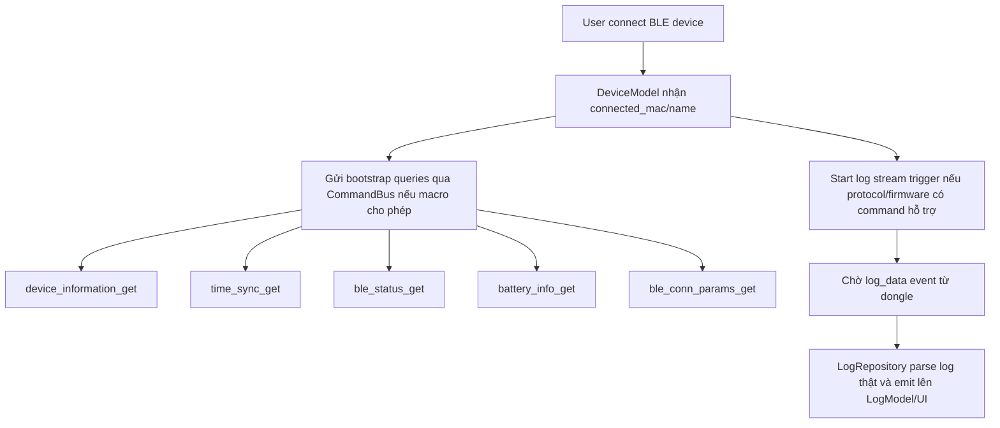
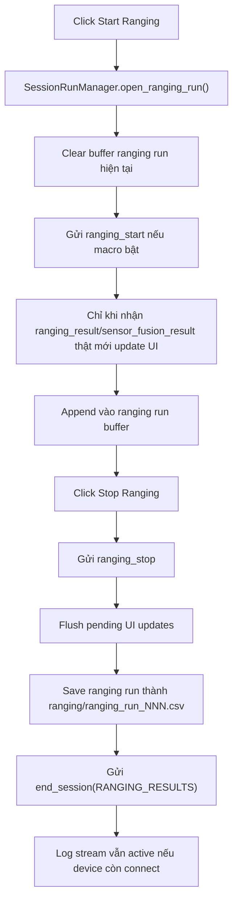
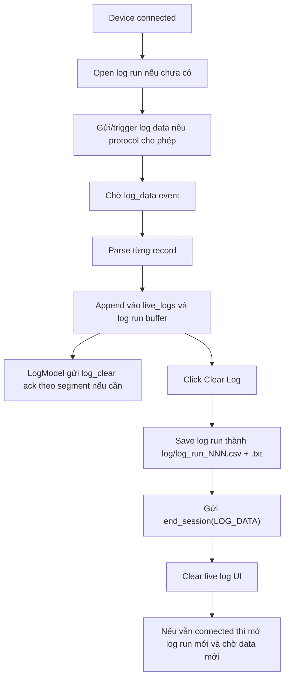
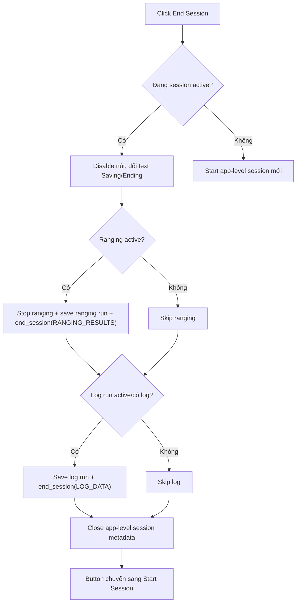
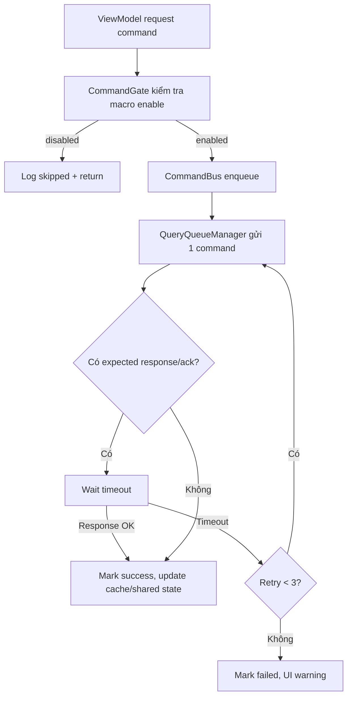

# Plan: Tách session ranging/log, chỉ hiển thị data thật, và chống trôi command

## 1. Mục tiêu

Tài liệu này là plan trước khi implement cho flow session hiện tại của `uwb_rtls_studio`.

Mục tiêu chính:

- Không sửa `protocol/protos/protocol.proto`. File protobuf thuộc tác giả khác, app chỉ được đọc/tham chiếu các enum/message đang có.
- Khi bấm `Start Ranging`, app chỉ bắt đầu session/run của ranging và chỉ lưu dữ liệu ranging thật sự nhận từ dongle qua USB-C.
- Khi bấm `Stop Ranging`, app dừng stream ranging, không dừng stream log, lưu một file ranging riêng cho lần chạy đó, rồi gửi `end_session` với reason `SESSION_END_REASON_RANGING_RESULTS`.
- Khi đang connect device, app kích hoạt cơ chế nhận log data một lần theo event, chờ firmware/device đẩy `log_data` lên UI. Log không phụ thuộc vào trạng thái ranging.
- Khi bấm `Clear Log`, app kết thúc run log hiện tại, không dừng ranging, lưu một file log riêng cho lần log đó, rồi gửi `end_session` với reason `SESSION_END_REASON_LOG_DATA`.
- Khi bấm `End Session` tổng, app kết thúc các stream đang active, lưu đủ ranging/log run còn mở, và gửi đúng enum kết thúc cho từng loại đang active.
- UI mở lên không được hiển thị data ảo. Field nào chưa từng có response thật thì hiển thị `--`.
- Command-response phải đi qua hàng đợi có timeout/retry rõ ràng, không để command bị trôi do gửi quá nhanh hoặc response về lệch nhịp.
- Mỗi command có một macro/bypass flag để bật/tắt việc app có được phép gọi command đó hay không.

## 2. Hiện trạng tìm thấy trong code

Các file quan trọng để đọc/tham chiếu:

- `protocol/protos/protocol.proto` chỉ đọc, tuyệt đối không sửa.
- `software/common/commands.py`
- `software/uwb_rtls_studio/services/command_bus.py`
- `software/uwb_rtls_studio/services/query_state_machine.py`
- `software/uwb_rtls_studio/models/ranging_model.py`
- `software/uwb_rtls_studio/models/log_model.py`
- `software/uwb_rtls_studio/models/device_model.py`
- `software/uwb_rtls_studio/viewmodels/live_tracking_viewmodel.py`
- `software/uwb_rtls_studio/viewmodels/log_viewmodel.py`
- `software/uwb_rtls_studio/viewmodels/main_viewmodel.py`
- `software/uwb_rtls_studio/repository/session_repository.py`
- `software/uwb_rtls_studio/views/tabs/live_tracking_tab.py`
- `software/uwb_rtls_studio/views/tabs/log_tab.py`
- `software/uwb_rtls_studio/views/ui/log_tab.ui`
- `software/uwb_rtls_studio/utils/app_state.py`

Các vấn đề đang có:

1. `MainViewModel.end_session()` hiện vừa save session vừa gọi `request_end_session(reason=0)`. Reason mặc định `0` là `SESSION_END_REASON_UNSPECIFIED`, chưa đúng với ranging/log.
2. `SharedAppState.ranging_active` tự tạo `current_session_id` khi start và xóa khi stop. Cách này dễ mất ID đúng lúc cần save run.
3. `SessionRepository.save_session()` hiện lưu kiểu tổng hợp `positions.csv`, `logs.csv`, `logs.txt`; đã có folder `ranging`/`log` mirror nhưng chưa có cơ chế mỗi lần start-stop tạo một file riêng.
4. `LogTab` có fallback `_populate_virtual_history()` tạo history giả nếu chưa set ViewModel. Đây là nguồn data ảo trực tiếp trong Log/Session History.
5. `CommandFactory` có nhiều builder response dùng dữ liệu mặc định để phục vụ test/mock. Phần này hợp lệ cho test, nhưng UI/runtime cần đảm bảo không lấy các giá trị đó làm data thật nếu chưa có RX từ dongle.
6. `RangingModel`, `RangingRepository`, `TelemetryRepository`, `DeviceModel` dùng nhiều `getattr(..., 0)` hoặc `setdefault(..., 0)`, khiến UI khó phân biệt `0` thật với field chưa nhận.
7. `QueryQueueManager` đã có queue và retry 3 lần, nhưng timeout đang là `0.25s`, khá ngắn với device thật. Ngoài ra response match hiện chỉ theo `param_name`, chưa match theo seq/command context nên có thể bị lệch khi nhiều query cùng expected response.
8. Protocol hiện có `log_data_t`, `log_clear_t`, `end_session_t`, nhưng chưa thấy message kiểu `log_start_t` hoặc `log_request_t`. Vì không được sửa proto, app phải làm việc trong phạm vi message hiện có và chỉ ghi chú điểm này để xác nhận với firmware/tác giả protocol.

## 3. Protocol và enum cần dùng

Ràng buộc bắt buộc:

- Không sửa `protocol/protos/protocol.proto`.
- Không thêm enum/message mới.
- Không đổi tag, field number, field name, package, hoặc semantic protobuf hiện có.
- Không regenerate `software/common/protocol_pb2.py` từ proto trong scope implement này, trừ khi user/tác giả protocol cung cấp file generated mới.
- App chỉ dùng các command/enum hiện có trong `software/common/commands.py` và `protocol_pb2.py`.

Trong `protocol.proto` hiện có:

```proto
enum session_end_reason_t {
    SESSION_END_REASON_UNSPECIFIED        = 0;
    SESSION_END_REASON_LOG_DATA           = 1;
    SESSION_END_REASON_RANGING_RESULTS    = 2;
    SESSION_END_REASON_DEBUG_STREAMING    = 3;
}

message end_session_t {
    session_end_reason_t reason = 1;
}
```

Quy ước app nên dùng:

- Stop ranging run: gửi `ranging_stop`, sau đó gửi `end_session(reason=SESSION_END_REASON_RANGING_RESULTS)`.
- Clear/end log run: gửi `end_session(reason=SESSION_END_REASON_LOG_DATA)`.
- End session tổng: nếu cả ranging và log đang active thì gửi cả hai reason theo thứ tự deterministic. Không nên gửi `UNSPECIFIED`.

Đề xuất cho End Session tổng:

- Nên gửi enum, vì firmware cần biết host đang kết thúc loại data nào để flush/close đúng buffer.
- Vì proto hiện tại chỉ cho một reason trong một packet, không có `SESSION_END_REASON_ALL`, app nên gửi hai packet `end_session` riêng nếu cả hai stream active.
- Không nên gửi “đồng thời” theo nghĩa fire-and-forget song song. Nên enqueue tuần tự qua command bus: `ranging_stop` -> `end_session(RANGING_RESULTS)` -> `end_session(LOG_DATA)`. Nếu firmware không cần `ranging_stop` riêng thì vẫn giữ để tương thích flow hiện tại.
- Nếu firmware coi `end_session(LOG_DATA)` là dừng toàn bộ session global thì cần thống nhất semantic với firmware/tác giả protocol. App side không tự sửa proto và không đoán.

## 4. Workflow đích

### 4.1 Connect device và bootstrap



Quy tắc:

- Connect device chỉ kích hoạt log stream, không tự start ranging.
- Vì không được sửa proto, nếu chưa có `log_start`/`log_request`, app chỉ được xử lý theo message hiện có:
  - Phương án app-side: sau khi connected, mở log run và chờ firmware tự push `log_data`.
  - Nếu firmware yêu cầu command khác để trigger log, command đó phải là command đã tồn tại trong proto/generated code; nếu không có thì ghi thành blocker/ghi chú cho tác giả protocol, không tự thêm proto.
- Không tạo log line giả để lấp UI.

### 4.2 Start/Stop ranging



Quy tắc:

- `Start Ranging` mới tạo run ranging.
- `Stop Ranging` không clear log buffer.
- Mỗi lần start-stop tạo một file `ranging_run_001.csv`, `ranging_run_002.csv`, ...
- Nếu không có sample thật thì vẫn có thể tạo metadata run với `sample_count=0`, nhưng không tạo data giả.

### 4.3 Log data và Clear Log



Quy tắc:

- `Clear Log` ở UI không chỉ xóa text. Nó là “end log data session/run”.
- `Clear Log` không dừng ranging.
- `log_clear_t` trong proto là ACK/xóa segment đã xử lý theo offset/length, không nên dùng thay cho nút `Clear Log`.
- Nút Clear Log nên gửi `end_session(LOG_DATA)` sau khi đã save run log.

### 4.4 End Session tổng



Animation/nút:

- Trạng thái `Running`: nút hiển thị `End Session`, màu đỏ.
- Sau click lần 1: chuyển `Ending...` hoặc `Saving...`, disable tạm để tránh double-click.
- Khi save và gửi command xong: chuyển sang `Start Session`, màu xanh/cyan.
- Click lần 2: tạo app-level session mới, reset counters, không tự start ranging, log sẽ chờ connected device.

## 5. Kiến trúc session/run đề xuất

Thêm một lớp nhỏ, ví dụ:

- `software/uwb_rtls_studio/services/session_run_manager.py`

Trách nhiệm:

- Quản lý `app_session_id` độc lập với `ranging_active`.
- Quản lý nhiều run con:
  - `RangingRunState`
  - `LogRunState`
- Cấp số run tăng dần trong một app session.
- Nhận buffer snapshot từ `RangingModel`/`LogModel`.
- Gọi `SessionRepository` để lưu từng run.
- Gửi end reason đúng qua `DeviceInfoViewModel`/`DeviceModel`.

Data model đề xuất:

```python
AppSessionState:
    session_id: str
    started_at: datetime
    ended_at: datetime | None
    active: bool
    connected_device_snapshot: dict
    run_counters: {"ranging": int, "log": int}

StreamRunState:
    run_id: str
    stream_type: "ranging" | "log"
    index: int
    started_at: datetime
    ended_at: datetime | None
    active: bool
    device_snapshot: dict
    sample_count: int
    file_paths: list[str]
```

### 5.1 Làm rõ BE cho `session_model.py`

Hiện tại `software/uwb_rtls_studio/models/session_model.py` gần như mới là tài liệu/docstring và `pass`, chưa thật sự là BE model. Khi implement plan này, file này phải được dùng làm source-of-truth cho session lifecycle thay vì để `MainViewModel` và `SharedAppState` tự giữ state rải rác.

Chức năng nhiệm vụ của `SessionModel`:

- Quản lý app-level session:
  - `session_id`
  - `is_active`
  - `started_at`
  - `ended_at`
  - `duration_sec`
  - thông tin device/dongle snapshot tại thời điểm session chạy.
- Quản lý stream/run-level state:
  - ranging run hiện tại đang mở hay không.
  - log run hiện tại đang mở hay không.
  - số thứ tự run kế tiếp cho `ranging_run_NNN` và `log_run_NNN`.
  - start/end time, sample count, file paths, end reason của từng run.
- Cung cấp API BE cho ViewModel/manager:
  - `start_app_session(device_snapshot, dongle_snapshot)`.
  - `end_app_session(reason="USER_END_SESSION")`.
  - `open_ranging_run()`.
  - `close_ranging_run(sample_count, files, end_reason)`.
  - `open_log_run(device_key=None)`.
  - `close_log_run(line_count, files, end_reason)`.
  - `active_runs()` để biết End Session tổng cần đóng stream nào.
  - `build_session_meta()` và `build_runs_meta()` để repository save.
- Emit signal cho UI/status bar:
  - `session_started(session_id)`.
  - `session_ending(session_id)`.
  - `session_ended(session_id)`.
  - `run_started(stream_type, run_index)`.
  - `run_ended(stream_type, run_index, files)`.
  - `session_state_changed(dict)`.
- Không trực tiếp ghi file, không trực tiếp gửi protocol command. `SessionModel` chỉ giữ state và tạo metadata. Việc save file thuộc `SessionRepository`; việc gửi command thuộc `CommandBus`/`DeviceModel`.

Quan hệ với `SessionRunManager`:

- `SessionRunManager` là orchestration service: gọi command, lấy buffer từ `RangingModel`/`LogModel`, gọi repository save.
- `SessionModel` là data/state model: biết session/run nào đang active và metadata cần lưu.
- Nếu muốn giảm số lớp, có thể bỏ `SessionRunManager` và để `MainViewModel` orchestration trực tiếp qua `SessionModel`; nhưng khuyến nghị vẫn tách manager để `SessionModel` sạch, dễ test.

Data class nên thêm vào `session_model.py`:

```python
@dataclass
class StreamRunState:
    run_id: str
    stream_type: str
    index: int
    started_at: datetime
    ended_at: datetime | None = None
    active: bool = True
    sample_count: int = 0
    end_reason: str = ""
    files: list[str] = field(default_factory=list)

@dataclass
class AppSessionState:
    session_id: str
    started_at: datetime
    ended_at: datetime | None = None
    active: bool = True
    device_snapshot: dict = field(default_factory=dict)
    dongle_snapshot: dict = field(default_factory=dict)
    runs: list[StreamRunState] = field(default_factory=list)
```

### 5.2 Làm rõ BE cho `telemetry_model.py`

Hiện tại `software/uwb_rtls_studio/models/telemetry_model.py` cũng mới là skeleton/docstring và `pass`. Trong lần implement tới, file này phải trở thành BE model giữ telemetry thật nhận từ packet, thay vì để telemetry nằm lẫn giữa `DeviceModel`, `TelemetryRepository`, `DeviceInfoViewModel`, status bar và shared state.

Chức năng nhiệm vụ của `TelemetryModel`:

- Giữ state telemetry mới nhất cho device đang connected:
  - battery voltage.
  - SoC phần trăm.
  - remaining minutes.
  - charging state.
  - MCU/UWB/IMU temperature.
  - MCU/UWB voltage.
  - error mask.
  - RSSI/BLE status nếu cần gom chung phần health.
- Chỉ update khi có packet thật:
  - `battery_info_resp`
  - `ble_status_resp`
  - `rtos_resource_resp`
  - `rtos_task_stats_resp`
  - các health/status response khác nếu sau này thêm.
- Không tự fill số `0` để UI tưởng là có data. State ban đầu là `None`/`valid=False`, ViewModel format thành `--`.
- Quản lý freshness:
  - `never_received`: chưa có packet thật.
  - `fresh`: mới nhận.
  - `stale`: quá thời gian TTL.
  - `failed`: query timeout hoặc parse lỗi.
- Cung cấp API BE:
  - `handle_battery_info(data, received_at=None)`.
  - `handle_ble_status(data, received_at=None)`.
  - `handle_rtos_resource(data, received_at=None)`.
  - `handle_rtos_task_stats(tasks, received_at=None)`.
  - `mark_query_failed(command_name)`.
  - `snapshot()` trả dict đầy đủ cho UI/session save.
  - `display_snapshot()` trả dict đã format sẵn `--` cho UI nếu muốn.
  - `is_stale(key_or_group)` để status bar/dashboard đổi màu.
- Emit signal cho UI:
  - `battery_updated(dict)`.
  - `ble_status_updated(dict)`.
  - `rtos_resource_updated(dict)`.
  - `rtos_task_stats_updated(list)`.
  - `telemetry_snapshot_updated(dict)`.
  - `telemetry_freshness_changed(str, str)`.
- Có thể đọc từ `TelemetryRepository`, nhưng repository chỉ parse/persist packet. `TelemetryModel` mới là nơi quyết định state thật, stale, valid, và default `--`.

Data class nên thêm vào `telemetry_model.py`:

```python
@dataclass
class TelemetryField:
    value: object | None = None
    valid: bool = False
    received_at: float | None = None
    freshness: str = "never_received"

@dataclass
class TelemetrySnapshot:
    battery: dict[str, TelemetryField] = field(default_factory=dict)
    ble_status: dict[str, TelemetryField] = field(default_factory=dict)
    rtos_resource: dict[str, TelemetryField] = field(default_factory=dict)
    rtos_tasks: list[dict] = field(default_factory=list)
```

Quan hệ với các lớp hiện có:

- `TelemetryRepository`: parse raw protobuf thành dict sạch, không quyết định UI default.
- `TelemetryModel`: nhận dict đã parse, lưu state thật + freshness.
- `DeviceInfoViewModel`: đọc từ `TelemetryModel`, format UI `--`/value.
- `MainWindow` status bar: đọc signal/snapshot từ `TelemetryModel`, không đọc trực tiếp default `0`.
- `SessionRepository`: khi save session/run, lấy `TelemetryModel.snapshot()` làm telemetry snapshot nếu cần debug.

Folder/file đích:

```text
data/sessions/SES_YYYYMMDD_HHMMSS_session/
  session_meta.json
  runs.json
  anchors.json
  config_snapshot.json
  ranging/
    ranging_run_001.csv
    ranging_run_002.csv
  log/
    log_run_001.csv
    log_run_001.txt
    log_run_002.csv
    log_run_002.txt
```

`runs.json` nên ghi:

- `run_id`
- `stream_type`
- `index`
- `start_time_iso`
- `end_time_iso`
- `duration_sec`
- `sample_count`
- `end_reason`
- `command_seq_start`
- `command_seq_stop`
- `files`

`SessionRepository` cần thêm API:

- `save_ranging_run(session_id, run_index, positions, fusion_positions, meta)`
- `save_log_run(session_id, run_index, logs, meta)`
- `append_or_update_run_meta(session_id, run_meta)`
- `list_session_runs(session_id, stream_type=None)`
- `count_ranging_runs(session_id)` dùng `runs.json` là nguồn chính.
- `count_log_runs(session_id)` để hiển thị Session Files/Logs chính xác.

## 6. Chỉ hiển thị data thật, default là `--`

Nguyên tắc:

- UI không tự tạo value nghiệp vụ.
- Model/repository không tự fill `0` nếu field đó chưa được xác nhận là có data thật.
- Shared state chỉ update khi có packet RX thật hoặc user nhập config thật.
- `0` chỉ được hiển thị là `0` khi có packet thật chứa message tương ứng.
- Nếu chưa có packet thật hoặc field không có ý nghĩa, UI hiển thị `--`.

Việc cần sửa:

1. Xóa/disable `_populate_virtual_history()` trong `LogTab`.
2. Dashboard/Anchor layout vẫn hiển thị 4 anchor để giữ layout UI, nhưng từng field tọa độ hiển thị `--` cho đến khi có `anchor_layout_resp` thật hoặc user set layout.
3. `DeviceModel._handle_device_info()` không set `"UNSPECIFIED"` như data thật cho role/type nếu chưa rõ; nên đưa `None` hoặc `has_data=False`, ViewModel format thành `--`.
4. `TelemetryRepository.parse_battery_info()` và `DeviceModel._handle_battery_info()` cần thêm metadata:
   - `source: "device_rx"`
   - `received_at`
   - `received_fields`
   - `valid: True`
5. Với proto3 scalar field, Python không phân biệt presence nếu field không khai báo `optional`. Vì vậy app không thể biết một scalar field bị thiếu trong wire hay được gửi default `0` nếu chỉ nhìn object sau parse. Vì không được sửa proto, cách xử lý app-side an toàn là:
   - Tầng packet/repository xác nhận message-level: chỉ update nhóm field khi message resp thật sự về.
   - Với field cần phân biệt missing/0 thật nhưng proto hiện tại không có presence, app ghi nhận đây là giới hạn protocol hiện có và không tự sửa proto.
   - Trước mắt, UI sẽ không hiển thị gì cho đến khi message resp về. Sau khi message resp về, các field scalar trong message được coi là data thật theo semantic proto3 hiện tại.

ViewModel format helper đề xuất:

```python
def display_value(data: dict, key: str, fmt=str):
    if not data or not data.get("valid"):
        return "--"
    value = data.get(key, None)
    if value is None:
        return "--"
    return fmt(value)
```

## 7. Chống command bị trôi

Hiện có `CommandBus` và `QueryQueueManager`, nên không cần viết lại toàn bộ. Cần siết lại:

1. Tăng timeout mặc định cho hardware thật:
   - `QUERY_TIMEOUT_S`: từ `0.25s` lên khoảng `0.8s - 1.5s`.
   - Giữ `QUERY_MAX_RETRIES = 3`.
2. Match response theo `expected_response` và seq nếu firmware echo/ACK có đủ seq context.
3. Với command không có response nhưng có ACK, nên có transaction loại `CONTROL`:
   - `ranging_start`
   - `ranging_stop`
   - `end_session`
   - `log_clear`
   - `ble_connect`
   - `ble_disconnect`
4. Không gửi một loạt direct `send()` liên tiếp từ nhiều ViewModel. Tất cả command lifecycle nên qua `CommandBus`.
5. Có priority queue nhẹ:
   - High: stop/end/clear/disconnect.
   - Normal: user get/set config.
   - Low: polling telemetry/ranging status.
6. Khi một query đang pending, polling command không được chen vào trước stop/end command.
7. Log rõ command:
   - command name
   - dst
   - seq
   - attempt
   - expected response/ack
   - timeout/fail reason

Workflow command đề xuất:



## 8. Macro/bypass cho từng command

Yêu cầu: mỗi command có một khai báo bypass, set `1` thì được gọi, set `0` thì app không gọi.

Đề xuất thêm file:

- `software/uwb_rtls_studio/utils/command_flags.py`

Nội dung kiểu:

```python
COMMAND_ENABLE = {
    "device_information_get": 1,
    "time_sync_get": 1,
    "time_sync_set": 1,
    "sys_config_get": 1,
    "sys_config_set": 1,
    "sys_ranging_cfg_get": 1,
    "sys_ranging_cfg_set": 1,
    "ranging_start": 1,
    "ranging_stop": 1,
    "ranging_status_get": 1,
    "sensor_fusion_cfg_get": 1,
    "sensor_fusion_cfg_set": 1,
    "battery_info_get": 1,
    "anchor_layout_get": 1,
    "anchor_layout_set": 1,
    "ble_status_get": 1,
    "ble_conn_params_get": 1,
    "ble_conn_params_set": 1,
    "ble_scan_start": 1,
    "ble_scan_stop": 1,
    "ble_connect": 1,
    "ble_disconnect": 1,
    "log_clear": 1,
    "end_session": 1,
    "calib_status_get": 1,
    "rtos_resource_get": 1,
    "rtos_task_stats_get": 1,
}
```

`CommandBus.send()` và `CommandBus.request()` kiểm tra:

- Nếu flag = `0`, không gọi protocol.
- Emit/log `Command skipped by flag: <name>`.
- Với UI, không update data giả khi command bị skip.

Nên đặt tên là `COMMAND_ENABLE`, không phải `bypass`, để tránh hiểu ngược. Nếu vẫn muốn đúng từ bạn đang dùng, có thể dùng:

```python
COMMAND_BYPASS = {
    "anchor_layout_get": 0,  # 0 = không gọi
}
```

Nhưng cách này dễ nhầm. Khuyến nghị dùng `COMMAND_ENABLE`.

## 9. UI thay đổi cần làm

### Live Tracking

- `Start Ranging`: mở ranging run mới, clear trail/buffer của run cũ, gửi `ranging_start`.
- `Stop Ranging`: gọi flow stop/save/end reason ranging.
- Các label position/stats:
  - Ban đầu: `--`
  - Chỉ update khi có `ranging_result`, `sensor_fusion_result`, `ranging_status_resp` thật.
- Anchor distances:
  - Ban đầu: `A1 --`, `A2 --`, ...
  - Chỉ anchor nào có distance trong packet thì update anchor đó.

### Log Tab

- Thêm nút `Clear Log` trong `views/ui/log_tab.ui`, nằm cùng hàng filter hoặc footer live log.
- `Clear Log` gọi `LogViewModel.clear_log_session()`:
  - save log run
  - gửi `end_session(LOG_DATA)`
  - clear live log text
  - mở log run mới nếu vẫn connected
- Xóa virtual history fallback.
- Khi chưa có session thật: bảng history trống, text `0 entries`.

### End Session button

- Nút tổng trong `MainWindow` không gọi `reason=0`.
- Dùng state:
  - `SESSION_RUNNING`
  - `SESSION_ENDING`
  - `SESSION_ENDED`
- Click lần 1: end/save all active runs.
- Click lần 2: start app-level session mới.

## 10. Các file dự kiến sẽ sửa khi implement

Nhóm session/run:

- `software/uwb_rtls_studio/models/session_model.py` biến từ skeleton thành BE model giữ app session/run state.
- `software/uwb_rtls_studio/services/session_run_manager.py` thêm mới.
- `software/uwb_rtls_studio/repository/session_repository.py` thêm API save run và `runs.json`.
- `software/uwb_rtls_studio/viewmodels/main_viewmodel.py` chuyển qua orchestration mới.
- `software/uwb_rtls_studio/utils/app_state.py` tách `current_session_id` khỏi `ranging_active`.

Nhóm ranging:

- `software/uwb_rtls_studio/models/ranging_model.py`
- `software/uwb_rtls_studio/repository/ranging_repository.py`
- `software/uwb_rtls_studio/viewmodels/live_tracking_viewmodel.py`
- `software/uwb_rtls_studio/views/tabs/live_tracking_tab.py`

Nhóm log:

- `software/uwb_rtls_studio/models/log_model.py`
- `software/uwb_rtls_studio/repository/log_repository.py`
- `software/uwb_rtls_studio/viewmodels/log_viewmodel.py`
- `software/uwb_rtls_studio/views/tabs/log_tab.py`
- `software/uwb_rtls_studio/views/ui/log_tab.ui`

Nhóm command:

- `software/uwb_rtls_studio/utils/command_flags.py` thêm mới.
- `software/uwb_rtls_studio/services/command_bus.py`
- `software/uwb_rtls_studio/services/query_state_machine.py`
- `software/common/commands.py` nếu cần thêm expected ACK/control metadata.

Nhóm data thật/default:

- `software/uwb_rtls_studio/models/telemetry_model.py` biến từ skeleton thành BE model giữ telemetry thật + freshness.
- `software/uwb_rtls_studio/models/device_model.py`
- `software/uwb_rtls_studio/repository/telemetry_repository.py`
- `software/uwb_rtls_studio/viewmodels/device_info_viewmodel.py`
- `software/uwb_rtls_studio/views/tabs/config_tab.py`
- `software/uwb_rtls_studio/views/tabs/anchor_visual_widget.py`
- Dashboard/status widgets nếu đang đọc trực tiếp default `0`.

## 11. Thứ tự implement đề xuất

1. Thêm command flags và chặn command ở `CommandBus`.
2. Xóa virtual data trong `LogTab`, đảm bảo UI trống khi chưa có ViewModel/data thật.
3. Implement `SessionModel` thật trong `models/session_model.py` để giữ app session/run state.
4. Implement `TelemetryModel` thật trong `models/telemetry_model.py` để giữ telemetry thật, valid/freshness, default `--`.
5. Tách app session ID khỏi `ranging_active` trong `SharedAppState`.
6. Thêm `SessionRunManager` và API save run trong `SessionRepository`.
7. Wire `Start Ranging`/`Stop Ranging` vào run manager và `SessionModel`.
8. Thêm nút `Clear Log` và flow save/end log run.
9. Sửa `End Session` tổng để end đúng từng stream, không dùng reason `0`.
10. Chuẩn hóa format UI `--` cho device info, battery, anchor layout, ranging stats qua `TelemetryModel`/ViewModel.
11. Siết timeout/retry/priority queue cho command lifecycle.
12. Viết test cho session run, telemetry freshness, command flags, không hiển thị data giả.

## 12. Test checklist

Test unit:

- `CommandBus` không gửi command khi `COMMAND_ENABLE[name] = 0`.
- `CommandBus` vẫn gửi command khi flag = 1.
- `SessionRepository.save_ranging_run()` tạo đúng `ranging_run_001.csv`, `ranging_run_002.csv`.
- `SessionRepository.save_log_run()` tạo đúng `log_run_001.csv/.txt`.
- `count_ranging_runs()` đọc đúng từ `runs.json`.
- `LogTab` không populate virtual history khi chưa có ViewModel.
- `SessionModel` mở/đóng app session, ranging run, log run đúng state và run index.
- `TelemetryModel` ban đầu trả `--`/`valid=False`, chỉ chuyển `valid=True` sau khi nhận data thật.
- `TelemetryModel` chuyển freshness từ `fresh` sang `stale` khi quá TTL.
- `RangingModel.clear_history()` không xóa app session ID.

Test integration bằng simulator:

- Connect tag/anchor -> chỉ device info/log bootstrap chạy, ranging chưa chạy.
- Start ranging -> có `ranging_start`, nhận `ranging_result`, UI update.
- Stop ranging -> có `ranging_stop`, save ranging file, gửi `end_session(RANGING_RESULTS)`, log vẫn nhận.
- Clear log -> save log file, gửi `end_session(LOG_DATA)`, ranging vẫn chạy nếu đang active.
- End Session khi cả hai active -> save cả hai, gửi đủ two reason.
- Tắt `anchor_layout_get` flag -> app không gọi command và layout vẫn `--`.
- Tắt `battery_info_get` flag -> dashboard/status không hiện pin giả.
- Nhận `battery_info_resp` thật -> `TelemetryModel` update, Device Info/status bar mới hiện pin/nhiệt/voltage.
- Không nhận `battery_info_resp` -> Device Info/status bar vẫn `--`, không hiện default từ `CommandFactory`.

Test UI:

- Mở app chưa connect: mọi field nghiệp vụ là `--` hoặc trống.
- Connect nhưng chưa nhận `device_information_resp`: device info vẫn `--`.
- Nhận thiếu nhóm response: nhóm chưa nhận vẫn `--`.
- Session History không có session giả.
- Nút End Session đổi trạng thái đúng, không double-save khi double-click.

## 13. Rủi ro và điểm cần xác nhận

1. Proto3 scalar field không có presence mặc định. Nếu firmware thật sự có thể gửi thiếu từng field trong cùng một message và app phải biết field nào thiếu, app không tự sửa proto; phần này cần tác giả protocol/firmware quyết định ngoài scope implement app.
2. Protocol hiện chưa có command start/request log stream rõ ràng. Cần xác nhận firmware đang kích hoạt log upload bằng cách nào:
   - tự push sau connect,
   - dùng command hiện có nhưng chưa được đặt tên rõ,
   - nếu cần message mới thì đây là blocker ngoài scope app vì không được sửa proto.
3. Nếu firmware dùng `end_session` như “end toàn bộ session global”, việc gửi hai reason riêng có thể gây side effect. Khuyến nghị firmware định nghĩa rõ `end_session(reason)` là kết thúc stream theo reason, không kill BLE/device.
4. Nếu `log_clear_t` xóa flash segment sau từng `log_data`, cần đảm bảo `Clear Log` UI không gọi nhầm `log_clear` với offset/length không đúng.
5. Tăng timeout command sẽ làm UI phản hồi chậm hơn khi device mất kết nối, nhưng ổn định hơn với hardware thật.

## 14. Đề xuất để app hoàn thiện hơn

- Thêm panel nhỏ “Command Monitor” trong Developer mode: command, seq, retry, status.
- Thêm badge trên status bar:
  - `Ranging: Running/Idle`
  - `Log: Streaming/Idle`
  - `Queue: N pending`
- Lưu raw packet theo từng run, không chỉ runtime global, để debug replay sau này.
- Thêm `session_manifest.json` tổng hợp tất cả file và checksum.
- Có nút `Export Session` xuất nguyên folder session gồm `runs.json`, ranging, log, raw packet.
- Với field UI quan trọng, dùng `DataFreshness`:
  - `never_received`
  - `fresh`
  - `stale`
  - `failed`
- Khi stale quá lâu, UI giữ giá trị cuối nhưng đổi màu/tooltip; khi never received thì `--`.
